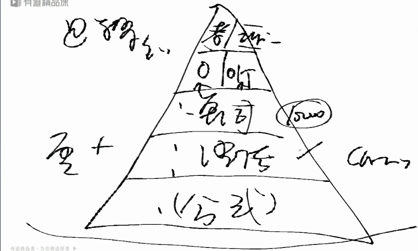
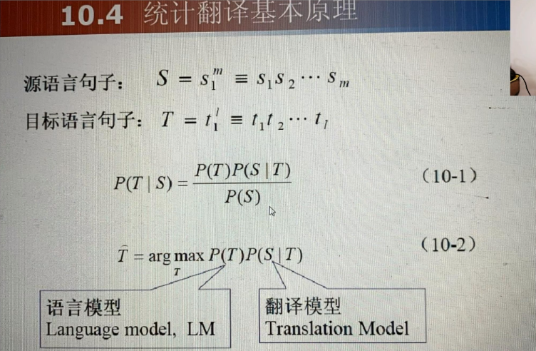
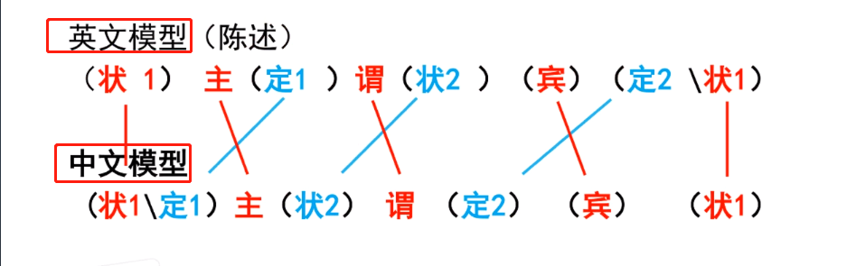
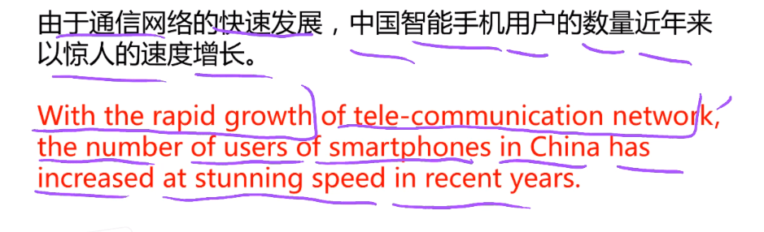
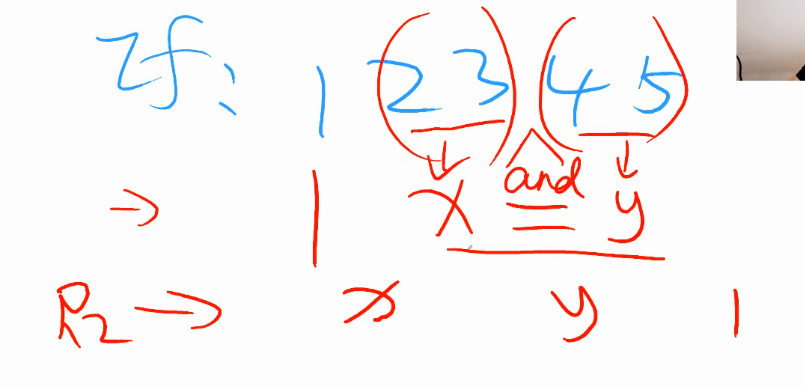
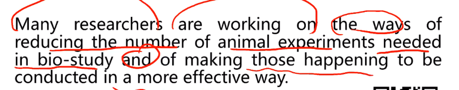
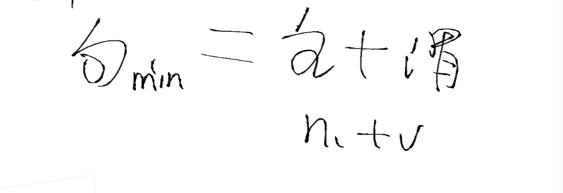
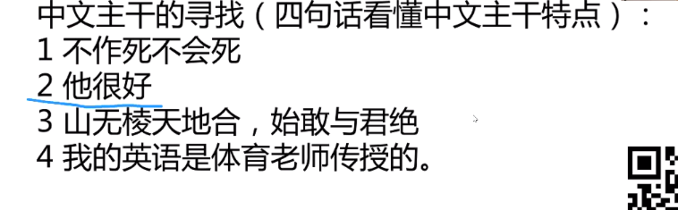
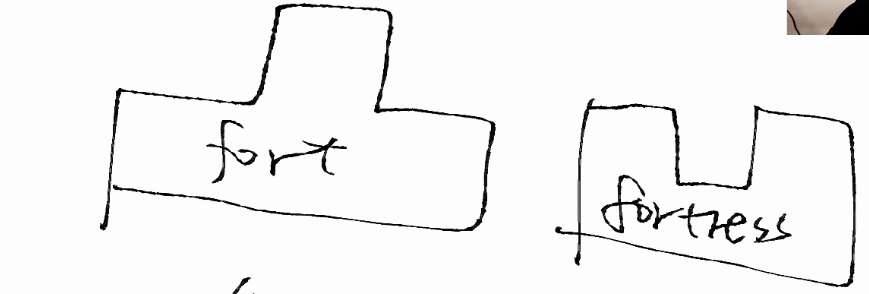

# EN学习逻辑英语

参考书（英文观止）

体系：

## 公式法

### 公式

用理工科的思维方式学习英语：

翻译算法：

区别两个语言的标准,不是发音不同，而是算法问题（序列排列问题）

语言是有模型的：

中文和英文，主谓宾状的顺序是一样的（红色部分），剩下的是颠倒的（蓝色部分）

**补充知识**：定语修饰主语和宾语，一般常由形容词、数量词、名词、代词充当，状语位于主谓之间，起修饰限定作用。

状语是修饰谓语（动词），从情况、时间、处所、方式、条件、对象、肯定、否定、范围和程度等方面对谓语中心词进行修饰、限制。

**总结**：对于英语>>汉语，其实就是把英语中本来位于后面的修饰主语的定语，修饰谓语的状语，修饰宾语的定语分别放在主语，谓语，宾语的前面进行翻译。对于汉语>>英语，反之。

------

### R1 R2

但是定语状语比较长的时候，需要对它们内部进行分析，这时候用到内部排序算法，内部排序算法有两层，R1 + R2

* R1 倒叙

这里，对于开头的原因状语从句，在转译的时候就，进行了倒叙

CATTI 国家翻译考试是开卷的！可以带两本字典！

* R2 递归

其实就是，并列的不用倒叙

重点在于找并列句： 以and为基准分开 the ways of 后面and之前是1，and之后的是2,1和2 并列

## 语法

固定搭配？习惯用法？不存在的 

### 可数不可数

可数不可数，不是可不可以数，而是可不可以简化。

对于可数名词car  可以用a car ,这样就可以说清楚是一辆车。但是对于不可数名词meat就不能用a meat，一个肉？，一个肉到底是多少肉，说不清楚，所以才需要使用量词kilograml来描述

对于即可数也不可数的名词:

time  因为它有很多意思，有的意思可数，有的意思不可数。

hair 一根头发它可数 但是实际中它又没有数的必要所以在某些情况下可以当成可数名词，某些情况可以当成不可数名词。

### 介词

* On

接触   所有的on都可以翻译为接触 或者从接触引申开来

* About

Ab 就是转圈圈  关于也是转圈圈

比如about-face 就是转过脸来。可以引申为change of attitude改变态度

### 句子结构补全

单词不是问题，只要把逻辑搞懂，翻译的时候，不过是精准的问题

找主谓宾，然后状语定语倒叙，就OK！后面不过是选介词，注意时态即可。

* **主谓宾**

（英文）句子的主干：

（英语）一个句子中可以没有宾语，但是必须有主语和谓语（祈使句come on！其实是省略了主语，而不是没有主语，可以补全>>you come on）==（要注意，汉语可以没有主语）==

eg:

**地上有坨屎**  在这里地上并不是主语（因为地上和屎并没有从属关系），地上是一个状语，可以这样看 ：*在地上有坨屎*，状语可以放在后面：有坨屎在地上。

* **主系表**

中文是个佛系语言，动词可以当主语，但是英语就比较纠结。

英语的主语：名词 代词 不定式 动名词 数词 名词化的形容词 短语 主语（8种）

> 我爱你是个错误
>
> That I love you is a mistake.//在这里that不能省略，它提醒对方我下面说的这个句子是个主语，你要注意了。（该句子即为主语从句）

* **重后审美**

中文歧义比较多，英文比较严谨。

汉语喜欢头大身小，英语喜欢头小身大。

The fact that.......这个主语就是fact

垃圾分类，从我做起（省略了主语 我们垃圾分类，在翻译成英语的时候，要补全主语）

汉语里面，尽量不加关联词，但是英语里面必须要加关联词。

* **东西语言风格不同**

中国仙气中，自然科学逻辑弱。

* **to do** 

逻辑上是这样的，有时候语气比较急的时候 会省略掉to，比如一些使役动词：I want  you die,语气比较强烈，迫不及待的说出来，所以省略了to

但是被动句中，主语是上面的you时 to就要还原（因为这个语气就不急了）

## 单词

* 放弃拼写，根据发音来记单词。单词量==识别量，而不是拼写量。老外也很容易写错
* 多义词不要死记 思考等于记忆

R-  逻辑就是辐射 蔓延 发散 裂开

n-  鼻子 否定

> normal university 师范大学 normal 有1.正常 2.标准的意思 师范是专门培养老师的，老师都是为人模范，是做人的标准，所以师范大学就是normal university

* 词汇量==世界观

radical 根本的 激进的 

> 这个单词的两个意思 是因为西方人的思想比较激进（政治也是如此） 所以根本的就是激进的 所以radical 这个单词有根本和激进的意思
>
> foundation  根基 粉底  嘿嘿嘿女生懂

C- 圈圈

> city >>culture 等等   许多城市辐射开来 就是rural 乡野
>
> cell 细胞 牢房  cell phone 蜂窝电话 因为最早的电话网络就像蜂窝一样

Z- 曲折

> zoom  缩放 
>
> zeal 热情

F- 稳定 

> fort 堡垒   fortress 女堡垒（就是凹进去的堡垒）
>
> 

M- 对称 >>手指 镜子

H- 高

L-光明  线条 文字

J-  法律

* **记忆公式**

思考>忘记>重复>回忆>记忆

## 阅读

语言： 模型+数据库

每一段话都是围绕一个主题来的，找到主题。然后注意but ,还有一些表示对比的词

