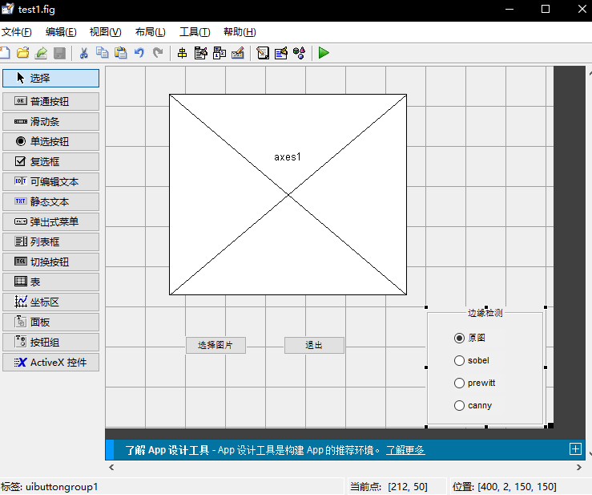
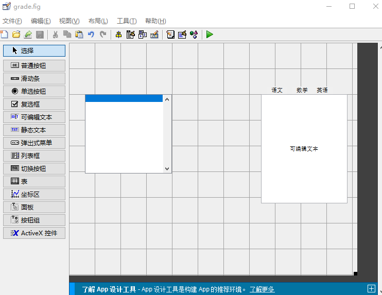
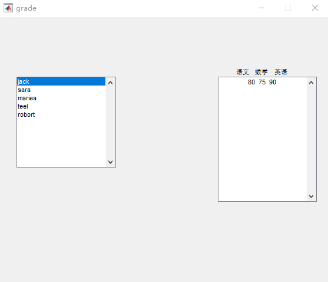
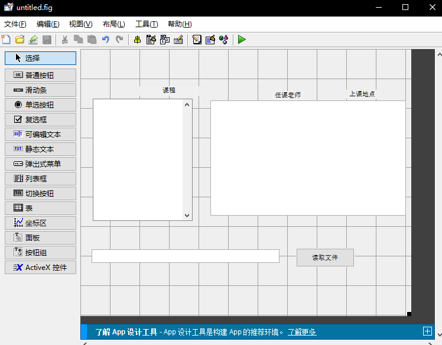
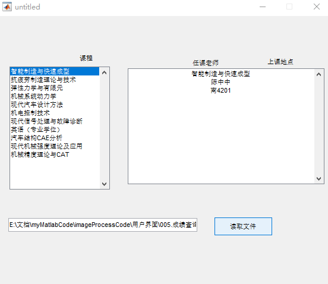

# MATLAB学习笔记

## 1基础知识

### 常识

```matlab
%% Matlab基本的小常识
% (1)在每一行的语句后面加上分号(一定要是英文的哦;中文的长这个样子；)表示不显示运行结果
a = 3;
a = 5

% (2)多行注释:选中要注释的若干语句,快捷键Ctrl+R
% a = 3;
% a = 5

% (3)取消注释:选中要取消注释的语句,快捷键Ctrl+T
% 我想要取消注释下面这行
% 还有这一行

% clear可以清楚工作区的所有变量
clear

% clc可以清除命令行窗口中的所有文本,让屏幕变得干净
clc

% 所以大家在很多代码开头，都会见到:
clear;clc   % 分号也用于区分行。
% 这两条一起使用，起到“初始化”的作用，防止之前的结果对新脚本文件（后缀名是 .m）产生干扰。

%% 输出和输入函数(disp 和 input)
% disp函数
% matlab中disp()就是屏幕输出函数，类似于c语言中的printf（）函数
disp('我是清风，大家好鸭~~~记得投币关注我哦')
a = [1,2,3]    %同一行中间用逗号分隔，也可以不用逗号，直接用空格
a = [1 2 3]
disp(a) 
% 注意，disp函数比较特殊，这里可要分号，可不要分号哦
disp(a);
% matlab中两个字符串的合并有两种方法
% （1）strcat(str1,str2……,strn) 
 strcat('字符串1','字符串2') 
% （2）[str 1,str 2，……, str n]或[str1  str2  ……  strn]
['字符串1'  '字符串2']
['字符串1','字符串2']
% 一个有用的字符串函数：num2str  将数字转换为字符串
c = 100
num2str(c)
disp(['c的取值为' num2str(c)])
disp(strcat('c的取值为', num2str(c)))

% input函数
% 一般我们会将输入的数、向量、矩阵、字符串等赋给一个变量，这里我们赋给A
A = input('请输入A：');
B = input('请输入B：')
% 注意观察工作区，并体会input后面加分号和不加分号的区别

%% sum函数
% （1）如果是向量（无论是行向量还是列向量），都是直接求和
E = [1,2,3]
sum(E)
E = [1;2;3]
sum(E)
% （2）如果是矩阵，则需要根据行和列的方向作区分
clc
E = [1,2;3,4;5,6]
% a=sum(x); %按列求和(得到一个行向量）
a = sum(E)
a = sum(E,1)
% a=sum(x,2); %按行求和(得到一个列向量）
a = sum(E,2)
% a=sum(x(:));%对整个矩阵求和
a = sum(sum(E))
a = sum(E(:))

%% 基础：matlab中如何提取矩阵中指定位置的元素？
% （1）取指定行和列的一个元素（输出的是一个值）
clc;A=[1 1 4 1/3 3;1 1 4 1/3 3;1/4 1/4 1 1/3 1/2;3 3 3 1 3;1/3 1/3 2 1/3 1];
A
A(2,1)
A(3,2)
% （2）取指定的某一行的全部元素（输出的是一个行向量）
clc;A
A(2,:)
A(5,:)
% （3）取指定的某一列的全部元素（输出的是一个列向量）
clc;A
A(:,1)
A(:,3)
% （4）取指定的某些行的全部元素（输出的是一个矩阵）
clc;A
A([2,5],:)      % 只取第二行和第五行（一共2行）
A(2:5,:)        % 取第二行到第五行（一共4行）
A(2:2:5,:)     % 取第二行和第四行 （从2开始，每次递增2个单位，到5结束）
1:3:10
10:-1:1
A(2:end,:)      % 取第二行到最后一行
A(2:end-1,:)    % 取第二行到倒数第二行
% （5）取全部元素(按列拼接的，最终输出的是一个列向量)
clc;A
A(:)

%% size函数
clc;
A = [1,2,3;4,5,6]
B = [1,2,3,4,5,6]
size(A)
size(B)
% size(A)函数是用来求矩阵A的大小的,它返回一个行向量，第一个元素是矩阵的行数，第二个元素是矩阵的列数
[r,c] = size(A)
% 将矩阵A的行数返回到第一个变量r，将矩阵的列数返回到第二个变量c
r = size(A,1)  %返回行数
c = size(A,2) %返回列数

%% repmat函数
% B = repmat(A,m,n):将矩阵A复制m×n块，即把A作为B的元素，B由m×n个A平铺而成。
A = [1,2,3;4,5,6]
B = repmat(A,2,1)
B = repmat(A,3,2)

%% Matlab中矩阵的运算
% MATLAB在矩阵的运算中，“*”号和“/”号代表矩阵之间的乘法与除法(A/B = A*inv(B))
A = [1,2;3,4]
B = [1,0;1,1]
A * B
inv(B)  % 求B的逆矩阵
B * inv(B)
A * inv(B)
A / B

% 两个形状相同的矩阵对应元素之间的乘除法需要使用“.*”和“./”
A = [1,2;3,4]
B = [1,0;1,1]
A .* B
A ./ B

% 每个元素同时和常数相乘或相除操作都可以使用
A = [1,2;3,4]
A * 2
A .* 2
A / 2 
A ./ 2

% 每个元素同时乘方时只能用 .^
A = [1,2;3,4]
A .^ 2
A ^ 2 
A * A

%% Matlab中求特征值和特征向量
% 在Matlab中，计算矩阵A的特征值和特征向量的函数是eig(A),其中最常用的两个用法：
A = [1 2 3 ;2 2 1;2 0 3]
% （1）E=eig(A)：求矩阵A的全部特征值，构成向量E。
E=eig(A)
% （2）[V,D]=eig(A)：求矩阵A的全部特征值，构成对角阵D，并求A的特征向量构成V的列向量。（V的每一列都是D中与之相同列的特征值的特征向量）
[V,D]=eig(A)

%% find函数的基本用法
% 下面例子来自博客：https://www.cnblogs.com/anzhiwu815/p/5907033.html 博客内有更加深入的探究
% find函数，它可以用来返回向量或者矩阵中不为0的元素的位置索引。
clc;X = [1 0 4 -3 0 0 0 8 6]
ind = find(X)
% 其有多种用法，比如返回前2个不为0的元素的位置：
ind = find(X,2)

%上面针对的是向量（一维），若X是一个矩阵（二维，有行和列），索引该如何返回呢？
clc;X = [1 -3 0;0 0 8;4 0 6]
ind = find(X)
% 这是因为在Matlab在存储矩阵时，是一列一列存储的，我们可以做一下验证：
X(4)
% 假如你需要按照行列的信息输出该怎么办呢？
[r,c] = find(X)
[r,c] = find(X,1) %只找第一个非0元素

%% 矩阵与常数的大小判断运算
% 共有三种运算符：大于> ;小于< ;等于 ==  （一个等号表示赋值；两个等号表示判断）
clc
X = [1 -3 0;0 0 8;4 0 6]
X > 0
X == 4

%% 判断语句
% Matlab的判断语句，if所在的行不需要冒号，语句的最后一定要以end结尾 ；中间的语句要注意缩进。
a = input('请输入考试分数:')
if a >= 85  
    disp('成绩优秀')
elseif a >= 60 
    disp('成绩合格')
else
    disp('成绩挂科')
end
```

### 数据类型

matlab中数据类型 大概有数组 矩阵 元胞

首先说一下数组和矩阵吧 ：

数组和矩阵都有数值数组（矩阵 ）和 字符串数组（矩阵）（元素类型必须相同），矩阵和数组的区别主要是在运算上，数组运算时相应元素之间的运算，称为点乘，矩阵运算就是线性代数里面的矩阵运算了。

元胞数组（cell）就比较牛逼了，它是一种特殊的数组（单元数组），它里面的元素的类型可以不同（可以有字符串 有数值 有矩阵 有数组），元胞数组的索引方式和普通数组的索引方式不同，使用{}索引的是相应位置的元素结构，再使用（）才能索引到相应位置结构的内部元素。

还有就是() [] {}这三个括号的用法和区别：

[]用来储存矩阵和向量。

{}用来创建和索引元胞数组cell

（）用来索引普通数组

具体可参考链接[我是一个链接](<https://blog.csdn.net/xuxinrk/article/details/80563915>)

## 2.GUIDE图形界面学习

#### 读取图片小栗子

实现了读取图片，使用一组复选框来使用不同的方法对图像进行边缘提取

1. 首先是搭界面



码代码：打开回调函数callback即可 首先是按钮‘选择图片’

```matlab
function pushbutton1_Callback(hObject, eventdata, handles)
% hObject    handle to pushbutton1 (see GCBO)
% eventdata  reserved - to be defined in a future version of MATLAB
% handles    structure with handles and user data (see GUIDATA)
%选择图片路径
[filename, pathname] = uigetfile({'*.jpg';'*.bmp';'*.gif' },'选择图片');
%合成路径+文件名
str = [pathname, filename];
%读取图片
global im
im = imread(str);
%使用第一个axes1 即在axes1这个区域作图
axes(handles.axes1);
%显示图片
imshow(im)
```

然后是‘退出’按钮

```matlab
% --- Executes on button press in pushbutton2.
function pushbutton2_Callback(hObject, eventdata, handles)
% hObject    handle to pushbutton2 (see GCBO)
% eventdata  reserved - to be defined in a future version of MATLAB
% handles    structure with handles and user data (see GUIDATA)
%关掉程序
close(gcf)
```

然后是按钮组 ，打开回调里面的SelectChangefcn，一个switch搞定

```matlab
function uibuttongroup1_SelectionChangedFcn(hObject, eventdata, handles)
% hObject    handle to the selected object in uibuttongroup1 
% eventdata  reserved - to be defined in a future version of MATLAB
% handles    structure with handles and user data (see GUIDATA)
global im%使用全局变量im
str =get(hObject, 'string');%拿到按钮名称
axes(handles.axes1);%指定在此之后的作图都在这个axes1里面画图
switch str
    case '原图'
        imshow(im)
    case 'sobel)'
        BW = edge(rgb2gray(im), 'sobel');
        imshow(BW)
    case 'prewitt'
        BW = edge(rgb2gray(im), 'prewitt');
        imshow(BW)
    case 'canny'
        BW = edge(rgb2gray(im), 'canny');
        imshow(BW)
end
```

需要注意的是，要把读取的图片im 存为global全局变量，这样才能在两个函数之间调用。

结果展示：


#### 成绩查询小栗子

主要功能：在软件启动的时候，读取路径下的txt文件（里面存了一些学生的成绩），把学生姓名显示在左边的窗口，当用户点击姓名的时候，在右边窗口显示该学生的成绩。

首先是界面：



这里左边用了列表框，用来放读取到的数据 ，右边用到了可编辑文本，用来显示学生的成绩，上面的三个标签，用了静态文本。

代码：程序执行时 界面显示

```matlab
%OpeningFcn 在程序执行功能的时候自动启动
function grade_OpeningFcn(hObject, eventdata, handles, varargin)

% Choose default command line output for grade
handles.output = hObject;

%以只读方式打开们的文件
fin = fopen('chengji.txt','r');
str = fgetl(fin);%返回文件中的下一行，并删除换行符
[str1 str2 str3 str4]= strread(str,'%s %s %s %s','delimiter',' ');%读取字符串 以空格作为分隔符
%四个标签暂时没用到
counter = 1;%用于计数
%读取名字 直到结尾（结尾返回1，循环结束）
while feof(fin) == 0
    str = fgetl(fin);%读取第二行
    [name yuwen shuxue yingyu] = strread(str,'%s %d %d %d','delimiter',' ');
    xingming(counter) = name;
    chengji(counter,:)=[yuwen shuxue yingyu];%给成绩的这一行赋值
    counter = counter + 1;
end
set(handles.listbox1,'string',xingming);%在listbox1显示内容
handles.chengji = chengji;%将成绩存入handles结构体，方便以后使用
set(handles.edit1,'string',num2str(chengji(1,:)));%默认显示第一个人的成绩
fclose(fin);%关闭文件

% Update handles structure
guidata(hObject, handles);
```

当用户选择姓名的时候，显示成绩：

```matlab
% --- Executes on selection change in listbox1.
function listbox1_Callback(hObject, eventdata, handles)
% hObject    handle to listbox1 (see GCBO)
% eventdata  reserved - to be defined in a future version of MATLAB
% handles    structure with handles and user data (see GUIDATA)

value = get(hObject, 'value');%获取当前选项的索引值value 在本例中有五个人 每个人对应于一个索引值
set(handles.edit1,'string',num2str(handles.chengji(value,:)));
```

结果展示：



注意：在listbox的属性中， max 为用户依次可以选中的最大的元素数目。

#### 读取Excle表格

功能和上面那个差不多，不过这次可以手动选择文件，读取的文件为excle格式的，读取方式会有点区别。

界面设计：




多了个选择文件的按钮，和一个显示文件读取路径的窗口。

代码，首先是读取文件部分：

```matlab
% --- Executes on button press in pushbutton1.
function pushbutton1_Callback(hObject, eventdata, handles)
% hObject    handle to pushbutton1 (see GCBO)
% eventdata  reserved - to be defined in a future version of MATLAB
% handles    structure with handles and user data (see GUIDATA)
%筛选文件类型为xlsx 和xls ,弹出的窗口的名字为chosse a file
[filename, pathname] = uigetfile({'*.xlsx';'*.xls'}, 'choose a flie');
%将文件路径保存下来
str = [pathname filename];

set(handles.edit2,'string',str);%显示文件路径及文件名字
xls_data = readcell(str);%以cell的形式读取excle文件
%在listbox1里面显示课程名字
set(handles.listbox1,'string',xls_data(2:end,1));
%在edit1里面显示第一门课对应的信息（类似于默认显示第一门的信息）
set(handles.edit1,'string', xls_data(2,:));
%将excle表格信息存到handles结构中，方便以后使用。
handles.xls_data = xls_data;
%更新guidata
guidata(hObject,handles);
```

可能是因为我的excle里面既有中文，又有数字，还有字符串，所以使用xlsread函数读取的时候，读取到是个空矩阵。使用readmatrix读取，所有的中文也都读取成了乱码。后来就使用了readcell进行读取，总算成功了。readcell牛逼！

然后就是listbox1的功能实现了：

```matlab
% --- Executes on selection change in listbox1.
function listbox1_Callback(hObject, eventdata, handles)
% hObject    handle to listbox1 (see GCBO)
% eventdata  reserved - to be defined in a future version of MATLAB
% handles    structure with handles and user data (see GUIDATA)

value =get(hObject,'value');
set(handles.edit1,'string', handles.xls_data(value+1,:).');
```

显示效果：



总结：set()可以控制各个控件上面的显示，可通过handles.name进行索引，name就是控件的tap标签。

还有个小小的问题，就是使用readcell读取后的变量，用set显示的时候，好像只能显示成列，尽管我使用了转置，而且在窗口单独试了，转成列的数据依旧显示成行，怀疑是set函数的问题，这个有时间再深究一下。

还有就是要找个时间总结一下matlab里面的数据结构，类型，比如通过（）{} []这三个括号对数据进行索引有什么区别。 

#### 错误处理方式

对于用户的一些错误操作，进行一些判断，防止软件过于脆弱。

这里对用户的输入进行了判断，以及错误提醒。

```matlab
% --- Executes on button press in pushbutton1.
function pushbutton1_Callback(hObject, eventdata, handles)
% hObject    handle to pushbutton1 (see GCBO)
% eventdata  reserved - to be defined in a future version of MATLAB
% handles    structure with handles and user data (see GUIDATA)

[filename, pathname] = uigetfile({'*.xlsx','Excel Files(*.xls)';...
    '*.txt','Txt Files(*.txt)'}, 'Choose a flie');
str = [pathname filename];
set(handles.edit2,'string',str);
if length(filename)<5
    msgbox('您没有选择文件');
    return;
end
fname = filename(1,end-2:end);

switch fname
    case 'txt'
        fin = fopen(str,'r');
        counter = 1;%用于计数
        %读取名字 直到结尾（结尾返回1，循环结束）
        while feof(fin) == 0
            str = fgetl(fin);%读取行
            [name, yuwen, shuxue, yingyu] = strread(str,'%s %s %s %s','delimiter',' ');
            txt_data(counter,:)=[name yuwen shuxue yingyu];%给成绩的这一行赋值
            counter = counter + 1;
        end
        set(handles.listbox1,'string',txt_data(2:end,1));%在listbox1显示内容
        handles.data = txt_data;%将成绩存入handles结构体，方便以后使用
        set(handles.edit1,'string',txt_data(2,2:end));%默认显示第一个人的成绩
        fclose(fin);%关闭文件

        % Update handles structure
        guidata(hObject, handles);
            
    case 'lsx'
        xls_data = readcell(str);
        set(handles.listbox1,'string',xls_data(2:end,1));
        set(handles.edit1,'string',xls_data(2,2:end));
        handles.data =xls_data;
        guidata(hObject,handles); 
    otherwise
        msgbox('请选择正确的格式');
end
```

代码有点问题，以后有时间改改。

#### GUI的优化 进度条

主要是 加了一个事件的进度条

```matlab
 case 'lsx'
        xls_data = readcell(str);
        h = waitbar(0,'正在读取文件哦');%创建一个waitbar 0为当前进度
        pause(2)
        waitbar(1,h,'读取完毕')% 进度显示为1 
        close(h)%关闭进度条
        set(handles.listbox1,'string',xls_data(2:end,1));
        set(handles.edit1,'string',xls_data(2,2:end));
        handles.data =xls_data;
        guidata(hObject,handles); 
    otherwise
        msgbox('请选择正确的格式');
```

退出功能：

```matlab
% --- Executes on button press in pushbutton2.
function pushbutton2_Callback(hObject, eventdata, handles)
% hObject    handle to pushbutton2 (see GCBO)
% eventdata  reserved - to be defined in a future version of MATLAB
% handles    structure with handles and user data (see GUIDATA)

clc
clear all]
close(gcf);%gcf表示当前的GUI程序
```

#### 程序打包及混合编程

首先是打包，进入有.fig和.m文件的路径中：输入

```matlab
mcc -m untitled%untitled是guid的名字
```

然后生成了一个exe文件，还有一堆log文件。但是这个exe文件只有在装了matlab的电脑上运行，想在没有装matlab的电脑上运行，需要下载一个版本一致的matlab库函数MCRinstaller。

混合编程使用comtool

#### 添加菜单active控件

这个因为版本问题，使用视频上的方法老是出错。

实现了播放视频的功能。

上代码:

第一种方法是通过proid和pos来建立activex（系统的视频控件）。

```matlab
% 窗体打开前，执行该函数----------------------------------------------------
function playMTV_OpeningFcn(hObject, eventdata, handles, varargin)
handles.output = hObject;

pos=[0 0 0 0];
%MovieControl=actxcontrol('AMOVIE.ActiveMovieControl.2',pos);
%actxcontrol   get(MovieControl)  查看文档属性
MovieControl=actxcontrol('WMPlayer.OCX.7',pos);  %调用Windows的系统控件(activex控件)
handles.MovieControl=MovieControl;  %绑定到全局变量中
mp=handles.MovieControl.currentMedia;
handles.output=mp;

guidata(hObject, handles);


% 打开文件按钮，播放视频----------------------------------------------------
function Untitled_2_Callback(hObject, eventdata, handles)

[filename pathname]=uigetfile('*.*','选择媒体文件');   %打开文件对话框
if ~filename   %如果没有打开文件
    return;
end
url1=[pathname filename];  %拼接绝对路径
set(handles.MovieControl,'URL',url1);  %用MovieControl播放视频


% 窗体大小改变时，执行该函数------------------------------------------------
function figure1_SizeChangedFcn(hObject, eventdata, handles)

units=get(handles.figure1,'units');
set(handles.figure1,'units','pixels');   %将单位设置成像素
pos=get(handles.figure1,'Position');
set(handles.figure1,'units',units);
pos=[0 0 pos(3:4)];      
move(handles.MovieControl,pos);   %设置MovieControl控件的大小随窗体大小的改变而改变


% 退出按钮-----------------------------------------------------------------
function Untitled_3_Callback(hObject, eventdata, handles)

clc;
clear all;
close(gcf);
```

第二种是通过先把activex1拖进gui,然后通过Activex1这个tap来对视频控件进行操作（感觉所有的GUI控件都可以通过它的tag,使用set函数对它进行显示操作）。

```matlab
% 窗体打开前，执行该函数----------------------------------------------------
function test_OpeningFcn(hObject, eventdata, handles, varargin)
%把activex1的currentMedia属性给mp
mp = handles.activex1.currentMedia;

% Choose default command line output for test
handles.output = mp;%将当前窗口的output属性设为mp

% Update handles structure
guidata(hObject, handles);%handles结构体里面包含hObject(即我们的这个GUi，figure1)的所有信息，更新的时候，handles对hObject负责，同步更新  hObject指该figure的句柄；
% 打开文件按钮，播放视频----------------------------------------------------
% --- Executes on button press in pushbutton1.
function pushbutton1_Callback(hObject, eventdata, handles)

[filename pathname] = uigetfile({'*.*'},'选择一个视频');
if ~filename
    return;
end
url = [pathname filename];
set(handles.activex1,'URL',url);
% 窗体大小改变时，执行该函数------------------------------------------------
function figure1_SizeChangedFcn(hObject, eventdata, handles)

units=get(handles.figure1,'units');
set(handles.figure1,'units','pixels');   %将单位设置成像素
pos=get(handles.figure1,'Position');
set(handles.figure1,'units',units);
pos=[0 0 pos(3:4)];      
move(handles.MovieControl,pos);   %设置MovieControl控件的大小随窗体大小的改变而改变

```


要点：

hObject指该figure的句柄；

```matlab
handles.output = hObject;
guidata(hObject, handles);
```

这两行代码配合使用，意思就是把该figure的句柄存到handles结构体中的output字段里去；

目的是使figue的主函数返回该figure的句柄，见OutputFcn函数：

```matlab
varargout{1} = handles.output;
```

主函数负责调度各个控件的callback响应。

