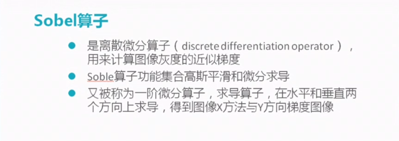
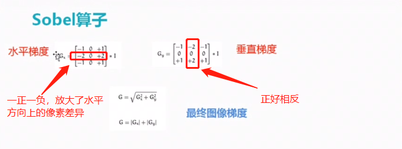
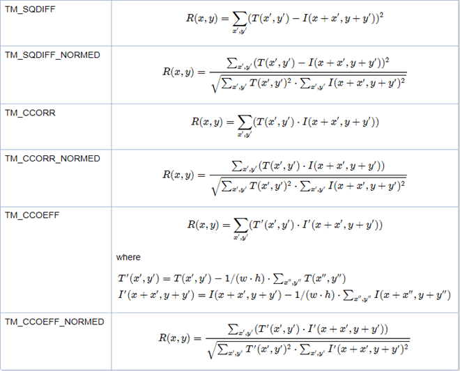

# Python&opencv知识点随手记

## python

### Python小知识

* 强制终止程序：ctrl+C
* 注释某一段：ctrl +alt + 3
* 取消注释： ctrl+alt +4

* 重复上一条命令 alt +p

python 查看已安装模块版本

例如查看已安装的pyautogui模块的版本

1. 通过pip查看所有pip安装的模块，

找到pyautogui pip list  

2. 通过模块的默认方法__version__查看

> `import pyautogui`
> `pyautogui._version`_

3. 查看模块的帮助信息

> import pyautogui
>
> help(pyautogui)

4. 更新pip

pip install  --upgrade pip  如果出错，提示没有权限的话 就用管理员身份打开cmd(千万不能加user)


### shape函数：

> import numpy
> array1 = numpy.tile(1,(3,2))
> array1
> array([[1, 1],
>        [1, 1],
>        [1, 1]])
> array1.shape
> (3, 2)
> array1.shape[0]       #shape[0]表示第一维的长度
> 3
> array1.shape[1]        #shape[1]表示第二维的长度
> 2

 shape[0]表示最第一维（外围）的数组的维数，shape[1]表示次外围的数组的维数，数字不断增大，维数由外到内

对于一个三通道的图片image.shape()  将返回（h,w,3）即图片 list tupe 等等  本质上是一个数组  其shape 函数返回的是

该数组的维数 >>几行几列还有 第三个方向上的维数（对于三通道来说就是3）

shape是numpy生成的数组带有的方法 我们可以用(h,w) = np.array(img).shape[0:2]获得一个image的行列


### for在列表生成中的应用

> `boundingBoxes=[cv2.boundingRect(c)  for c in cnts]#用最小的一个矩形把找到的形状包起来x,y,h,w`

### zip 函数  

它用于将可迭代对象的每一项打包成元组，然后返回包含这些元组的可迭代对象

> 1. \>>> a = [1, 2, 3]
> 2. \>>> b = [4, 5, 6]
> 3. \>>> list(zip(a, b))
> 4. [(1, 4), (2, 5), (3, 6)]
> 5. \>>> c = [1, 2, 1, 2, 3]
> 6. \>>> list(zip(a, b, c))     # zip 对象元素个数与最短的列表一致
> 7. [(1, 4, 1), (2, 5, 2), (3, 6, 1)]
> 8. \>>> a, b = zip(*zip(a, b))     # 解压 zip 对象
> 9. \>>> a
> 10. (1, 2, 3)
> 11. \>>> b
> 12. (4, 5, 6)

### sorted函数

`(cnts,boundingBoxes)=zip(*sorted(zip(cnts,boundingBoxes),key=lambda b:b[1][ 0 ],reverse=reverse))`

`x[1][0]`表示**元组**里的第二个元素的第一个数据，也就是boundingBoxes的第一个元素，即边界最小矩形的x；所以这句命令的意思就是按照最小边界的x值进行排序 

### list 切片操作

格式：list [start : end : step] 

> L = [1,2,3,4,5,6,7,8,9]
> print L[:3]
> print L[::2]
> print L[:]
>
> [1, 2, 3]
> [1, 3, 5, 7, 9]
> [1, 2, 3, 4, 5, 6, 7, 8, 9]

第一种，省略起始点，表示从0-3，不包含下标3，即[1,2,3] 
第二种，加入步长，每隔两个取一个，即[1,3,,5,7,9] 
第三种，省略起始点和结束点，取所有，即复制了一个新list,[1, 2, 3, 4, 5, 6, 7, 8, 9]

这种操作对tuple同样适合。

* ### .astype("uint8")改变数组类型

> `gradx = gradx.astype("uint8")#转化为8位无符号整形`

### D.items()

可用来遍历字典元素

> for a,b in a.items():
> print (a)
> print (b)

其中 a为字典“：”左边的键  b为右边的键值

### join()

语法： ‘sep’.join(seq)

参数说明： 
sep：分隔符。可以为空 
seq：要连接的元素序列、字符串、元组、字典

就是将数组里面的元素以什么符号隔开

>a="abcd"
>",".join(a)
>'a,b,c,d'

>"|".join(['a','b','c'])
>'a|b|c'

>",".join(('a','b','c'))
>'a,b,c'

### str.format()

- 替换字段形式： `{}`
- 注意：花括号个数可以少于位置参数的个数，反之不然。

> #### 省略字段名传递位置参数
>
> print('我叫{}，今年{}岁。'.format('小明', 18))
> """
> 我叫小明，今年18岁。
> """
>
> #### 花括号个数可以少于位置参数的个数
>
> print('我爱吃{}和{}。'.format('香蕉', '苹果', '大鸭梨'))
> """
> 我爱吃香蕉和苹果。
> """
>
> #### 花括号个数多于位置参数的个数则会报错
>
> print('我还吃{}和{}。'.format('西红柿'))
>
> """
> IndexError: tuple index out of range
> """
>

## opencv

* top_hat操作能够突出明亮区域 过滤掉无用背景

* 索贝儿算子soble 用于边缘检测

* opencv 文件读取路径不能有中文

* r"文件路径"为绝对路径

### cv2.threshold()

  函数的作用是将一幅灰度图二值化，基本用法如下：

  **#ret:暂时就认为是设定的thresh阈值**，mask：二值化的图像
  ret,mask = cv2.threshold(img2gray,175,255,cv2.THRESH_BINARY)
  plt.imshow(mask,cmap='gray')
  上面代码的作用是，将灰度图img2gray中灰度值小于175的点置0，灰度值大于175的点置255

* 参考文档里面的返回值是retval指的是返回的是一个矩形的参数 起始点x y 和h,w

### enumerate 迭代器用于遍历

  > ```
  > >>> for i,j in enumerate(('a','b','c')):
  >  print i,j
  > 
  > 0 a
  > 1 b
  > 2 c
  > ```
  >
  > 

### findContours()

  ref_,refCnts,hierarchy=cv2.findContours(ref.copy(),cv2.RETR_EXTERNAL,cv2.CHAIN_APPROX_SIMPLE)`

​      返回的三个参数中 ref_为输入的图片

* 对于hierarchy   它是一个四元数 是对各个轮廓顺序的一个存储

  以RETE-TREE模式为例：

  

  <https://blog.csdn.net/a380331382/article/details/64132250>

  <https://blog.csdn.net/qq_33810188/article/details/81285867>

### cv2.resize：

  > `resized = cv2.resize(roi, (512, 512), interpolation=cv2.INTER_CUBIC)`

| interpolation 选项 | 所用的插值方法                                               |
| :----------------- | ------------------------------------------------------------ |
| INTER_NEAREST      | 最近邻插值                                                   |
| INTER_LINEAR       | 双线性插值（默认设置）                                       |
| INTER_AREA         | 使用像素区域关系进行重采样。 它可能是图像抽取的首选方法，因为它会产生无云纹理的结果。 但是当图像缩放时，它类似于INTER_NEAREST方法。 |
| INTER_CUBIC        | 4x4像素邻域的双三次插值                                      |
| INTER_LANCZOS4     | 8x8像素邻域的Lanczos插值                                     |

（*tip: shape函数image.shape[0:2]返回的参数图片的（h,w）即行和列*）只能重置给定大小尺寸

### Sobel算子

用来计算灰度的近似梯度  



> gradx = cv2.Sobel(tophat, ddepth=cv2.CV_32F, dx=1, dy=0, ksize=-1)





### cv2.matchTemplate（）

> result = cv2.matchTemplate(roi, digitROI, cv2.TM_CCOEFF)

result里面保存的是各个区域匹配度的度量值

下面的那个是c++版的opencv 参数略为不同 可以参考一下：




OpenCV中常见的6种匹配算法：

1、计算平方的不同：越小越相关。TM_SQDIFF,TF_SQDIFF_NORMED

2、计算相关性：越大越相关TF_CCORR,TF_CCORR_NORMED

3、计算相关系数：越大越相关TF_CCOEFF,TF_CCOEFF_NORMED

### cv2.arcLength()

求轮廓周长：

>
> `perimeter = cv2.arcLength(cnt,True)`#求轮廓周长 ，也被称为弧长。可以使用函数cv2.arcLength() 计算得到。这个函数的第二参数可以用来指定对象的形状是闭合的（True），还是打开的（一条曲线）。

### cv2.approxPolyDP(c,0.02*peri,True)

画轮廓近似多边形：

求轮廓的近似多边形  第一个参数为输入的轮廓 第二个为精度 true 表示画出来的多边形是封闭的

### 透视变换：

**cv2.getPerspectiveTransform(rect,dst)**

获得透视变换矩阵： 只要给出原坐标 目标坐标 就能算出 中间的变换矩阵 （透视变换）

**cv2.warpPerspective(image,M,(maxWidth,maxHeight))**

进行透视变换：第一个参数为原图片  第二个为变换矩阵 第三个为变换后输出图片的大小  返回值为变换后的图片

### Harris角点检测：

**cv2.cornerHarris()**

- img： 数据类型为 float32 的入图像
- blockSize： 角点检测中指定区域的大小
- ksize： Sobel求导中使用的窗口大小
- k： 取值参数为 [0,04,0.06]

返回值为两个特征值  分别表示在XY两个方向上的自相关函数大小 


### 尺度不变特征变换SIFT算法：

得到关键点：

> sift = cv2.xfeatures2d.SIFT_create()
>
> kp = sift.detect(gray, None)

计算特征：

> kp, des = sift.compute(gray, kp)#kp为关键点  des为每个关键点的描述（特征向量）

这里有更详细的介绍:[sift算法详解](<https://blog.csdn.net/u010440456/article/details/81483145>)

局部影像特征的描述与侦测可以帮助辨识物体，SIFT 特征是基于物体上的一些局部外观的兴趣点而与影像的大小和旋转无关。对于光线、噪声、些微视角改变的容忍度也相当高。基于这些特性，它们是高度显著而且相对容易撷取，在母数庞大的特征数据库中，很容易辨识物体而且鲜有误认。

轮廓的绘制或填充。

### drawContours():

```
cv2.drawContours(image, contours, contourIdx, color[, thickness[, lineType[, hierarchy[, maxLevel[, offset]]]]]) -> image
```

**参数：**

**image** - 目标图像

**contours** - 所有的输入轮廓，每个轮廓为点矢量（a point vector）/点向量 形式，与findcontours中的返回值 contours 的列表list形式一致（具体详见代码）

**contourIdx** - 指定轮廓列表的索引 ID（将被绘制），若为负数，则所有的轮廓将会被绘制。

**color** - 绘制轮廓的颜色。

**thickness** - 绘制轮廓线条的宽度，若为负值或CV.FILLED则将填充轮廓内部区域

**lineType** - Line connectivity,（有的翻译线型，有的翻译线的连通性）

**hierarchy** - 层次结构信息，与函数findcontours()的hierarchy有关

**maxLevel** - 绘制轮廓的最高级别。若为0，则绘制指定轮廓；若为1，则绘制该轮廓和所有嵌套轮廓（nested contours）；若为2，则绘制该轮廓、嵌套轮廓（nested contours）/子轮廓和嵌套-嵌套轮廓（all the nested-to-nested contours）/孙轮廓，等等。该参数只有在层级结构时才用到。

**offset** - 按照偏移量移动所有的轮廓（点坐标）。

**返回值：**经过函数处理后的图像image

### total=countNonZero(mask)

```
total = cv2.countNonZero(mask)
```

计算图片中非0 点的个数  

