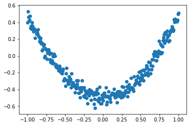

# tensorflow

## 一个小例子


```python
import tensorflow as tf
import numpy as np

# create data
x_data = np.random.rand(100).astype(np.float32)
y_data = x_data*0.1 + 0.3
pr
### create tensorflow structure start ###
Weights = tf.Variable(tf.random.uniform([1], -1.0, 1.0)) #权重
biases = tf.Variable(tf.zeros([1]))   #偏置

y = Weights*x_data + biases #预测值

loss = tf.reduce_mean(tf.square(y-y_data))#预测值与真实值的偏差
optimizer = tf.train.GradientDescentOptimizer(0.5)#使用梯度下降给最优法
train = optimizer.minimize(loss)
### create tensorflow structure end ###

sess = tf.Session()
# tf.initialize_all_variables() no long valid from
# 2017-03-02 if using tensorflow >= 0.12
if int((tf.__version__).split('.')[1]) < 12 and int((tf.__version__).split('.')[0]) < 1:
    init = tf.initialize_all_variables()# 初始化所有变量 版本低于0.2
else:
    init = tf.global_variables_initializer()# 其他版本使用初始化方法
sess.run(init) #开始执行初始化值 

for step in range(201):
    sess.run(train) #开始训练数据
    if step % 20 == 0:
        print(step, sess.run(Weights), sess.run(biases))

```

    0 [0.8153867] [-0.11029217]
    20 [0.30153248] [0.19439411]
    40 [0.15564139] [0.27084312]
    60 [0.11536213] [0.29195005]
    80 [0.10424136] [0.29777747]
    100 [0.10117102] [0.29938638]
    120 [0.10032333] [0.2998306]
    140 [0.10008927] [0.29995322]
    160 [0.10002465] [0.29998708]
    180 [0.10000681] [0.29999644]
    200 [0.10000189] [0.29999903]


## Session会话控制


```python
import tensorflow as tf
# 创建两个矩阵相乘
matrix1 = tf.constant([[3,3]])# 一行两列
matrix2 = tf.constant([[2],[2]])# 两行一列
product = tf.matmul(matrix1,matrix2) #multiply 相当于np.dot 
#method 1
sess = tf.Session() #创建一个会话session
result = sess.run(product)# 执行我们上面定义的操作
print(result)
sess.close()# 要记得把session关闭
# method 2
with tf.Session () as sess:
    result2 = sess.run(product)
    print(result2)
    


```


## Variable变量


```python
import tensorflow as tf

state = tf.Variable(0,name='counter')#创建一个用来计数的变量
#可以使用 print(state.name)访问到state的名字
one = tf.constant(1) #定义一个常量 1

new_value = tf.add(state,one)# 把one 添加到state里面
updata = tf.assign(state,new_value)#把new_value加载到state上

init = tf.global_variables_initializer()

with tf.Session() as sess:#开启一个会话
    sess.run(init)#执行初始化操作
    for _ in range(3):# __做变量名代表不需这个值 只读不写
        sess.run(updata)#执行更新操作
        print(sess.run(state))# sess 是一个指针 只有run一下state 才能出来state的结果


```

    1
    2
    3


## placeholder 传入值


```python
input1 = tf.placeholder(tf.float32)# 也可以在参数中加上[2,2]定义输入值的结构二行二列
input2 = tf.placeholder(tf.float32)
output = tf.multiply(input1,input2)

with tf.Session() as sess:
    print(sess.run(output,feed_dict={input1:[7.],input2:[2.]}))#要以字典的形式传入输入值
```

    [14.]


## activation funtion激励函数

tf.nn.elu

tf.nn.softplus

tf.nn.softsign

tf.nn.dropout

##  建造一个神经网络


```python
import tensorflow as tf
import numpy as np
import matplotlib.pyplot as plt
#添加层 add_layer
def add_layer(inputs,in_size,out_size,activation_function=None):
    Weights = tf.Variable(tf.random_normal([in_size,out_size]))# 矩阵 大小为输入值size 行 输出值size 列
    biases = tf.Variable(tf.zeros([1,out_size])+0.1)#一般偏置项不为0 所以给初始值0.11
    Wx_plus_b = tf.matmul(inputs,Weights)+ biases#预测值 还没有被激活的值存储在则会个变量里面
    if activation_function is None:
        outputs = Wx_plus_b# 当af为None的时候 保持现状 即一个线性的激活函数
    else:
        outputs = activation_function(Wx_plus_b)# 如果af不为None 就把当前值传入已有的激活函数
    return outputs
#make up some real data
x_data = np.linspace(-1,1,300)[:,np.newaxis]#添加一个维度 300行的数据 一列
noise = np.random.normal(0,0.05,x_data.shape)#添加一个噪点 使数据更真实
y_data = np.square(x_data)- 0.5+ noise

#define placeholder for inputs to network
xs = tf.placeholder(tf.float32,[None,1])#None表示输入的个数不限
ys = tf.placeholder(tf.float32,[None,1])
#add hidden layer
l1 = add_layer(xs,1,10,activation_function=tf.nn.relu)
#add output layer
prediction = add_layer(l1,10,1,activation_function=None)
#the error between prediction and real data
# 求的是均方误差
loss = tf.reduce_mean(tf.reduce_sum(tf.square(ys-prediction),reduction_indices=[1]))
train_step = tf.train.GradientDescentOptimizer(0.1).minimize(loss)
#important step
inint = tf.global_variables_initializer()
sess = tf.Session()
sess.run(inint)
#plot the real data
fig = plt.figure()
ax = fig.add_subplot(1,1,1)
ax.scatter(x_data,y_data)
# show()函数会把图片显示后 让程序暂停  如果不想让程序暂停 可以加上ion（）函数
plt.ion()
plt.show()
for i in range(1000):
    # start training
    sess.run(train_step,feed_dict={xs:x_data,ys:y_data})
    if i%50==0:
        #to see the step improvement
        #print(sess.run(loss,feed_dict={xs:x_data,ys:y_data}))
        # to visualize the result and improvement
        try:
            ax.lines.remove(lines[0])
        except Exception:
            pass
        #plot the prediction
        prediction_value = sess.run(prediction,feed_dict={xs:x_data})
        lines = ax.plot(x_data,prediction_value,'r-',lw=5)
        plt.pause(0.1)

```





## 优化器 optimizer

新手的话用GradientDescentOptimizer 就足够了

## tensorboard 可视化助手

### 例子1


```python
import tensorflow as tf
def add_layer(inputs, in_size, out_size, activation_function=None):
    # add one more layer and return the output of this layer
    with tf.name_scope('layer'):
        with tf.name_scope('weights'):
            Weights = tf.Variable(tf.random_normal([in_size, out_size]), name='W')
        with tf.name_scope('biases'):
            biases = tf.Variable(tf.zeros([1, out_size]) + 0.1, name='b')
        with tf.name_scope('Wx_plus_b'):
            Wx_plus_b = tf.add(tf.matmul(inputs, Weights), biases)
        if activation_function is None:
            outputs = Wx_plus_b
        else:
            outputs = activation_function(Wx_plus_b, )
        return outputs


# define placeholder for inputs to network
with tf.name_scope('inputs'):
    xs = tf.placeholder(tf.float32, [None, 1], name='x_input')
    ys = tf.placeholder(tf.float32, [None, 1], name='y_input')

# add hidden layer
l1 = add_layer(xs, 1, 10, activation_function=tf.nn.relu)
# add output layer
prediction = add_layer(l1, 10, 1, activation_function=None)

# the error between prediciton and real data
with tf.name_scope('loss'):
    loss = tf.reduce_mean(tf.reduce_sum(tf.square(ys - prediction),
                                        reduction_indices=[1]))

with tf.name_scope('train'):
    train_step = tf.train.GradientDescentOptimizer(0.1).minimize(loss)

sess = tf.Session()

# tf.train.SummaryWriter soon be deprecated, use following
if int((tf.__version__).split('.')[1]) < 12 and int((tf.__version__).split('.')[0]) < 1:  # tensorflow version < 0.12
    writer = tf.train.SummaryWriter('logs/', sess.graph)
else: # tensorflow version >= 0.12
    writer = tf.summary.FileWriter("logs/", sess.graph)

# tf.initialize_all_variables() no long valid from
# 2017-03-02 if using tensorflow >= 0.12
if int((tf.__version__).split('.')[1]) < 12 and int((tf.__version__).split('.')[0]) < 1:
    init = tf.initialize_all_variables()
else:
    init = tf.global_variables_initializer()
sess.run(init)

# direct to the local dir and run this in terminal:
# $ tensorboard --logdir=logs
```

### 例子二


```python
import tensorflow as tf
import numpy as np


def add_layer(inputs, in_size, out_size, n_layer, activation_function=None):
    # add one more layer and return the output of this layer
    layer_name = 'layer%s' % n_layer
    with tf.name_scope(layer_name):
        with tf.name_scope('weights'):
            Weights = tf.Variable(tf.random_normal([in_size, out_size]), name='W')
            tf.summary.histogram(layer_name + '/weights', Weights)
        with tf.name_scope('biases'):
            biases = tf.Variable(tf.zeros([1, out_size]) + 0.1, name='b')
            tf.summary.histogram(layer_name + '/biases', biases)
        with tf.name_scope('Wx_plus_b'):
            Wx_plus_b = tf.add(tf.matmul(inputs, Weights), biases)
        if activation_function is None:
            outputs = Wx_plus_b
        else:
            outputs = activation_function(Wx_plus_b, )
        tf.summary.histogram(layer_name + '/outputs', outputs)
    return outputs


# Make up some real data
x_data = np.linspace(-1, 1, 300)[:, np.newaxis]
noise = np.random.normal(0, 0.05, x_data.shape)
y_data = np.square(x_data) - 0.5 + noise

# define placeholder for inputs to network
with tf.name_scope('inputs'):
    xs = tf.placeholder(tf.float32, [None, 1], name='x_input')
    ys = tf.placeholder(tf.float32, [None, 1], name='y_input')

# add hidden layer
l1 = add_layer(xs, 1, 10, n_layer=1, activation_function=tf.nn.relu)
# add output layer
prediction = add_layer(l1, 10, 1, n_layer=2, activation_function=None)

# the error between prediciton and real data
with tf.name_scope('loss'):
    loss = tf.reduce_mean(tf.reduce_sum(tf.square(ys - prediction),
                                        reduction_indices=[1]))
    tf.summary.scalar('loss', loss)

with tf.name_scope('train'):
    train_step = tf.train.GradientDescentOptimizer(0.1).minimize(loss)

sess = tf.Session()
merged = tf.summary.merge_all()

writer = tf.summary.FileWriter("logs/", sess.graph)

init = tf.global_variables_initializer()
sess.run(init)

for i in range(1000):
    sess.run(train_step, feed_dict={xs: x_data, ys: y_data})
    if i % 50 == 0:
        result = sess.run(merged,
                          feed_dict={xs: x_data, ys: y_data})
        writer.add_summary(result, i)

# direct to the local dir and run this in terminal:
# $ tensorboard --logdir logs
```

## Classification分类学习


```python
import tensorflow as tf
from tensorflow.examples.tutorials.mnist import input_data
# number 1 to 10 data
#下面这行代码作用是如果没有下载数据集的话 会自动下载
mnist = input_data.read_data_sets('MNIST_data', one_hot=True)

def add_layer(inputs, in_size, out_size, activation_function=None,):
    # add one more layer and return the output of this layer
    Weights = tf.Variable(tf.random_normal([in_size, out_size]))
    biases = tf.Variable(tf.zeros([1, out_size]) + 0.1,)
    Wx_plus_b = tf.matmul(inputs, Weights) + biases
    if activation_function is None:
        outputs = Wx_plus_b
    else:
        outputs = activation_function(Wx_plus_b,)
    return outputs

def compute_accuracy(v_xs, v_ys):
    global prediction
    y_pre = sess.run(prediction, feed_dict={xs: v_xs})
    correct_prediction = tf.equal(tf.argmax(y_pre,1), tf.argmax(v_ys,1))
    accuracy = tf.reduce_mean(tf.cast(correct_prediction, tf.float32))
    result = sess.run(accuracy, feed_dict={xs: v_xs, ys: v_ys})
    return result

# define placeholder for inputs to network
xs = tf.placeholder(tf.float32, [None, 784]) # 28x28
ys = tf.placeholder(tf.float32, [None, 10])

# add output layer softmax一般是用来做分类的
prediction = add_layer(xs, 784, 10,  activation_function=tf.nn.softmax)

# the error between prediction and real data
cross_entropy = tf.reduce_mean(-tf.reduce_sum(ys * tf.log(prediction),
                                              reduction_indices=[1]))       # loss
train_step = tf.train.GradientDescentOptimizer(0.5).minimize(cross_entropy)

sess = tf.Session()
# important step
# tf.initialize_all_variables() no long valid from
# 2017-03-02 if using tensorflow >= 0.12
if int((tf.__version__).split('.')[1]) < 12 and int((tf.__version__).split('.')[0]) < 1:
    init = tf.initialize_all_variables()
else:
    init = tf.global_variables_initializer()
sess.run(init)

for i in range(1000):
    #为了提高训练效率 每次训练100个
    batch_xs, batch_ys = mnist.train.next_batch(100)
    sess.run(train_step, feed_dict={xs: batch_xs, ys: batch_ys})
    if i % 50 == 0:
        print(compute_accuracy(
            mnist.test.images, mnist.test.labels))

```

    Extracting MNIST_data\train-images-idx3-ubyte.gz
    Extracting MNIST_data\train-labels-idx1-ubyte.gz
    Extracting MNIST_data\t10k-images-idx3-ubyte.gz
    Extracting MNIST_data\t10k-labels-idx1-ubyte.gz
    0.0567
    0.6315
    0.7266
    0.7707
    0.8026
    0.8193
    0.8267
    0.8389
    0.843
    0.8457
    0.8491
    0.8543
    0.8618
    0.8602
    0.8606
    0.8634
    0.8636
    0.8673
    0.8701
    0.8721


## 卷积神经网络


```python
import tensorflow as tf
from tensorflow.examples.tutorials.mnist import input_data
# number 1 to 10 data
mnist = input_data.read_data_sets('MNIST_data', one_hot=True)
#该函数用来计算识别的精度
def compute_accuracy(v_xs, v_ys):
    global prediction
    y_pre = sess.run(prediction, feed_dict={xs: v_xs, keep_prob: 1})
    correct_prediction = tf.equal(tf.argmax(y_pre,1), tf.argmax(v_ys,1))
    accuracy = tf.reduce_mean(tf.cast(correct_prediction, tf.float32))
    result = sess.run(accuracy, feed_dict={xs: v_xs, ys: v_ys, keep_prob: 1})
    return result

def weight_variable(shape):
    initial = tf.truncated_normal(shape, stddev=0.1)#初始化
    return tf.Variable(initial)

def bias_variable(shape):
    initial = tf.constant(0.1, shape=shape)#偏置初始值一般为正值
    return tf.Variable(initial)

def conv2d(x, W):
    # stride [1, x_movement, y_movement, 1] 
    #对应featuremap，含义[batch,height,weight,channels],
    #因为卷积池化过程中不需要对batch channels进行操作 所以这两个值是1
    # Must have strides[0] = strides[3] = 1
    return tf.nn.conv2d(x, W, strides=[1, 1, 1, 1], padding='SAME')
    #padding 填充 当是SAME时在原图片外围填充一圈0 输出图片尺寸等于输入图片尺寸/stride
    #vaild时 （size-2*stride）/2+1
def max_pool_2x2(x):
    # stride [1, x_movement, y_movement, 1] 池化层 就是一个下采样 把图片放大
    return tf.nn.max_pool(x, ksize=[1,2,2,1], strides=[1,2,2,1], padding='SAME')
    #max_pool能更好的保存特征 
# define placeholder for inputs to network
xs = tf.placeholder(tf.float32, [None, 784])/255.   # 输入为28x28的图片
ys = tf.placeholder(tf.float32, [None, 10])#输出为表示0-9的值
keep_prob = tf.placeholder(tf.float32)
x_image = tf.reshape(xs, [-1, 28, 28, 1])#-1 表示不指定这一维大小 函数自己判断有多少张
# -1可以理解为导入数据有多少个图片  28*28*1表示图片的大小通道数
#和batch有所区别 batch_size是决定了一次训练取多少张图片
# print(x_image.shape)  # [n_samples, 28,28,1]

## conv1 layer ##
W_conv1 = weight_variable([5,5, 1,32]) # patch 5x5, in size 1, out size 32
#5*5 是patch的尺寸 1为本层输入的通道数 32是本层输出的depth 即本层卷积核的个数（filter的层数）
#卷积核 小区域加权平均的时候的权重由一个函数定义 这个函数称为卷积核 卷积核数目自己定义
b_conv1 = bias_variable([32])#每一个filter 都有一个bias
h_conv1 = tf.nn.relu(conv2d(x_image, W_conv1) + b_conv1) # output size 28x28x32
#relu 该激励函数使输出非线性化
h_pool1 = max_pool_2x2(h_conv1)   #步长是2  所以经过池化层之后 输出为 output size 14x14x32

## conv2 layer ##
W_conv2 = weight_variable([5,5, 32, 64]) # patch 5x5, in size 32, out size 64
b_conv2 = bias_variable([64])
h_conv2 = tf.nn.relu(conv2d(h_pool1, W_conv2) + b_conv2) # output size 14x14x64
h_pool2 = max_pool_2x2(h_conv2)                                         # output size 7x7x64

## fc1 layer ##
W_fc1 = weight_variable([7*7*64, 1024])
b_fc1 = bias_variable([1024])
# [n_samples, 7, 7, 64] ->> [n_samples, 7*7*64]
h_pool2_flat = tf.reshape(h_pool2, [-1, 7*7*64])
h_fc1 = tf.nn.relu(tf.matmul(h_pool2_flat, W_fc1) + b_fc1)
h_fc1_drop = tf.nn.dropout(h_fc1, keep_prob)# 防止过拟合

## fc2 layer ##
W_fc2 = weight_variable([1024, 10])
b_fc2 = bias_variable([10])
prediction = tf.nn.softmax(tf.matmul(h_fc1_drop, W_fc2) + b_fc2)


# the error between prediction and real data
cross_entropy = tf.reduce_mean(-tf.reduce_sum(ys * tf.log(prediction),
                                              reduction_indices=[1]))       # loss
train_step = tf.train.AdamOptimizer(1e-4).minimize(cross_entropy)

sess = tf.Session()
# important step
# tf.initialize_all_variables() no long valid from
# 2017-03-02 if using tensorflow >= 0.12
if int((tf.__version__).split('.')[1]) < 12 and int((tf.__version__).split('.')[0]) < 1:
    init = tf.initialize_all_variables()
else:
    init = tf.global_variables_initializer()
sess.run(init)

for i in range(1000):
    batch_xs, batch_ys = mnist.train.next_batch(100)
    sess.run(train_step, feed_dict={xs: batch_xs, ys: batch_ys, keep_prob: 0.5})
    if i % 50 == 0:
        print(compute_accuracy(
            mnist.test.images[:1000], mnist.test.labels[:1000]))


```

    Extracting MNIST_data\train-images-idx3-ubyte.gz
    Extracting MNIST_data\train-labels-idx1-ubyte.gz
    Extracting MNIST_data\t10k-images-idx3-ubyte.gz
    Extracting MNIST_data\t10k-labels-idx1-ubyte.gz
    0.077
    0.761
    0.867
    0.902
    0.913
    0.922
    0.934
    0.938
    0.939
    0.952
    0.958
    0.949
    0.958
    0.966
    0.963
    0.968
    0.969
    0.967
    0.972
    0.973


## Saver 保存读取

### 保存


```python
import tensorflow as tf
import numpy as np
#Save to file
#remember to define the same dtype and shape when restore
W = tf.Variable([[1,2,3],[3,4,5]], dtype=tf.float32, name='weights')
b = tf.Variable([[1,2,3]], dtype=tf.float32, name='biases')

if int((tf.__version__).split('.')[1]) < 12 and int((tf.__version__).split('.')[0]) < 1:
    init = tf.initialize_all_variables()
else:
    init = tf.global_variables_initializer()

saver = tf.train.Saver()

with tf.Session() as sess:
    sess.run(init)
    save_path = saver.save(sess, "my_net/save_net.ckpt")
    print('save to path',save_path)
```

    save to path my_net/save_net.ckpt


### 读取


```python
import tensorflow as tf
import numpy as np
#restore variables
# redefine the same shape and same type for your variables
tf.reset_default_graph()# Clears the default graph stack and resets the global default graph
W = tf.Variable(np.arange(6).reshape((2, 3)), dtype=tf.float32, name="weights")
b = tf.Variable(np.arange(3).reshape((1, 3)), dtype=tf.float32, name="biases")

# not need init step

saver = tf.train.Saver()
with tf.Session() as sess:
    saver.restore(sess, "my_net/save_net.ckpt")
    print("weights:", sess.run(W))
    print("biases:", sess.run(b))
```

    INFO:tensorflow:Restoring parameters from my_net/save_net.ckpt
    weights: [[1. 2. 3.]
     [3. 4. 5.]]
    biases: [[1. 2. 3.]]

## 语法入门：


