# python常用库

## pandas

### 生成数据

（生成的数据data类似于excle 有行标签 index 有列标签 columns ）

```python
import pandas as pd
import numpy as np
s = pd.Series([1,3,6,np.nan,4,1]) #生成一维数组
```

> 0    1.0
> 1    3.0
> 2    6.0
> 3    NaN
> 4    4.0
> 5    1.0
> dtype: float64

```python
dates = pd.date_range('20160101', periods=6)#index
df = pd.DataFrame(np.random.randn(6,4), index=dates, columns=['A','B','C','D'])# 生成6*4的数据
print(df)
```

> ​                             A         B         C         D
> 2016-01-01  0.766013  0.709325 -0.177668  1.955910
> 2016-01-02 -0.458004 -1.522308  0.396516  1.358957
> 2016-01-03 -1.421787  0.978309  0.677042  1.498006
> 2016-01-04  0.028752 -1.021694  1.245495 -0.316957
> 2016-01-05  1.972788 -1.803018 -0.110645 -0.635439
> 2016-01-06 -0.265201 -0.310657  0.262895  1.532657

### 选择部分数据输出

```python
print(df['A'])#    与 df.A 效果相同 按列标签输出
```

> 2013-01-01   -0.162028
> 2013-01-02   -0.247155
> 2013-01-03   -1.544164
> 2013-01-04   -1.194200
> 2013-01-05    2.173732
> 2013-01-06   -0.501831
> Freq: D, Name: A, dtype: float64

```python
print(df['20130102':'20130104']) # 根据index范围输出 若print(df['A':'C'])则会报错
```

> A         B         C         D
> 2013-01-02 -0.247155 -1.664754  2.044796 -1.647486
> 2013-01-03 -1.544164 -0.278302 -0.910734 -1.471865
> 2013-01-04 -1.194200 -1.295544 -0.522822  0.416136

```python
# select by label: loc 通过 x y 的label 进行选择输出
print(df.loc['20130102'])
print(df.loc[:,['A','B']])
print(df.loc['20130102', ['A','B']])
```

> A   -0.247155
> B   -1.664754
> C    2.044796
> D   -1.647486
> Name: 2013-01-02 00:00:00, dtype: float64
>                    A         B
> 2013-01-01 -0.162028 -1.209992
> 2013-01-02 -0.247155 -1.664754
> 2013-01-03 -1.544164 -0.278302
> 2013-01-04 -1.194200 -1.295544
> 2013-01-05  2.173732  0.422870
> 2013-01-06 -0.501831  0.392393
> A   -0.247155
> B   -1.664754
> Name: 2013-01-02 00:00:00, dtype: float64

```python
# select by position: iloc 通过位置选择 即通过坐标选择（或范围）
print(df.iloc[3])
print(df.iloc[3, 1])
print(df.iloc[3:5,0:2])
print(df.iloc[[1,2,4],[0,2]])
```

> A   -1.194200
> B   -1.295544
> C   -0.522822
> D    0.416136
> Name: 2013-01-04 00:00:00, dtype: float64
> -1.2955436468567092
>                    A         B
> 2013-01-04 -1.194200 -1.295544
> 2013-01-05  2.173732  0.422870
>                    A         C
> 2013-01-02 -0.247155  2.044796
> 2013-01-03 -1.544164 -0.910734
> 2013-01-05  2.173732 -0.665288
>
> 

```python
# mixed selection: ix  混合选择 即通过label 和坐标 进行选择

print(df.ix[:3, ['A', 'C']])

# Boolean indexing     逻辑选择 可以加入一些逻辑判断进行选择

print(df[df.A > 0])
```

> ​                    A         C
> 2013-01-01 -0.162028 -1.259382
> 2013-01-02 -0.247155  2.044796
> 2013-01-03 -1.544164 -0.910734
> ​                          A        B         C         D
> 2013-01-05  2.173732  0.42287 -0.665288 -0.585846
>
> 

### 设置value

```python
#与上述差不多 还是确定要改变的数据位置即可
df.iloc[2,2] = 1111# 通过坐标位置改变
df.loc['2013-01-03', 'D'] = 2222 #通过标签确定位置 改变
df.A[df.A>0] = 0 #通过逻辑判断筛选改变
df['F'] = np.nan #通过标签改变
df['G']  = pd.Series([1,2,3,4,5,6], index=pd.date_range('20130101', periods=6))# 666
print(df)
```

> ```
>                   A         B            C            D   F  G
> 2013-01-01  0.000000 -0.132451     0.021797    -1.656566 NaN  1
> 2013-01-02 -0.182227 -0.656873    -0.633688     1.143701 NaN  2
> 2013-01-03  0.000000 -0.330042  1111.000000  2222.000000 NaN  3
> 2013-01-04 -0.664301  0.248035    -1.286524     0.879787 NaN  4
> 2013-01-05 -0.005037 -0.753467    -1.390868     0.842121 NaN  5
> 2013-01-06 -0.529367 -1.093037    -0.984761    -1.243129 NaN  6
> ```

### 去除 填充  判断Nan

```python
dates = pd.date_range('20130101', periods=6)
df = pd.DataFrame(np.arange(24).reshape((6,4)), index=dates, columns=['A', 'B', 'C', 'D'])
# 先生成几个nan
df.iloc[0,1] = np.nan
df.iloc[1,2] = np.nan
df.iloc[2,:] = np.nan
print(df)
```

> ```
>  A     B     C     D
> 2013-01-01   0.0   NaN   2.0   3.0
> 2013-01-02   4.0   5.0   NaN   7.0
> 2013-01-03   NaN   NaN   NaN   NaN
> 2013-01-04  12.0  13.0  14.0  15.0
> 2013-01-05  16.0  17.0  18.0  19.0
> 2013-01-06  20.0  21.0  22.0  23.0
> ```


```python
print(df.dropna(axis=0, how='any'))   # how={'any', 'all'} 删除任何有nan的行 （axis=1则为列）
```

> ```
> A     B     C     D
> 2013-01-04  12.0  13.0  14.0  15.0
> 2013-01-05  16.0  17.0  18.0  19.0
> 2013-01-06  20.0  21.0  22.0  23.0
> ```

```python
print(df.dropna(axis=0, how='all'))   # how={'any', 'all'} 删除全为nan的行 （axis=1则为列）
```

> ```
> A     B     C     D
> 2013-01-01   0.0   NaN   2.0   3.0
> 2013-01-02   4.0   5.0   NaN   7.0
> 2013-01-04  12.0  13.0  14.0  15.0
> 2013-01-05  16.0  17.0  18.0  19.0
> 2013-01-06  20.0  21.0  22.0  23.0
> ```

```python
print(df.fillna(value=0)) #用其它值 填充 nan
```

> ```
>  A     B     C     D
> 2013-01-01   0.0   0.0   2.0   3.0
> 2013-01-02   4.0   5.0   0.0   7.0
> 2013-01-03   0.0   0.0   0.0   0.0
> 2013-01-04  12.0  13.0  14.0  15.0
> 2013-01-05  16.0  17.0  18.0  19.0
> 2013-01-06  20.0  21.0  22.0  23.0
> ```

```python
print(pd.isnull(df))  #判断是不是non
```

> ```
> A      B      C      D
> 2013-01-01  False   True  False  False
> 2013-01-02  False  False   True  False
> 2013-01-03   True   True   True   True
> 2013-01-04  False  False  False  False
> 2013-01-05  False  False  False  False
> 2013-01-06  False  False  False  False
> ```

### 合并数据 concat


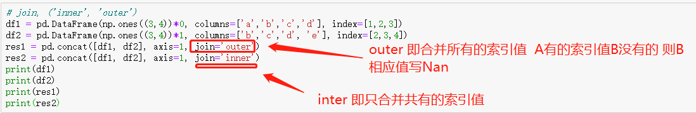

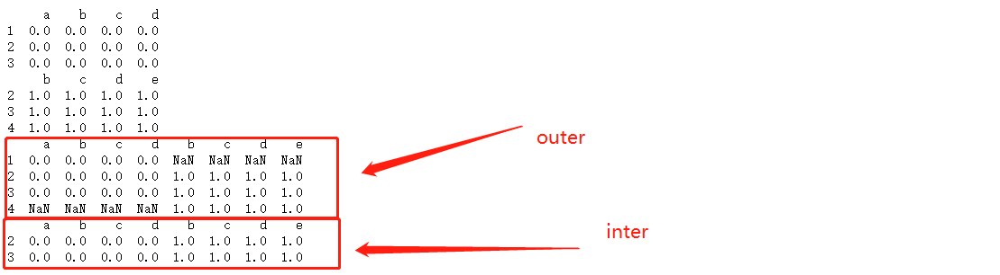


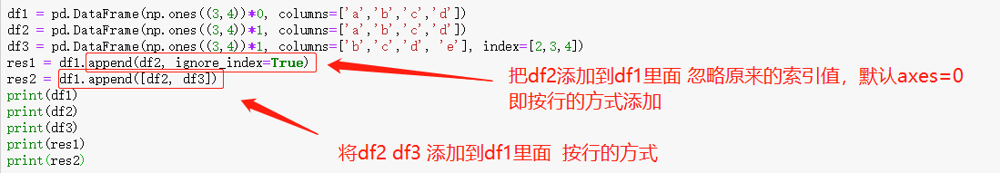

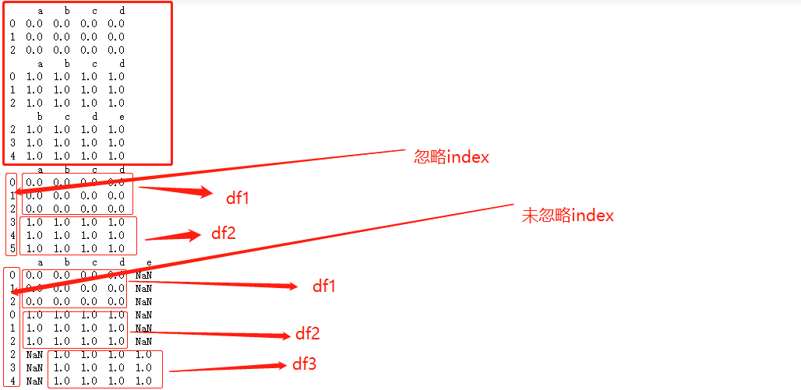


###  融合数据 merge

可根据columns列合并和根据index索引合并


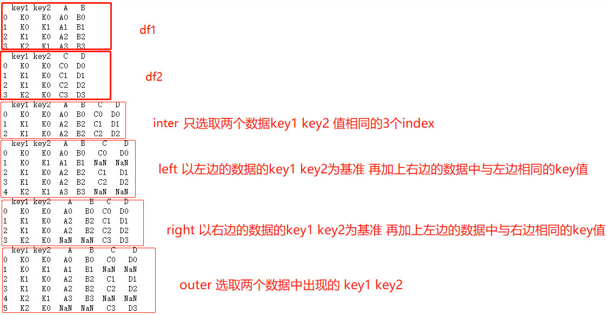


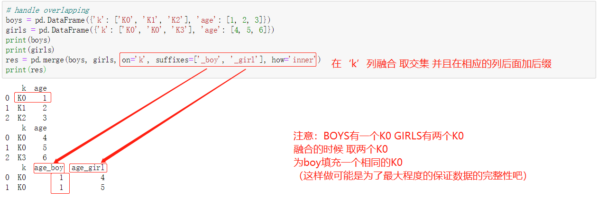

### 绘出数据plot


### 读取保存数据


### 小心得

数据 的index可以不写 默认为0 1 2 3....，但是列columns一定要写(写成字典的形式)


## numpy


## matplotlib

### 基本操作

```python
import matplotlib.pyplot as plt
import numpy as np
#基本用法
x = np.linspace(-5, 5, 50)
y = 2*x + 1
# y = x**2
plt.plot(x, y)
plt.show()
```


### 使用figure 自定义窗口以及在一个图上画多条曲线

```python
x = np.linspace(-3, 3, 50)
y1 = 2*x + 1
y2 = x**2
##使用figure 来自定义自己窗口
#第一个figure figure下面的图都在该figure上绘出  直到定义下一个figure
plt.figure()
plt.plot(x, y1)

#第二个figure num是图片的的索引
plt.figure(num=3, figsize=(8, 5),)
plt.plot(x, y2)#第一条曲线

plt.plot(x, y1, color='red', linewidth=1.0, linestyle='--')#第二条曲线
plt.show()
```


### 设置坐标轴

#### 修改坐标轴的label

```python
x = np.linspace(-3, 3, 50)
y1 = 2*x + 1
y2 = x**2

plt.figure()
plt.plot(x, y2)
# plot the second curve in this figure with certain parameters
plt.plot(x, y1, color='red', linewidth=1.0, linestyle='--')
# set x limits 设置x y的范围
plt.xlim((-1, 2))
plt.ylim((-2, 3))
plt.xlabel('I am x')# x y 的label
plt.ylabel('I am y')

# set new sticks #设置新的刻度
new_ticks = np.linspace(-1, 2, 5)
print(new_ticks)
plt.xticks(new_ticks)
# to use '$ $' for math text and nice looking, e.g. '$\pi$'
# set tick labels 设置新的label  $是为了让字体更加美观  |为转义字符  可以将alpha转为数学里面的α
plt.yticks([-2, -1.8, -1, 1.22, 3], 
           [r'$reallybad$', r'$bad\alpha$', r'$normal$', r'$good$', r'$really\ good$'])
plt.show()
```

```
[-1.   -0.25  0.5   1.25  2.  ]
```


#### 修改坐标轴的位置

```python
x = np.linspace(-3, 3, 50)
y2 = x**2
plt.figure(num=3, figsize=(8, 5),)
plt.plot(x, y2)#第一条曲线
plt.plot(x, y1, color='red', linewidth=1.0, linestyle='--')#第二条曲线


# gca = 'get current axis'
ax= plt.gca()
ax.spines['right'].set_color('none')# 将上边和右边的边框去掉
ax.spines['top'].set_color('none')
plt.show()
```

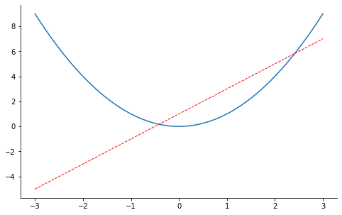


```python
x = np.linspace(-3, 3, 50)
y2 = x**2
plt.figure(num=3, figsize=(8, 5),)
plt.plot(x, y2)#第一条曲线
plt.plot(x, y1, color='red', linewidth=1.0, linestyle='--')#第二条曲线


ax= plt.gca()
ax.spines['right'].set_color('none')# 将上边和右边的边框去掉
ax.spines['top'].set_color('none')
ax.xaxis.set_ticks_position('bottom')# 把下边的那条变设置为x_axis
# ACCEPTS: [ 'top' | 'bottom' | 'both' | 'default' | 'none' ]

ax.spines['bottom'].set_position(('data', 0))# 把bottom边放在y==0的高度
# the 1st is in 'outward' | 'axes' | 'data'
# axes: percentage of y axis
# data: depend on y data

ax.yaxis.set_ticks_position('left') #把左边的那条边设为 y_axis
# ACCEPTS: [ 'left' | 'right' | 'both' | 'default' | 'none' ]

ax.spines['left'].set_position(('data',0))# 把left 放在x==0的位置
plt.show()
```

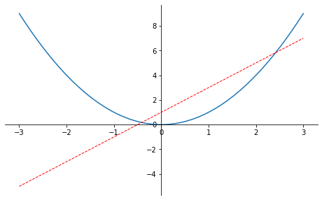

### legend 图例

```python
x = np.linspace(-3, 3, 50)
y1 = 2*x + 1
y2 = x**2

plt.figure()
# set x limits
plt.xlim((-1, 2))
plt.ylim((-2, 3))

# set new sticks
new_sticks = np.linspace(-1, 2, 5)
plt.xticks(new_sticks)
# set tick labels
plt.yticks([-2, -1.8, -1, 1.22, 3],
           [r'$really\ bad$', r'$bad$', r'$normal$', r'$good$', r'$really\ good$'])
# 设置图例
l1, = plt.plot(x, y1, label='linear line')
l2, = plt.plot(x, y2, color='red', linewidth=1.0, linestyle='--', label='square line')
#设置图例的位置
plt.legend(loc='upper right') 
#plt.legend(handles=[l1, l2], labels=['up', 'down'],  loc='best')
# the "," is very important in here l1, = plt... and l2, = plt... for this step
"""legend( handles=(line1, line2, line3),
           labels=('label1', 'label2', 'label3'),
           'upper right')
    The *loc* location codes are::

          'best' : 0,          (currently not supported for figure legends)
          'upper right'  : 1,
          'upper left'   : 2,
          'lower left'   : 3,
          'lower right'  : 4,
          'right'        : 5,
          'center left'  : 6,
          'center right' : 7,
          'lower center' : 8,
          'upper center' : 9,
          'center'       : 10,"""

plt.show()
```


### 添加注解Annotation

```python
x = np.linspace(-3, 3, 50)
y = 2*x + 1

plt.figure(num=1, figsize=(8, 5),)
plt.plot(x, y,)

ax = plt.gca()
ax.spines['right'].set_color('none')
ax.spines['top'].set_color('none')
ax.spines['top'].set_color('none')
ax.xaxis.set_ticks_position('bottom')
ax.spines['bottom'].set_position(('data', 0))
ax.yaxis.set_ticks_position('left')
ax.spines['left'].set_position(('data', 0))

x0 = 1
y0 = 2*x0 + 1
plt.plot([x0, x0,], [0, y0,], 'k--', linewidth=2.5)# 画黑色的虚线 k--表示黑色
plt.scatter([x0, ], [y0, ], s=50, color='b')# 画出该点 b 蓝色

# method 1:
#####################
plt.annotate(r'$2x+1=%s$' % y0, xy=(x0, y0), xycoords='data', xytext=(+30, -30),
             textcoords='offset points', fontsize=16,
             arrowprops=dict(arrowstyle='->', connectionstyle="arc3,rad=.2"))

# method 2:
########################
plt.text(-3.7, 3, r'$This\ is\ the\ some\ text. \mu\ \sigma_i\ \alpha_t$',
         fontdict={'size': 16, 'color': 'r'})

plt.show()
```


### tick能见度

```python
x = np.linspace(-3, 3, 50)
y = 0.1*x

plt.figure()
plt.plot(x, y, linewidth=10, zorder=1)      # set zorder for ordering the plot in plt 2.0.2 or higher
plt.ylim(-2, 2)
ax = plt.gca() #获得当前轴
ax.spines['right'].set_color('none')
ax.spines['top'].set_color('none')
ax.xaxis.set_ticks_position('bottom')
ax.spines['bottom'].set_position(('data', 0))
ax.yaxis.set_ticks_position('left')
ax.spines['left'].set_position(('data', 0))


for label in ax.get_xticklabels() + ax.get_yticklabels():
    label.set_fontsize(12)
    # set zorder for ordering the plot in plt 2.0.2 or higher
    label.set_bbox(dict(facecolor='white', edgecolor='none', alpha=0.8, zorder=2))
plt.show()
```

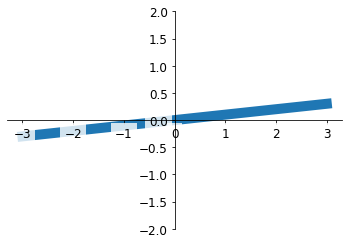

### Scatter 散点图

```python
n = 1024    # data size
X = np.random.normal(0, 1, n)
Y = np.random.normal(0, 1, n)
T = np.arctan2(Y, X)    # for color later on

plt.scatter(X, Y, s=75, c=T, alpha=.5)# s为size  c为color alpha 为透明度

plt.xlim(-1.5, 1.5)
plt.xticks(())  # ignore xticks
plt.ylim(-1.5, 1.5)
plt.yticks(())  # ignore yticks 隐藏所有的ticks

plt.show()
```


### Bar 柱状图

```python
n = 12
X = np.arange(n)#生成从0-n 12个整数
Y1 = (1 - X / float(n)) * np.random.uniform(0.5, 1.0, n)#产生n个0.5-1的数
Y2 = (1 - X / float(n)) * np.random.uniform(0.5, 1.0, n)

plt.bar(X, +Y1, facecolor='#9999ff', edgecolor='white')
plt.bar(X, -Y2, facecolor='#ff9999', edgecolor='white')

for x, y in zip(X, Y1):
    # ha: horizontal alignment
    # va: vertical alignment
    plt.text(x + 0.1, y + 0.05, '%.2f' % y, ha='center', va='bottom')

for x, y in zip(X, Y2):
    # ha: horizontal alignment
    # va: vertical alignment
    plt.text(x + 0.4, -y - 0.05, '%.2f' % y, ha='center', va='top')

plt.xlim(-.5, n)
plt.xticks(())
plt.ylim(-1.25, 1.25)
plt.yticks(())

plt.show()
```

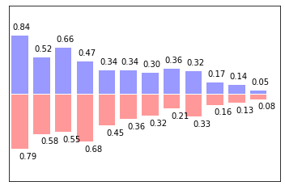

### Contours 等高线图

```python
def f(x,y):
    # the height function
    return (1 - x / 2 + x**5 + y**3) * np.exp(-x**2 -y**2)

n = 256
x = np.linspace(-3, 3, n)
y = np.linspace(-3, 3, n)
X,Y = np.meshgrid(x, y)#网格图

# 1. use plt.contourf to filling contours 填充
# X, Y and value for (X,Y) point
plt.contourf(X, Y, f(X, Y), 8, alpha=.75, cmap=plt.cm.hot)# 类型 冷热图

# 2. use plt.contour to add contour lines 画线
C = plt.contour(X, Y, f(X, Y), 8, colors='black')#8 代表等高线条数 即等高线的稀疏
# 3. adding label
plt.clabel(C, inline=True, fontsize=10)# inline 为Flase时 label将被线挡住

plt.xticks(())
plt.yticks(())
plt.show()
```

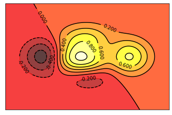

### image 图片

```python
# image data
a = np.array([0.313660827978, 0.365348418405, 0.423733120134,
              0.365348418405, 0.439599930621, 0.525083754405,
              0.423733120134, 0.525083754405, 0.651536351379]).reshape(3,3)

"""
for the value of "interpolation", check this:
http://matplotlib.org/examples/images_contours_and_fields/interpolation_methods.html
for the value of "origin"= ['upper', 'lower'], check this:
http://matplotlib.org/examples/pylab_examples/image_origin.html
"""
plt.imshow(a, interpolation='nearest', cmap='bone', origin='lower')#
plt.colorbar(shrink=.92)# 压缩为92%

plt.xticks(())# 隐藏 ticks 
plt.yticks(())
plt.show()
```

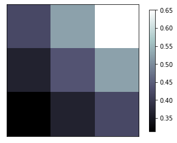

### 3D数据

```python
from mpl_toolkits.mplot3d import Axes3D

fig = plt.figure()# 建一个图片的窗口
ax = Axes3D(fig)# 给窗口添加3D维度
# X, Y value
X = np.arange(-4, 4, 0.25)
Y = np.arange(-4, 4, 0.25)
X, Y = np.meshgrid(X, Y)# 作为网格 
R = np.sqrt(X ** 2 + Y ** 2)
# height value
Z = np.sin(R)

ax.plot_surface(X, Y, Z, rstride=1, cstride=1, cmap=plt.get_cmap('rainbow'))# 1 1分别为行跨 列跨
"""
============= ================================================
        Argument      Description
        ============= ================================================
        *X*, *Y*, *Z* Data values as 2D arrays
        *rstride*     Array row stride (step size), defaults to 10 
        *cstride*     Array column stride (step size), defaults to 10
        *color*       Color of the surface patches
        *cmap*        A colormap for the surface patches.
        *facecolors*  Face colors for the individual patches
        *norm*        An instance of Normalize to map values to colors
        *vmin*        Minimum value to map
        *vmax*        Maximum value to map
        *shade*       Whether to shade the facecolors
        ============= ================================================
"""

# I think this is different from plt12_contours
ax.contourf(X, Y, Z, zdir='z', offset=-2, cmap=plt.get_cmap('rainbow'))
"""
==========  ================================================
        Argument    Description
        ==========  ================================================
        *X*, *Y*,   Data values as numpy.arrays
        *Z*
        *zdir*      The direction to use: x, y or z (default)
        *offset*    If specified plot a projection of the filled contour
                    on this position in plane normal to zdir
        ==========  ================================================
"""

ax.set_zlim(-2, 2)

plt.show()
```


### subplot 多合一显示

#### 基本方法

```python
# example 1:
###############################
plt.figure(figsize=(6, 4))
# plt.subplot(n_rows, n_cols, plot_num)
plt.subplot(2, 2, 1) #两行两列 第一张图
plt.plot([0, 1], [0, 1])

plt.subplot(222)#也可将逗号省掉 两行两列 第二张图
plt.plot([0, 1], [0, 2])

plt.subplot(223)#两行两列 第三张图
plt.plot([0, 1], [0, 3])

plt.subplot(224)#两行两列 第四张图
plt.plot([0, 1], [0, 4])

plt.tight_layout()
```


```python
# example 2:
###############################
plt.figure(figsize=(6, 4))
# plt.subplot(n_rows, n_cols, plot_num)
plt.subplot(2, 1, 1)
# figure splits into 2 rows, 1 col, plot to the 1st sub-fig
plt.plot([0, 1], [0, 1])

plt.subplot(234)
# figure splits into 2 rows, 3 col, plot to the 4th sub-fig
plt.plot([0, 1], [0, 2])

plt.subplot(235)
# figure splits into 2 rows, 3 col, plot to the 5th sub-fig
plt.plot([0, 1], [0, 3])

plt.subplot(236)
# figure splits into 2 rows, 3 col, plot to the 6th sub-fig
plt.plot([0, 1], [0, 4])


plt.tight_layout()
plt.show()
```


#### 其他方法

```python
import matplotlib.pyplot as plt
import matplotlib.gridspec as gridspec

# method 1: subplot2grid
##########################
plt.figure()
# stands for axes 三行三列 第一图从（0,0）开始 跨度为3（默认为1）
ax1 = plt.subplot2grid((3, 3), (0, 0), colspan=3)  
ax1.plot([1, 2], [1, 2])
ax1.set_title('ax1_title')# 设置title 的label
ax2 = plt.subplot2grid((3, 3), (1, 0), colspan=2)# 从（1,0）开始 列跨度为2
ax3 = plt.subplot2grid((3, 3), (1, 2), rowspan=2)#从（1,2）开始 行跨度为2
ax4 = plt.subplot2grid((3, 3), (2, 0))# 不写跨度 默认 1 1
ax4.scatter([1, 2], [2, 2])
ax4.set_xlabel('ax4_x')
ax4.set_ylabel('ax4_y')
ax5 = plt.subplot2grid((3, 3), (2, 1))


```


```python
# method 2: gridspec
#########################
plt.figure()
gs = gridspec.GridSpec(3, 3)
# use index from 0
ax6 = plt.subplot(gs[0, :])
ax7 = plt.subplot(gs[1, :2])
ax8 = plt.subplot(gs[1:, 2])
ax9 = plt.subplot(gs[-1, 0])
ax10 = plt.subplot(gs[-1, -2])


```

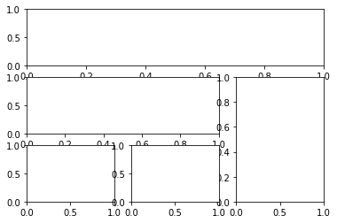


```python
# method 3: easy to define structure
####################################
f, ((ax11, ax12), (ax13, ax14)) = plt.subplots(2, 2, sharex=True, sharey=True)
ax11.scatter([1,2], [1,2])

plt.tight_layout()
plt.show()
```

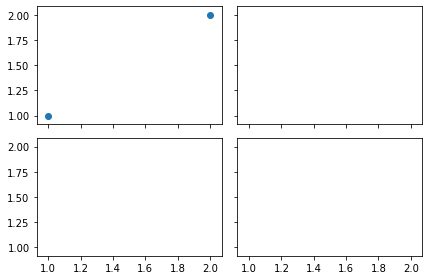

### 图中图

```python
fig = plt.figure()
x = [1, 2, 3, 4, 5, 6, 7]
y = [1, 3, 4, 2, 5, 8, 6]

# below are all percentage
left, bottom, width, height = 0.1, 0.1, 0.8, 0.8# 小图相对于figure 的位置大小 （百分比）
ax1 = fig.add_axes([left, bottom, width, height])  # main axes 第一个图
ax1.plot(x, y, 'r')
ax1.set_xlabel('x')
ax1.set_ylabel('y')
ax1.set_title('title')

ax2 = fig.add_axes([0.2, 0.6, 0.25, 0.25])  # inside axes 第二个小图
ax2.plot(y, x, 'b')
ax2.set_xlabel('x')
ax2.set_ylabel('y')
ax2.set_title('title inside 1')


# different method to add axes
####################################
plt.axes([0.6, 0.2, 0.25, 0.25])
plt.plot(y[::-1], x, 'g')
plt.xlabel('x')
plt.ylabel('y')
plt.title('title inside 2')

plt.show()
```


### 次坐标轴

```python
x = np.arange(0, 10, 0.1)
y1 = 0.05 * x**2
y2 = -1 *y1

fig, ax1 = plt.subplots()

ax2 = ax1.twinx()    # mirror the ax1 把ax1 的数据镜像
ax1.plot(x, y1, 'g-')
ax2.plot(x, y2, 'b-')

ax1.set_xlabel('X data')
ax1.set_ylabel('Y1 data', color='g')
ax2.set_ylabel('Y2 data', color='b')

plt.show()

```


### 动画

```python
from matplotlib import animation

fig, ax = plt.subplots()

x = np.arange(0, 2*np.pi, 0.01)
line, = ax.plot(x, np.sin(x))


def animate(i):
    line.set_ydata(np.sin(x + i/10.0))  # update the data
    return line,


# Init only required for blitting to give a clean slate.
def init():
    line.set_ydata(np.sin(x))
    return line,

# call the animator.  blit=True means only re-draw the parts that have changed.
# blit=True dose not work on Mac, set blit=False
# interval= update frequency
ani = animation.FuncAnimation(fig=fig, func=animate, frames=100, init_func=init,
                              interval=20, blit=False)

# save the animation as an mp4.  This requires ffmpeg or mencoder to be
# installed.  The extra_args ensure that the x264 codec is used, so that
# the video can be embedded in html5.  You may need to adjust this for
# your system: for more information, see
# http://matplotlib.sourceforge.net/api/animation_api.html
# anim.save('basic_animation.mp4', fps=30, extra_args=['-vcodec', 'libx264'])

plt.show()
```

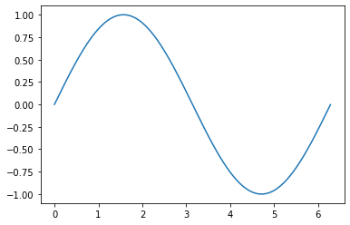


