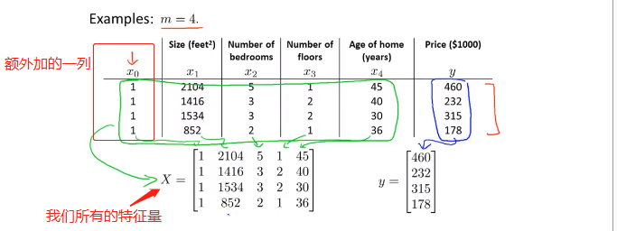
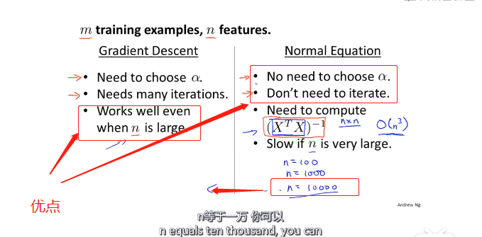
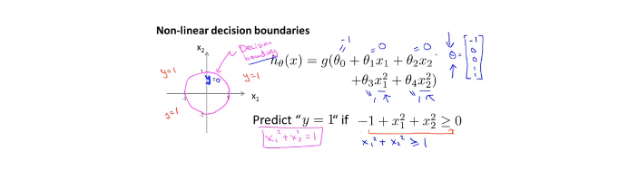

# 吴恩达机器学习笔记

## 1.3监督学习

给出正确答案，训练神经网络进行学习

## 1.4无监督学习

* 聚类算法


应用：基因分类  person1 person2 person3

facebook 通过Email可以分析出你的朋友圈   市场

找出一堆数据里面的数据结构

* 鸡尾酒会问题

混声中分离音频


## 2.1房价预测小例子

hypothesis 预测函数

cost function 代价函数（损失函数）


* 只考虑w的时候 

  右边的图是预测函数不同的斜率的时候，损失函数的值。w=1时，损失函数最小，此时预测函数最优。


* 当考虑权值w  和偏置b 的时候

这个时候，（w，b)与损失函数值J的图像是一个碗状函数。


可以用等高线表示：


### 2.5梯度下降


梯度下降公式：


α 为学习率，也就是步长。步长过大的话，损失函数可能会无法收敛或发散

随着梯度下降，越接近局部最优点，下降速度越慢（因为J(θ)的导数接近于0）

### 2.7线性回归的梯度下降

推导过程：


算法：


我们要同时更新θ0 和 θ1

batch 梯度下降：（计算每一步的梯度的时候，没有遍历整个数据集，而是按批次，只遍历了一部分子集）这样做可以提高效率。

### 3.1矩阵和向量

一般用大写字母表示矩阵

矩阵的加减乘除 很简单 没有什么可记的

矩阵的求逆 转置

### 4.1多元变量（考虑多个输入）


依旧是房价预测问题，不过这次我们有更多的因素需要考虑：这个时候就要使用矩阵了


优化方法：梯度下降法Gradient Descent 对于多元，分别对自变量求偏导即可


### 4.4多元梯度下降法

- 特征缩放:Feature Scaling


当两个参数的取值范围差别很大的时候，代价函数的等值线就会非常扁平，这个时候梯度下降的速率就会很慢，这个时候可以使用特征缩放（感觉这就是特征值归一化）如右边的图所示。


缩放方法：

Mean normalization


* 学习率


注意：这个图像的*横轴是迭代次数*，通过这条曲线可以判断代价函数是否收敛。


如果下降算法没有正常工作，可以将学习率（步长）降低，可以每隔3倍取值试一下0.001 0.003 0.01......

### 4.5特征和多项式回归

有时候，按自己的需求定义一些特征量，会得到一个更好的模型：这里是将房屋的height wide 两个特征量，用area一个特征量来表示


选择怎样的多项式去拟合数据？


对于房价，我们可以使用三次多项式，也可以使用其它合适的曲线拟合，根号函数  具体如何选择 要根据具体背景

### 4.6正规方程

对于多元的代价函数，求其最小值，可以对其偏导数都为零，解出相应的θi   ：


但是这样做过程可能会非常复杂。我们可以采用其他的方法：（额外加的一列1是偏置项）



我们可以使用下面的这个方法来计算θ


推导过程：

design matrix 设计矩阵X


使用正规方程不需要使用特征缩放

梯度法和正规方程优缺点比较：



#### 公式推导过程

**目标任务**
 %5E%7B-1%7DX%5ETy)
 其中：
 
 **具体过程：**

1. 将代价函数的向量表达式转成矩阵表达式
    %20%3D%20%5Cfrac%7B1%7D%7B2%7D(X%5Ctheta-y)%5E2) 

- X为m行n列（m个样本个数，n个特征个数）
- 为n行1列的矩阵

2. 做变换：
    %20%26%20%3D%20%5Cfrac%7B1%7D%7B2%7D%7B(X%5Ctheta-y)%7D%5ET(X%5Ctheta-y)%20%5C%5C%20%26%20%3D%20%5Cfrac%20%7B1%7D%7B2%7D%7B(%5Ctheta%5ETX%5ET-y%5ET)(X%5Ctheta-y)%7D%20%5C%5C%20%26%20%3D%20%5Cfrac%20%7B1%7D%7B2%7D%7B(%5Ctheta%5ETX%5ETX%5Ctheta-%5Ctheta%5ETX%5ETy-y%5ETX%5Ctheta%2By%5ETy)%7D%20%5Cend%7Balign%7D) 

3. 在进行求解偏导的过程中会用到的公式

    

   

4. 求导


 令上面的导数等于0，得到​θ

### 4.7正规方程不可逆的时候怎么办

XXT不可逆的时候，虽然这种情况很少发生。（即使发生，也可以用pinv求伪逆）


样本数据少，待确定参数多的时候，就会出现正规方程不可逆的情况。可删除一些无关紧要的特征量。

## 5.1Octave基本使用

和MATLAB差不多可以参考网址：

### 5.2读取数据

size（M） 可以查看矩阵M的维度

length(M) 可以查看矩阵元素的个数 

load fileNname可以读取文件

load('fileName')  也可以读取

### 5.3计算数据

加减乘除

### 5.4数据绘制

```matlab
t=[0:0.01:0.98];
y1=sin(2*pi*4*t);
plot(t,y1)
hold on
y2=cos(2*pi*4*t);
plot(t,y2)
xlabel('time')%加一些标签
ylabel('value')
legend('sin','cos')%加图标
title('my plot')%加title
```


```matlab
subplot(1,2,2)%和matplotlib差不多1*2 的窗口 中的第二个
plot(t,y1)
subplot(1,2,1)
plot(t,y2)
axis([0.5,1,-1,1])%加刻度
```


```matlab
A = magic(5)

A =

17    24     1     8    15
23     5     7    14    16
 4     6    13    20    22
10    12    19    21     3
11    18    25     2     9
%使用逗号 连续调用函数
imagesc(A),colorbar,colormap gray;%加colorbar map类型为gray
```


### 5.5控制语句

```matlab
 i=1;
while true,v(i)=999;
i=i+1;if i==6,break;
end;%结束if
end;%结束while

v

v =

  列 1 至 6
   999         999         999         999         999          64

  列 7 至 10

    128         256         512        1024
```

函数：对于预测房价中的代价函数

```matlab
function J = costFun(x,y,theta)
%COSTFUN 这是用来计算代价函数
%   x ,y theta 是x y 和权值
m=size(x,1);%样本的数目 输入有几行
predictions=x*theta;%predictions of hypothesis on all m examples
sqrErrors = (predictions-y).^2;%compute the error
J = 1/(2*m)*sum(sqrErrors);
end
```

测试一下：

```matlab
x=[1 1;1 2;1 3];%设计矩阵 输入三个x  1 2 3
y=[1;2;3];%y 1 2 3 相当于三个点（1,1） （2,2）（3,3）
theta =[0;1];%权值 0 1

j=costFun(x,y,theta)

j =

 0


```

### 5.6矢量


用c++实现：


## 6.1分类问题


将线性回归方法用于分类问题效果很差。

但是可以使用logistics Regression（逻辑回归）方法：


### 6.2 hypothesis

Logistics function 只输出两个结果，即0和1。


### 6.3decision boundary（决策边界）


非线性的决策边界：



### 6.4 cost function


如果使用线性回归里面的cost function的话，代价函数是一个非凸函数，不适合使用梯度下降法进行优化：


我们要寻找一个更适合的cost function：


对于这个代价函数的理解：如果对于一组数据，当y=1时，（表明肿瘤存在），我们的预测函数h~θ~(x)=0，即预测出来的结果是该数据是1（肿瘤存在）的几率是0，即肿瘤不存在。我们的真实值为y=1，y-h~θ~(x)=1即代表了真实值与预测值的误差（惩罚力度）。

当y=0时，cost function使用上面这个。我们的预测函数h~θ~(x)=0，即预测出来的结果是该数据是1（肿瘤存在）的几率是0，即肿瘤不存在。我们的真实值为y=0，y-h~θ~(x)=0即代表了真实值与预测值的误差（惩罚力度）。

### 6.5简化代价函数与梯度下降

将上面的Cost function简化为下面的式子：


（其实就是把原来的分段函数，写成一个函数了，更加紧凑）

next is to fit parameters θ：


### 6.6高级优化

optimization algorithm


advance algorithm：BFGS ，L-BGGS


可以使用fminunc()方法对自己函数进行优化 它的最后一个返回值exitFlag，如果为1，说明算法收敛。


### 6.7Multiclass classification（多元分类）

就是输出不止0 1 两种情况：


举个栗子：


使用了三个分类器，第一个分类器能够识别出△，第二个分类器能够识别出□，第三个分类器能够识别出×。

总结：


## 7.1过拟合问题（overfitting problem）

对于线性回归问题：


对于分类问题：


预测函数中的高阶项越多，其拟合曲线越复杂，如第三个图。

### 7.2代价函数

通过代价函数可以解决过拟合问题：


通过在代价函数里面用一个比较大的数（1000）乘以高阶项系数θ~3~，θ~4~，可以使θ~3~，θ~4~的值趋近于0，起到降阶的效果。

以上就是正则化的思想：


由于我们不知道哪些项是高阶项，所以我们在后面加上一个正则项，使所有的θ都变小。


λ如果太大，那么对θ的惩罚力度太大，就会造成拟合曲线的欠拟合。


后面将会学到怎样自动的选择λ的值。

### 7.3线性回归的正则化

以线性回归问题的优化方法为例：


我们把θ0和其他的θ分开进行处理。可以发现，加上正则项的更新函数，其实就是比正常的更新函数多了一个（1-α*λ/m),也就是把θ~j~的值降低了。


当然，使用正规方程，也要面对X^T^X不可逆的问题。但是可以证明，当λ>1时，那一坨必定可逆。


