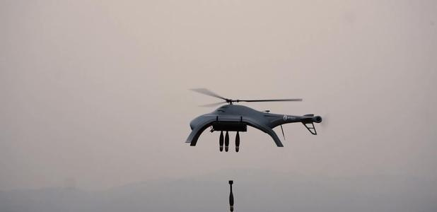
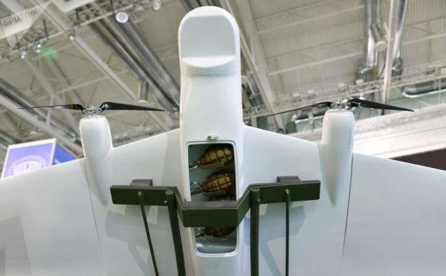
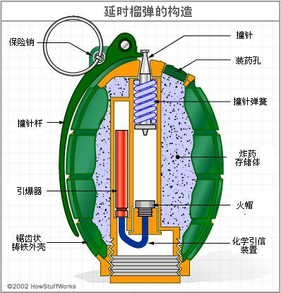

# 挂手雷

## 目前已将存在的挂弹方式：

## 手雷的结构

## :

## 需要注意的问题：

无人机保险 拉开的力大概需要9公斤 大致相当于掰断一只铅笔的力

手雷是**触碰** 还是**延时爆炸** 还是两种方式的结合 ：如果有巨大冲击 立马爆炸 如果没有 也会在4秒之后爆炸

如果手雷延时时间是 4秒  如何防止炸到无人机自己 

## 要解决的问题：

> 要实现的功能为 ：
>
> 飞行过程中保证手雷不脱落 而且保险销处于安全状态
>
> 释放的时候  保险拔出 并将手雷推出

