数值分析

先把PPT看一遍：

数值分析这门课主要讲了

1. 基础知识
2.  代数插值 
3. 数据拟合的最小二乘法 
4. 数值微分与数值积分 
5. 解线性方程组 直接法
6. 解线性方程组的迭代法
7. 非线性方程的数值解法
8. 常微分方程初值问题数值解法

## 重点考察内容

 

> **第一章 基础**
>
>   掌握：误差的种类，截断误差，舍入误差的来源，有效数字的判断。
>
>   了解：误差限，算法及要注意的问题。
>
> **第二章 插值**
>
>    掌握：Hermite插值，牛顿插值，差商计算，插值误差估计。
>
>   了解：Lagrange插值
>
> **第三章 数据拟合**
>
>    掌握：给出几个点求线性拟合曲线。
>
>   了解：最小二乘原理
>
> **第四章 数值积分微分**
>
>    掌握：梯形公式，Simpson公式，代数精度，Gauss积分，带权Gauss积分公式推导，复化梯形公式推导及算法。
>
>   了解：数值微分，积分余项
>
> **第五章 直接法**
>
>    掌握：LU分解求线性方程组，运算量
>
>   了解：Gauss消去法，LDL，追赶法
>
> **第六章 迭代法**
>
>    掌握：Jacobi,Gauss-Seidel迭代格式构造，敛散性分析，向量、矩阵的范数、谱半径
>
>   了解：SOR迭代
>
> **第七章 Nolinear迭代法**
>
>    掌握：牛顿迭代格式构造，简单迭代法构造、敛散性分析，收敛阶。
>
>   了解：二分法，弦截法
>
> **第八章 ODE解法**
>
>    掌握：Euler公式构造、收敛阶。
>
>   了解：梯形Euler公式、收敛阶，改进Euler公式
>
> 题目类型：填空，计算，证明综合题

## 第一章基础知识

> **第一章 基础**
>
> 掌握：误差的种类，截断误差，舍入误差的来源，有效数字的判断。
>
> 了解：误差限，算法及要注意的问题。

### 误差的种类：

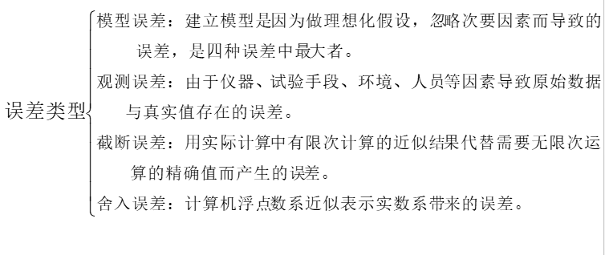

模型误差：真实值与模型计算值之差

截断误差：用有限代替无限的误差

### 数值计算基本原则：

1. 避免两个相近的数相减。 

2. 两个相差很大的数进行运算，要防止大数吃掉小数。调整运算次序可以避免这种情况发生。

3.  尽量简化计算步骤，不但可以节约解题的时间，还能减少舍入误差

4. 避免被除数的绝对值远远大于出书绝对值的除法。这样有可能导致上溢，也会增大原有的误差。

   

### 计算工具

可以将主要精力放在对问题的描述和对计算结果的分析上面，而把繁琐的算法实现和优化细节交给现成的科学计算与工程软件库来处理。

然而，在应用中要想**准确的选择及灵活使用已实现的各种算法**，必须对该算法的数学理论有透彻的了解，并根据自己的课题做取舍。这也是工科各专业研究生学习本课程的切入点和动因。

感觉这个有点用，就记一下吧。

数学软件包：

数学软件库：

交互式科学软件计算软件：

效率低，但是好学。

说的 就是matlab。

还有mathematica

### 题型：

## 第二章代数插值

> **第二章 插值**
>
> 掌握：Hermite插值，牛顿插值，差商计算，插值误差估计。
>
> 了解：Lagrange插值

### 拉格朗日插值：

直接构造法

#### 一次拉格朗日（线性）插值多项式：

#### 二次（抛物线）插值：

#### n次插值

基函数：

#### 插值余项（截断误差）

#### 做题总结：

给三个点，就用二阶插值，给四个点用三阶插值；

注意：截断误差  分母和倒数的阶数都为n+1;

### 牛顿插值

比拉格朗日更好用。

#### 原理性质

K阶差商：

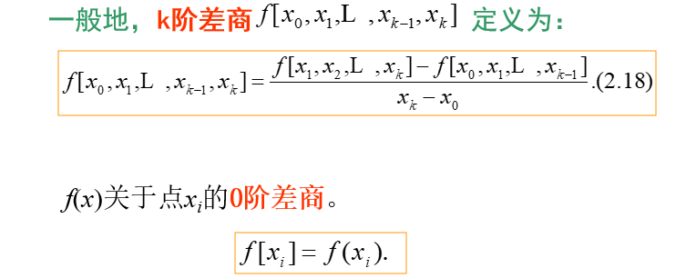

性质：

#### 差商的计算：

差商表：

#### 计算多项式：

#### 插值误差：

==注意，这里前面的相乘项，多了一个x, 后面的相乘项乘到Xn。==

插值的唯一性？？？

总结：

主要是算查商表

### 分段线性插值

荣格现象

并不是插值节点越多，逼近程度就越好。

#### 公式

插值函数为：

#### 例题：

#### 插值误差

#### 题型总结：

根据公式求出$l_0$, $li $,$ ln$,若区间为[a,b]，则$x_0$=a, $x_n$=b, $x_i$ = a + i*h,i [1 , n-1]。

### Herimite插值

优点：

要知道的多了一个节点处的==导数值==

#### 定义：

#### 算法:

每个点对应两个插值基函数：

### 题型：

## 第三章数据拟合

> **第三章 数据拟合**
>
> 掌握：给出几个点求线性拟合曲线。
>
> 了解：最小二乘原理

拟合和插值的区别在于，插值函数精确的经过每一个数据点，拟合函数按照某种度量使拟合函数的误差最小。

### 最小二乘法

函数族的选择：

也就是多项式拟合，指数拟合，对数拟合……

#### 正规方程组（法方程组）：

### 题型:

## 第四章数值微分与数值积分

> **第四章 数值积分微分**
>
> 掌握：梯形公式，Simpson公式，代数精度，Gauss积分，带权Gauss积分公式推导，复化梯形公式推导及算法。
>
> 了解：数值微分，积分余项

### 插值型求积公式

#### 梯形公式

余项（误差）：

#### Simpson公式

余项（误差）

#### 插值型求积公式

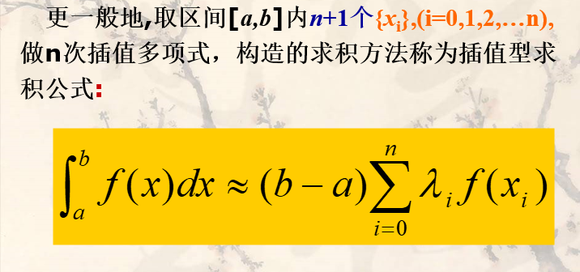

#### 代数精度

例题：

#### Cotes公式（科特斯）

### 复化求积公式

也就是我们考研的时候最熟悉的积分方法。

#### n阶复化梯形公式

##### 推导：

余项：

##### 算法：

#### n阶复化Simpson公式

#### n阶复化Cotes公式

好难啊，应该不考吧

例题：

### Gauss型积分

#### 定义

#### 正交多项式

感觉和矩阵的正交化有点类似。

#### Gauss-Legendre积分

注意，Legendre的积分区间为【-1 1】。

应该不会出更高阶的了吧

对于区间不在【-1 1】的一般积分区间上的变量：

余项：

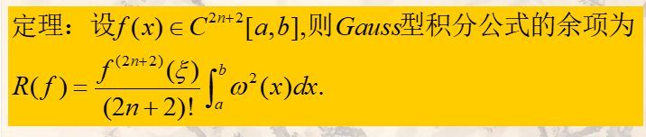

优点：

### 插商型数值微分

本节作为了解

#### 向前插商

#### 向后插商

#### 中心插商

==中心插商具有好的截断误差，但是在区间端点处不能使用。==

#### 二阶插商

误差：

### 题型

第三题，老师讲的和PPT上的解法不一样？？？

## 第五章解线性代数方程组的直接法：

> **第五章 直接法**
>
> 掌握：LU分解求线性方程组，运算量
>
> 了解：Gauss消去法，LDL，追赶法

系数矩阵： 低阶稠密（常见） 和 高阶稀疏方程组（大片零元素）。

解法：直接法，迭代法

### 高斯消去

不考计算吧

估计运算量：只估计乘除的次数。

评价：

例题:

没看懂

### 主元素高斯消去法

大概率考填空，嘿嘿

### 三角分解法（LU）

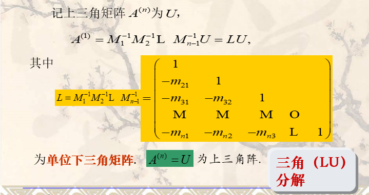

计算量与Gauss消去法同。

感觉这种东西，还是直接上题做比较好：

#### 例题

还是比较好算的

评价：

### 对称正定矩阵的平方根法

cholesky（乔利斯基）分解

评价：

### 三对角方程组的追赶法

严格对角占优矩阵

#### 计算公式

### 范数与误差分析

范数：对向量及矩阵大小的度量（多维向量）

计算：

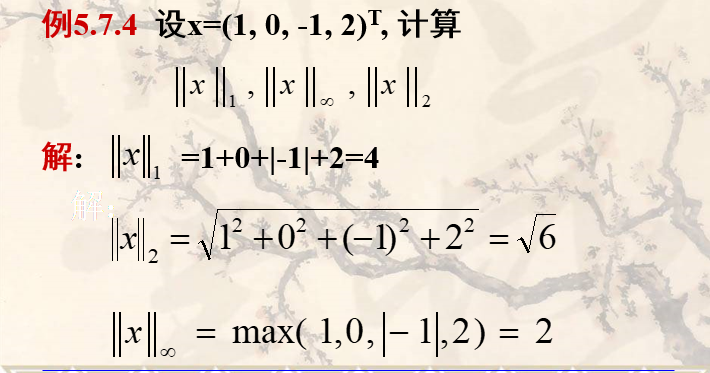

### 题型：

## 第六章解线性代数方程组的迭代法

> **第六章 迭代法**
>
> 掌握：Jacobi,Gauss-Seidel迭代格式构造，敛散性分析，向量、矩阵的范数、谱半径
>
> 了解：SOR迭代

迭代法：

从一个初始向量出发，按照一定的迭代格式，构造出一个趋向于真解的无穷序列。

稀疏矩阵不适合使用直接法。迭代法适用于解大型稀疏方程组（万阶以上，零元素多）

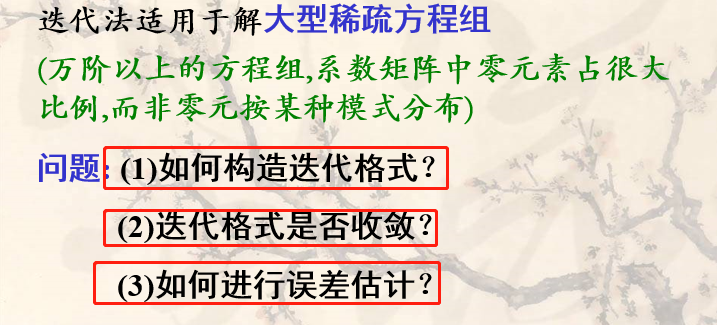

迭代式：

收敛性：

### 几种常见的迭代格式

#### 雅可比（jacobi）迭代格式

通用式：

就是简单的移项

迭代矩阵：

#### 高斯-赛德尔（Gauss-Seidel）迭代法

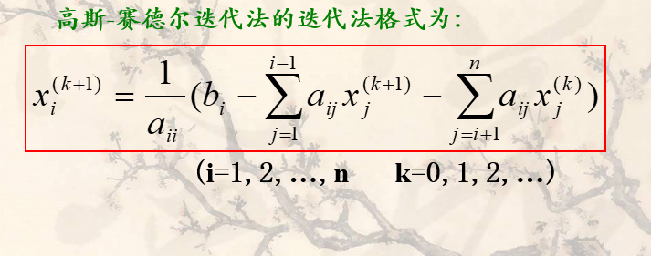

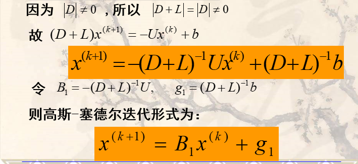

##### 例题：

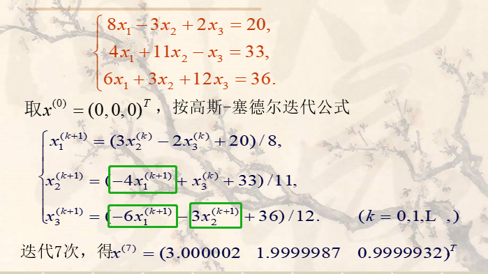

#### 超松弛迭代法（SOR方法）

基本思想：

### 迭代法的收敛性及误差估计

充分必要条件：谱半径<1即收敛。

==谱半径：矩阵的谱半径为矩阵的特征值的模的最大值；==

==关于矩阵的谱（半径）的一个重要性质即是：**任意复数域上的矩阵的谱半径不大于其任意一种诱导范数**，该性质可以用对谱半径进行近似估计。==

充分条件：

==对角占优矩阵：主对角元素的绝对值大于同行其他元素绝对值之和，且主对角元素不全为零。==

==正定矩阵：计算A的各阶主子式。若A的各阶主子式均大于零，则A是正定的；==

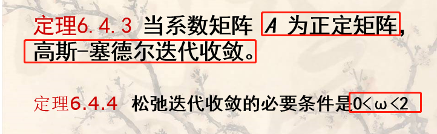

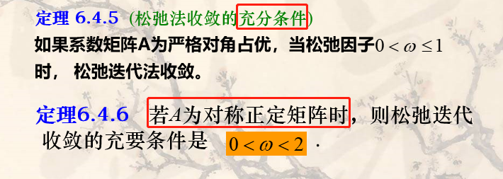

### 例题：

#### 补充知识：向量，矩阵的范数

2. 矩阵的范数

==注意矩阵的2范数，为A^T^A的最大特征值开平方，==与谱半径不同（谱半径为A特征值绝对值的最大值）

#### 例1

B为雅可比迭代矩阵，只要迭代矩阵的任意一种范数小于1，该迭代就收敛。

判断高斯迭代：

#### 例2

#### 例3

==谱半径，即矩阵特征值绝对值的最大值==

#### 例4

## 第七章非线性方程组的数值解法

> **第七章 Nolinear迭代法**
>
> 掌握：牛顿迭代格式构造，简单迭代法构造、敛散性分析，收敛阶。
>
> 了解：二分法，弦截法

定理：

### 二分区间法

了解即可：

特点：

### 迭代法及其加速

==简单迭代==

找等价方程！！！

#### 几何意义：

#### 收敛判断

#### 例题

局部收敛性

#### 收敛阶

### 牛顿迭代法

#### 收敛性：

#### 算法评价：

### 弦截法

==多点迭代法==：必须给出两个初始近似根

##### 例题：

### 解非线性方程组的迭代解法

也是取了泰勒展开的线性部分

### 例题：

> 补充知识：
>
> 条件数是线性方程组Ax=b的解对b中的误差或不确定度的敏感性的度量。数学定义为矩阵A的条件数等于A的范数与A的逆的范数的乘积，即[cond](https://baike.baidu.com/item/cond/6618081)(A)=‖A‖·‖A的逆‖，对应矩阵的3种范数，相应地可以定义3种条件数。

## 第八章常微分方程的数值解法

> **第八章 ODE解法**
>
> 掌握：Euler公式构造、收敛阶。
>
> 了解：梯形Euler公式、收敛阶，改进Euler公式

本章主要是解决一阶常微分方程的初值问题

### 欧拉（Euler）法

#### 例题：

例1

例2

#### 收敛性

==欧拉公式是一阶收敛的==

#### 小结：

### 改进欧拉方法

### 单步法的稳定性

