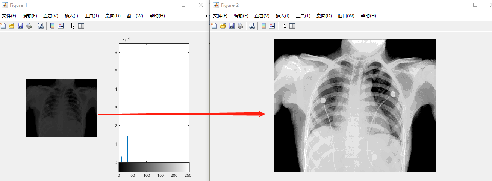
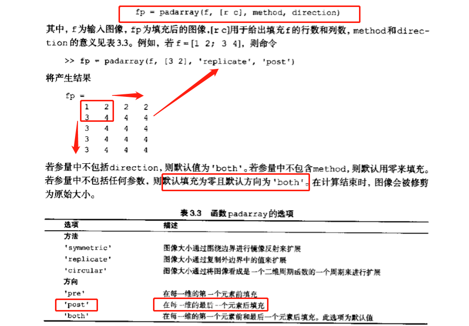
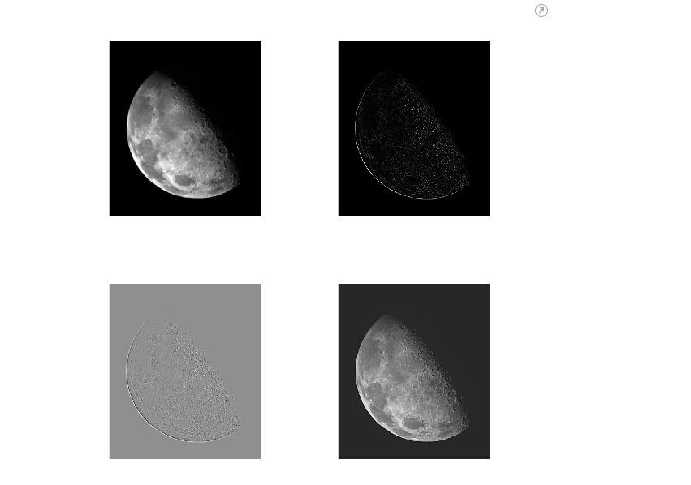
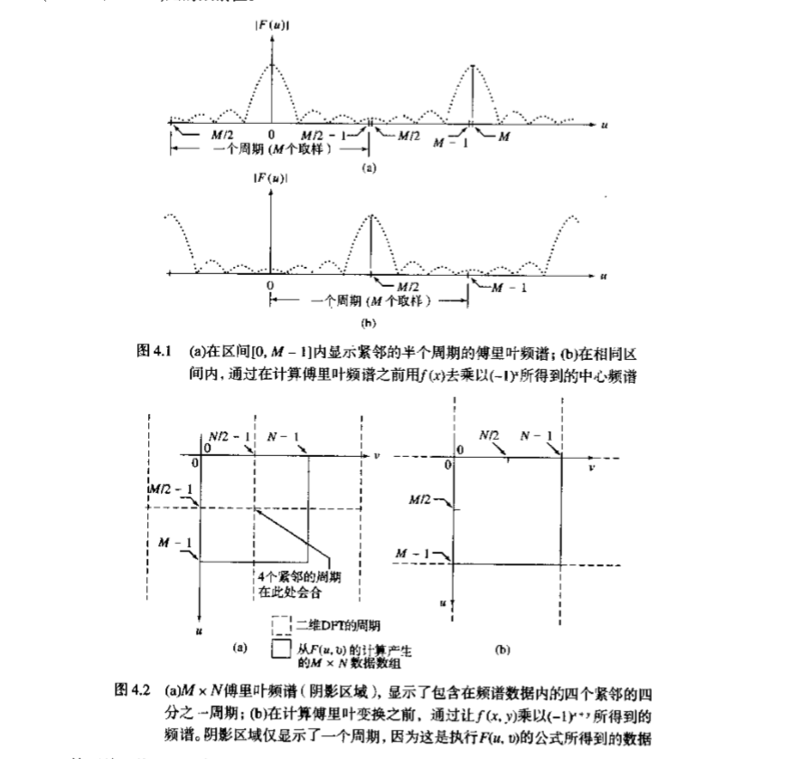
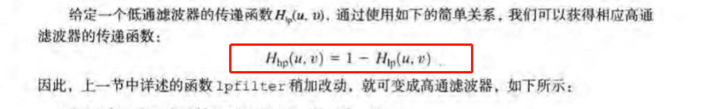
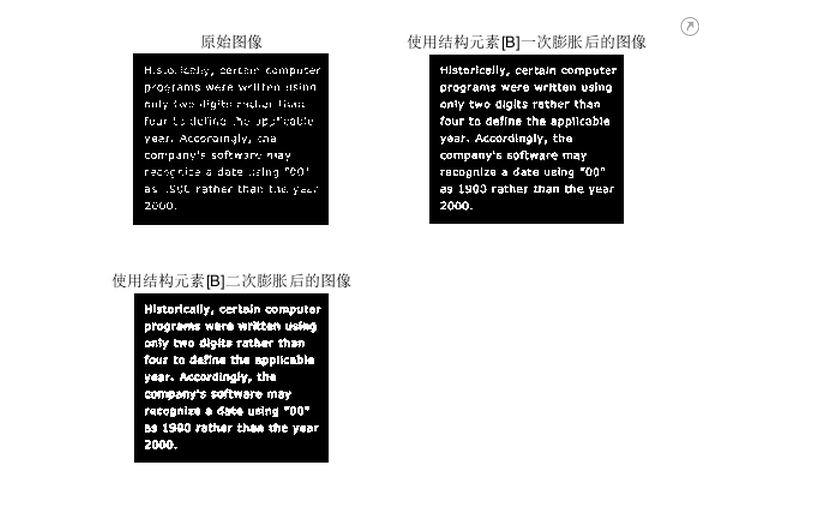
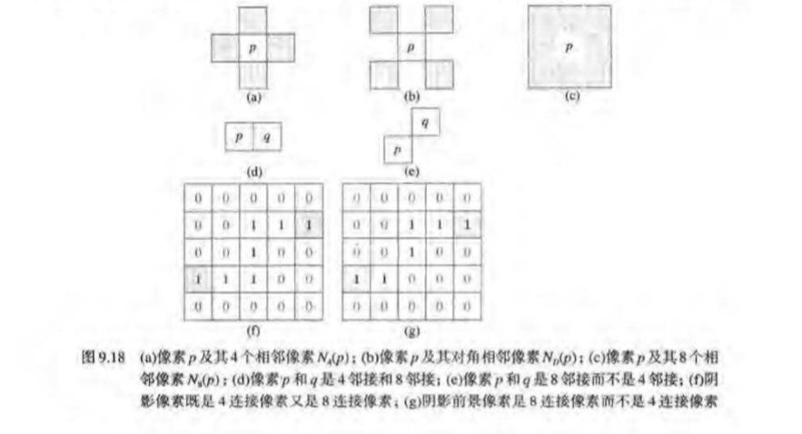
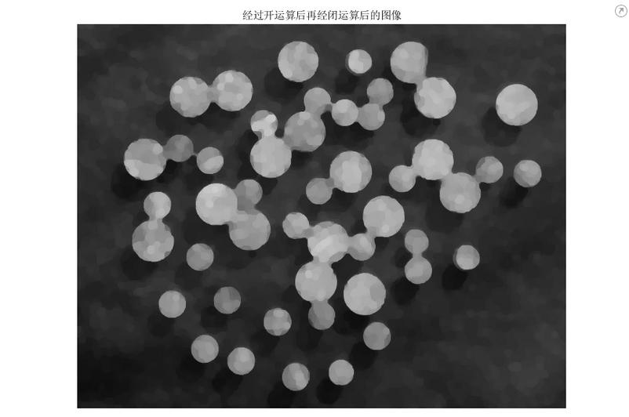
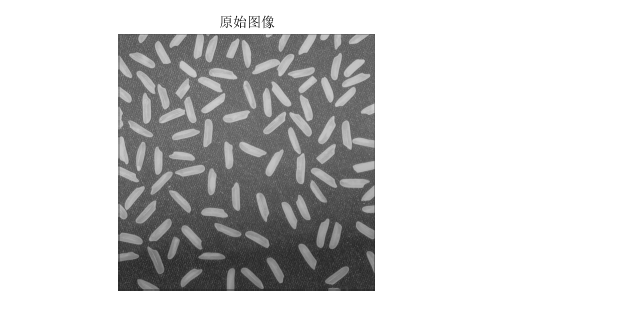
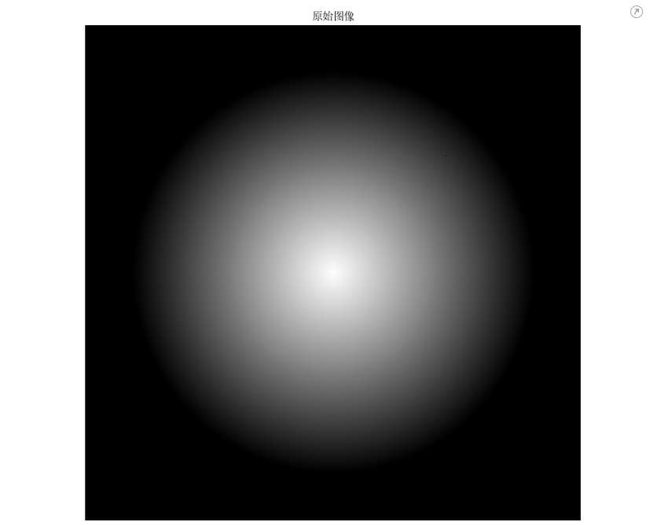

数字图像处理MATLAB（笔记）

## 扩展（MATLAB基础）

```matlab
%% Matlab基本的小常识
% (1)在每一行的语句后面加上分号(一定要是英文的哦;中文的长这个样子；)表示不显示运行结果
a = 3;
a = 5

% (2)多行注释:选中要注释的若干语句,快捷键Ctrl+R
% a = 3;
% a = 5

% (3)取消注释:选中要取消注释的语句,快捷键Ctrl+T
% 我想要取消注释下面这行
% 还有这一行

% clear可以清楚工作区的所有变量
clear

% clc可以清除命令行窗口中的所有文本,让屏幕变得干净
clc

% 所以大家在很多代码开头，都会见到:
clear;clc   % 分号也用于区分行。
% 这两条一起使用，起到“初始化”的作用，防止之前的结果对新脚本文件（后缀名是 .m）产生干扰。

%% 输出和输入函数(disp 和 input)
% disp函数
% matlab中disp()就是屏幕输出函数，类似于c语言中的printf（）函数
disp('我是清风，大家好鸭~~~记得投币关注我哦')
a = [1,2,3]    %同一行中间用逗号分隔，也可以不用逗号，直接用空格
a = [1 2 3]
disp(a) 
% 注意，disp函数比较特殊，这里可要分号，可不要分号哦
disp(a);
% matlab中两个字符串的合并有两种方法
% （1）strcat(str1,str2……,strn) 
 strcat('字符串1','字符串2') 
% （2）[str 1,str 2，……, str n]或[str1  str2  ……  strn]
['字符串1'  '字符串2']
['字符串1','字符串2']
% 一个有用的字符串函数：num2str  将数字转换为字符串
c = 100
num2str(c)
disp(['c的取值为' num2str(c)])
disp(strcat('c的取值为', num2str(c)))

% input函数
% 一般我们会将输入的数、向量、矩阵、字符串等赋给一个变量，这里我们赋给A
A = input('请输入A：');
B = input('请输入B：')
% 注意观察工作区，并体会input后面加分号和不加分号的区别

%% sum函数
% （1）如果是向量（无论是行向量还是列向量），都是直接求和
E = [1,2,3]
sum(E)
E = [1;2;3]
sum(E)
% （2）如果是矩阵，则需要根据行和列的方向作区分
clc
E = [1,2;3,4;5,6]
% a=sum(x); %按列求和(得到一个行向量）
a = sum(E)
a = sum(E,1)
% a=sum(x,2); %按行求和(得到一个列向量）
a = sum(E,2)
% a=sum(x(:));%对整个矩阵求和
a = sum(sum(E))
a = sum(E(:))

%% 基础：matlab中如何提取矩阵中指定位置的元素？
% （1）取指定行和列的一个元素（输出的是一个值）
clc;A=[1 1 4 1/3 3;1 1 4 1/3 3;1/4 1/4 1 1/3 1/2;3 3 3 1 3;1/3 1/3 2 1/3 1];
A
A(2,1)
A(3,2)
% （2）取指定的某一行的全部元素（输出的是一个行向量）
clc;A
A(2,:)
A(5,:)
% （3）取指定的某一列的全部元素（输出的是一个列向量）
clc;A
A(:,1)
A(:,3)
% （4）取指定的某些行的全部元素（输出的是一个矩阵）
clc;A
A([2,5],:)      % 只取第二行和第五行（一共2行）
A(2:5,:)        % 取第二行到第五行（一共4行）
A(2:2:5,:)     % 取第二行和第四行 （从2开始，每次递增2个单位，到5结束）
1:3:10
10:-1:1
A(2:end,:)      % 取第二行到最后一行
A(2:end-1,:)    % 取第二行到倒数第二行
% （5）取全部元素(按列拼接的，最终输出的是一个列向量)
clc;A
A(:)

%% size函数
clc;
A = [1,2,3;4,5,6]
B = [1,2,3,4,5,6]
size(A)
size(B)
% size(A)函数是用来求矩阵A的大小的,它返回一个行向量，第一个元素是矩阵的行数，第二个元素是矩阵的列数
[r,c] = size(A)
% 将矩阵A的行数返回到第一个变量r，将矩阵的列数返回到第二个变量c
r = size(A,1)  %返回行数
c = size(A,2) %返回列数

%% repmat函数
% B = repmat(A,m,n):将矩阵A复制m×n块，即把A作为B的元素，B由m×n个A平铺而成。
A = [1,2,3;4,5,6]
B = repmat(A,2,1)
B = repmat(A,3,2)

%% Matlab中矩阵的运算
% MATLAB在矩阵的运算中，“*”号和“/”号代表矩阵之间的乘法与除法(A/B = A*inv(B))
A = [1,2;3,4]
B = [1,0;1,1]
A * B
inv(B)  % 求B的逆矩阵
B * inv(B)
A * inv(B)
A / B

% 两个形状相同的矩阵对应元素之间的乘除法需要使用“.*”和“./”
A = [1,2;3,4]
B = [1,0;1,1]
A .* B
A ./ B

% 每个元素同时和常数相乘或相除操作都可以使用
A = [1,2;3,4]
A * 2
A .* 2
A / 2 
A ./ 2

% 每个元素同时乘方时只能用 .^
A = [1,2;3,4]
A .^ 2
A ^ 2 
A * A

%% Matlab中求特征值和特征向量
% 在Matlab中，计算矩阵A的特征值和特征向量的函数是eig(A),其中最常用的两个用法：
A = [1 2 3 ;2 2 1;2 0 3]
% （1）E=eig(A)：求矩阵A的全部特征值，构成向量E。
E=eig(A)
% （2）[V,D]=eig(A)：求矩阵A的全部特征值，构成对角阵D，并求A的特征向量构成V的列向量。（V的每一列都是D中与之相同列的特征值的特征向量）
[V,D]=eig(A)

%% find函数的基本用法
% 下面例子来自博客：https://www.cnblogs.com/anzhiwu815/p/5907033.html 博客内有更加深入的探究
% find函数，它可以用来返回向量或者矩阵中不为0的元素的位置索引。
clc;X = [1 0 4 -3 0 0 0 8 6]
ind = find(X)
% 其有多种用法，比如返回前2个不为0的元素的位置：
ind = find(X,2)

%上面针对的是向量（一维），若X是一个矩阵（二维，有行和列），索引该如何返回呢？
clc;X = [1 -3 0;0 0 8;4 0 6]
ind = find(X)
% 这是因为在Matlab在存储矩阵时，是一列一列存储的，我们可以做一下验证：
X(4)
% 假如你需要按照行列的信息输出该怎么办呢？
[r,c] = find(X)
[r,c] = find(X,1) %只找第一个非0元素

%% 矩阵与常数的大小判断运算
% 共有三种运算符：大于> ;小于< ;等于 ==  （一个等号表示赋值；两个等号表示判断）
clc
X = [1 -3 0;0 0 8;4 0 6]
X > 0
X == 4

%% 判断语句
% Matlab的判断语句，if所在的行不需要冒号，语句的最后一定要以end结尾 ；中间的语句要注意缩进。
a = input('请输入考试分数:')
if a >= 85  
    disp('成绩优秀')
elseif a >= 60 
    disp('成绩合格')
else
    disp('成绩挂科')
end

```


## 2基本原理

图像处理工具箱（IPT）是扩展MATLAB数值计算能力的函数集。

### 2.1数字图像表示

灰度图像 彩色图像


#### 2.1.1坐标约定


MATLAB中的图像处理工具箱所用的坐标约定与编程语言中的坐标不同，它从（1，1）为起点。

#### 2.1.2图像的矩阵表示：


### 2.2读取图像

* imread()
* size()可以获取图像大小

```matlab
f =imread("image\001.png");
whos f
imshow(f)

```


### 2.3显示图像

* imshow(f,G)


```matlab
%% imshow 解决动态范围较小问题
clc
clear

I = imread('..\Pictures\images_ch02\Fig0203(a)(chest-xray).tif');
figure,subplot(121),imshow(I),subplot(122),imhist(I) 
axis tight

% 动态范围较低
class(I)
min(I(:))  
max(I(:))

figure,imshow(I,[])
```


我们可以看出，图片的灰度级都集中在比较暗的地方，经过处理后：


效果明显变好。

### 2.5数据类


### 2.6图像类型


一副图像的特性是由==数据类==和==图像类型==这两者来表征的。

工具箱中的有些函数只支持特殊的数据类型。（二值图像中的像素只能是logical数据类型）

### 2.7数据类与图像类型间的转换

#### 2.7.1数据类之间的转换


#### 2.7.2图像类和类型间的转换


### 2.8数组索引


索引不连续的元素：


#### 2.8.2矩阵索引


#### 2.8.3选择数组的维数


### 2.9一些重要的标准数组


### 2.10M函数编程简介


* 可以使用edit命令 编辑函数

#### 2.10.2运算符

A*B表示矩阵相乘，A.\*B表示数组乘法（对应元素相乘）

对于加法和减法来说，矩阵运算和数组运算是相同的，所以不存在.+和.-

==MATLAB不复制信息==


使用IPT函数的优点在于他们支持整数数据类，而等同的MATLAB数学运算符要求输入的是double类数据。

##### max函数


##### 关系运算符


##### 逻辑运算符与函数


##### 检测函数


* 获得元素个数


#### 2.10.3语句

##### for循环


```matlab
% 以不同的质量因子命名一系列的图片
f = imread("image/001.png");
imshow(f);
for q = 0:5:50
    filename = sprintf('series_%3d.jpg',q);
    imwrite(f,filename,'quality',q);
end
```


##### while

非零数为true，0为false


##### break

跳出循环

##### continue

结束当前循环，进入下一次循环。

##### switch

语法：


#### 2.10.4代码优化

##### 向量化循环


==MATLAB中的索引值中不能出现零==

向量化代码运行时要比基于for循环的实现快30倍。

##### 预分配数组


#### 2.10.5交互式IO

##### disp(argument)


##### input()


##### strread()分割字符串


#### 2.10.6单元数组


相当于python里面的列表

### MATLAB的一些代码

#### 1.imshow解决动态范围较小的问题

```matlab
%% imshow 解决动态范围较小问题
clc
clear

I = imread('..\Pictures\images_ch02\Fig0203(a)(chest-xray).tif');
figure,subplot(121),imshow(I),subplot(122),imhist(I) 
axis tight%axis tight命令可以让坐标轴调整到紧凑地显示图像或曲线，不留边界的空白

% 动态范围较低
class(I)
min(I(:))  
max(I(:))

figure,imshow(I,[])%根据 I 中的像素值范围对显示进行转换。imshow 使用 [min(I(:)) max(I(:))] 作为显示范围。imshow 将 I 中的最小值显示为黑色，将最大值显示为白色。其实就是进行了归一（256）化
```



#### 2.保存图像（figure）

```matlab
%% 保存图像
clc
clear

f = imread('..\Pictures\images_ch02\Fig0206(a)(rose-original).tif');
imshow(f)
print -f1 -dtiff -r300 hi_res_rose
%-f1为figure 1，1为第一个图片的句柄1 -dtiff 为figure1为tiff格式 -r300将输出分辨率设置为每英寸300dpi(-r0为屏幕分辨率) 后面的为保存名称
% 保存到当前工作空间

```

#### 3.im2uint8

```matlab
clc
clear
f1 = [-0.5 0.5
     0.75 1.5]
g1 = im2uint8(f1)

f2 = uint8(f1*100)
g2 = im2uint8(f2)

f3 = f1*100
g3 = im2uint8(f3)

f4 = uint16(f1*50000)
g4 = im2uint8(f4)
```

结果：（==对于im2uint8，如果输入是double类型，则会按照0-1范围内对值进行截取，然后再扩展到0-255。对于非double类型，则会直接在0-255内的值进行截取）==

```matlab
f1 =
   -0.5000    0.5000
    0.7500    1.5000
g1 =
  2×2 uint8 矩阵
     0   128
   191   255
f2 =
  2×2 uint8 矩阵
     0    50
    75   150
g2 =
  2×2 uint8 矩阵
     0    50
    75   150
f3 =
   -50    50
    75   150
g3 =
  2×2 uint8 矩阵
     0   255
   255   255
f4 =
  2×2 uint16 矩阵
       0   25000
   37500   65535
g4 =
  2×2 uint8 矩阵
     0    97
   146   255
```

#### 4.im2bw灰度图像变为二值图像

```matlab
%% im2bw 灰度图象变为二值图像
clc
clear

I = imread('liftingbody.png');
imshow(I)

BW = im2bw(I,0.46);%0.46为阈值（1为white）

figure,imshow(BW)%imshow后面可以不加；
```

#### 5.imabsdiff 计算两幅图像间的绝对差

```matlab
%% imabsdiff 计算两幅图像间的绝对差
clc
clear

I = imread('cameraman.tif');
imshow(I,[])%[]的作用为归0-255化
J = uint8(filter2(fspecial('gaussian'), I));%高斯滤波处理
imshow(J,[])
K = imabsdiff(I,J);
imshow(K,[]) % [] = scale data automatically
```

经过高斯滤波处理过的图片与原图的绝对差：


#### 6.对图像求补（取反）

```matlab
%% imcomplement 对图像求补
clc
clear

bw = imread('text.png');
bw2 = imcomplement(bw);
subplot(1,2,1),imshow(bw)
subplot(1,2,2),imshow(bw2)
```


#### 7.im2double

```matlab
%% im2double
clc
clear
f1 = [-0.5 0.5
     0.75 1.5]
g1 = im2double(f1)

f22 = uint8(f1)
f2 = uint8(f1*100)
g2 = im2double(f2)

f3 = f1*100
g3 = im2double(f3)

f4 = uint16(f1*50000)
g4 = im2double(f4)
```

MATLAB中==默认精度为double==，对于im2double如果输入为double，则输出也为double。但是如果输入不为double的话，它的输入将==自动归一化。==


#### 8.共轭转置、转置

```matlab
clc
clear
f1 = [-0.5+3*i 0.5+2*i
     0.75 1.5]
f1'   % 共轭转置
f1.'  % 转置
```

#### 9.矩阵变成列向量、行向量（统统按列操作）

```matlab
%% 矩阵变成列向量、行向量（统统按列操作）
clc
clear
f1 = [-0.5+3*i 0.5+2*i
     0.75 1.5
     0.6 2+5*i]
f1(:)  % 矩阵变成列向量 默认遍历是按列向量

f1(1:end) % 矩阵变成行向量

f1(1:2:end)

f1([1 4 5]) % 一个向量作为另一个向量的索引
```

#### 10.linespace

```matlab
x = linspace(0,1,5)%0-1 生成5个数
```

#### 11.一种极为有用的逻辑数组寻址

```matlab
A = [1 2 3
     4 5 6
     7 8 9]
I =[1 0 0
    0 0 1
    1 0 0];
%该代码作用是通过逻辑数组I对A中 对应位置的元素进行寻址并改变这些元素 因为matlab查询数组的时候是按列的形式进行查询，所以查询元素的顺序是1 7 6
D = logical(I)

A(D)
B = A
B(D) = 0;
B
```


#### 12.magic是double类型

```matlab
f1 = magic(5)
g1 = im2uint8(f1)

f2 = uint8(magic(5))
g2 = im2uint8(f2)
```

结果：


#### 13.引用类型问题

```matlab
A = [1 2
     3 4 ]
B = A
B = 3
A
A = []
B
```

在matlab中，B=A，B就像一个引用，指向A的数据（在此过程中，数据没有复制），当执行B=3时，B指向了3的数据，所以该操作对A没有影响。同理，此时在对A进行操作，对B也没有影响。==即通过给引用赋值并不能改变其指向的对象，而是将该引用指向新值。==

#### 14.+运算和max

```matlab
A = [1 2
     3 4 ]
B = [8 9
    12 23]
A + B

A1 = uint8(A*100)
B1 = uint8(B*100)
A1 + B1

imadd(A1,B1)
```


```matlab
A = [3 2
    0.6 0.5
     1 4 ]
[C,I] = max(A)%返回值C为A中每一列的最大值所组成的行向量 I为对应的元素在列中的索引值
[C,I] = max(A,[],1)%每一列的最大值 效果与上句相同
[C,I] = max(A,[],2)%每一行的最大值
```

#### 15.算法优化

```matlab
%% meshgrid 极为重要的索引函数！！！
c = [1 2 3]
r = [1 2 3 4 5]
[C,R] = meshgrid(c,r)
%C是一个矩阵，每一行是 c的一个副本；R也是一个矩阵，每一列是r的一个副本。
%其实就是返回二维网格坐标。
```

#### 16.交互式Io

```matlab
reply = input('Enter your data: ','s')%s 代表返回值的类型为字符串
```

```matlab
t = '12.6, x2y, z';
%使用逗号 作为分隔符 对字符向量进行割
[a b c] = strread(t,'%f%q%q','delimiter',',')
```

```matlab
str2num(['1 2';'3 4'])
%结果：
ans =

     1     2
     3     4
```

#### 17.结构体

```matlab
s.zxr = 5;
s.jie = 6;
s.child = '56h';

s
s.child
class(s.child)

%结果：
s = 
  包含以下字段的 struct:
      zxr: 5
      jie: 6
    child: '56h'
ans =
    '56h'
ans =
    'char'
```

#### 18.计算程序运行的时间

```matlab
tic
          your_code;
        toc
        %或者使用
        t=cputime; 
          your_operation; 
        cputime-t
```

eg:

```matlab
for n = 1:100
    A = rand(n,n);
    b = rand(n,1);
    tic
    x = A\b;
    t(n) = toc;%tic之后程序执行的时间 
end
plot(t)%t是一个一维数组100个元素 对一个与100次的程序执行时间
```


## 3亮度变换与空间滤波


### 3.2亮度变换函数

#### 3.2.1函数imadjust()


```matlab
%% 使用函数 imadjust 目的：突出我们感兴趣的亮度带·压缩灰度级的低端并扩展灰度级的高端
clc
clear

imshow(f)

g1 = imadjust(f,[0,1],[1,0]); % === imcomplement(f) 灰度反转 @ 灰度负片
imshow(g1)

g2 = imadjust(f,[0.5,0.75],[0,1]); % 突出我们感兴趣的亮度带
imshow(g2)

g3 = imadjust(f,[],[],2); % 压缩灰度级的低端并扩展灰度级的高端
```

#### 3.2.2对数变换和对比拉伸变换


```matlab
f = imread('..\Pictures\images_ch03\Fig0305(a)(spectrum).tif');

% 使用对数变换  压缩动态范围

subplot(121),imshow(f),subplot(122),imhist(f),axis tight

g = im2uint8(mat2gray(log(1 + double(f))));
figure,subplot(121),imshow(g),subplot(122),imhist(g),axis tight
title('使用对数变换减小动态范围')
% axis([0 255 0 4000]) 设置刻度范围

% 对比度拉伸变换
m = 5;
E = 10;
h = im2uint8(mat2gray(1./(1 + (m./(double(f) + eps)).^E)));
figure,subplot(121),imshow(h),subplot(122),imhist(h),axis tight
% axis([0 255 0 4000])
```

结果：


#### 3.2.3亮度变换的一些实用M函数

* 处理可变数量的输入和/或输出

使用nargin nargout nargchk对函数输入参数进行判段，结合error（）语句对程序进行中断。

```matlab
clc
clear

% Given the function foo, 
% 
% function f = foo(x, y, z)
% error(nargchk(2, 3, nargin))
% 
% Then typing foo(1) produces 
% 
% Not enough input arguments.
```

举个栗子：（该函数提供了四种算法 对图像进行亮度操作 还有该函数提供了一个很好的代码书写格式）

```matlab
function g = intrans(f, varargin)
%INTRANS Performs intensity (gray-level) transformations.
%   G = INTRANS(F, 'neg') computes the negative of input image F.
% 
%   G = INTRANS(F, 'log', C, CLASS) computes C*log(1 + F) and
%   multiplies the result by (positive) constant C. If the last two
%   parameters are omitted, C defaults to 1. Because the log is used
%   frequently to display Fourier spectra, parameter CLASS offers the
%   option to specify the class of the output as 'uint8' or
%   'uint16'. If parameter CLASS is omitted, the output is of the 
%   same class as the input. 
% 
%   G = INTRANS(F, 'gamma', GAM) performs a gamma transformation on
%   the input image using parameter GAM (a required input).  
%
%   G = INTRANS(F, 'stretch', M, E) computes a contrast-stretching
%   transformation using the expression 1./(1 + (M./(F +
%   eps)).^E).  Parameter M must be in the range [0, 1].  The default
%   value for M is mean2(im2double(F)), and the default value for E
%   is 4.
%
%   For the 'neg', 'gamma', and 'stretch' transformations, double
%   input images whose maximum value is greater than 1 are scaled
%   first using MAT2GRAY.  Other images are converted to double first
%   using IM2DOUBLE.  For the 'log' transformation, double images are
%   transformed without being scaled; other images are converted to
%   double first using IM2DOUBLE.
%
%   The output is of the same class as the input, except if a
%   different class is specified for the 'log' option.

%   Copyright 2002-2004 R. C. Gonzalez, R. E. Woods, & S. L. Eddins
%   Digital Image Processing Using MATLAB, Prentice-Hall, 2004
%   $Revision: 1.7 $  $Date: 2003/10/13 00:45:53 $

% Verify the correct number of inputs. 即输入参数只能是两个到四个，否则error报错
error(nargchk(2, 4, nargin))

% Store the class of the input for use later.
classin = class(f);

% If the input is of class double, and it is outside the range
% [0, 1], and the specified transformation is not 'log', convert the
% input to the range [0, 1].
if strcmp(class(f), 'double') & max(f(:)) > 1 & ...
      ~strcmp(varargin{1}, 'log')
   f = mat2gray(f);
else % Convert to double, regardless of class(f).
   f = im2double(f);
end

% Determine the type of transformation specified. varargin是一个单元数组
method = varargin{1};

% Perform the intensity transformation specified.    
switch method
case 'neg' 
   g = imcomplement(f); 

case 'log'
   if length(varargin) == 1  
      c = 1;
   elseif length(varargin) == 2  
      c = varargin{2}; 
   elseif length(varargin) == 3 
      c = varargin{2}; 
      classin = varargin{3};
   else 
      error('Incorrect number of inputs for the log option.')
   end
   g = c*(log(1 + double(f)));

case 'gamma'
   if length(varargin) < 2
      error('Not enough inputs for the gamma option.')
   end
   gam = varargin{2}; 
   g = imadjust(f, [ ], [ ], gam);
   
case 'stretch'
   if length(varargin) == 1
      % Use defaults.
      m = mean2(f);  
      E = 4.0;           
   elseif length(varargin) == 3
      m = varargin{2};  
      E = varargin{3};
   else error('Incorrect number of inputs for the stretch option.')
   end
   g = 1./(1 + (m./(f + eps)).^E);
otherwise
   error('Unknown enhancement method.')
end

% Convert to the class of the input image.
g = changeclass(classin, g);

```

上面这个函数简直是灰度变换的十项全能函数，我们可以这样调用：

```matlab
f = imread('..\Pictures\images_ch03\Fig0306(a)(bone-scan-GE).tif');
imshow(f)

g = intrans(f,'stretch',mean2(im2double(f)),0.9);
imshow(g)
```

* ==gscale 能把图像标度在全尺度==

其实就是把图像的灰度范围映射在一个新的范围内。


### 3.3直方图处理与函数绘图

#### 3.3.1生成并绘制图像的直方图

数学原理：


```matlab
f = imread('..\Pictures\images_ch03\Fig0308(a)(pollen).tif');
%绘制读取到的图像和直方图
subplot(121),imshow(f),subplot(122),imhist(f)  
ylim("auto")
%使用bar绘制直方图（条形图）参数为horz(水平值) v（垂直值）
h= imhist(f);%h是一个行向量 存储每一个bin对应的值（其实就是直方图的信息)默认条件下为256个
h1 = h(1:10:256);%水平方向上分为几段  降低水平轴的分辨率
horz = 1:10:256;%同理 降低竖直轴的分辨率
figure,subplot(221),imhist(f),subplot(222),bar(horz,h1)
%使用stem绘制直方图（茎叶图）
subplot(223),stem(horz,h1,'filled'),axis([0 255 0 15000])%定义轴的范围
set(gca,'xtick',(0:50:255))%定义轴的刻度
set(gca,'ytick',(0:2000:15000))
%使用plot绘制
subplot(224), plot(h)%use the default values
axis([0 255 0 15000])
set(gca,'xtick',(0:50:255))
set(gca,'ytick',(0:2000:15000))
```

结果展示：


#### 3.3.2直方图均衡化

数学原理：


```matlab
%% 例3.5 直方图均衡化 histeq(f,nlev) nlev为输出图像灰度级 默认为64

clc
clear
f = imread('..\Pictures\images_ch03\Fig0308(a)(pollen).tif');
subplot(121),imshow(f),subplot(122),imhist(f)
ylim('auto')

g = histeq(f,256);
figure,subplot(121),imshow(g),subplot(122),imhist(g)
ylim('auto')

g = histeq(f,128);
figure,subplot(121),imshow(g),subplot(122),imhist(g)
ylim('auto')

g = histeq(f);  % 默认为64
figure,subplot(121),imshow(g),subplot(122),imhist(g)
ylim('auto')

g = histeq(f,8);
figure,subplot(121),imshow(g),subplot(122),imhist(g)
ylim('auto')

```


#### 3.3.3直方图匹配（规定化）

有时候直方图均衡化达不到我们想要的效果，这个时候就需要使用直方图匹配。

数学背景：


```matlab
%% 例3.6 直方图均衡化的缺陷 
clc
clear
f = imread('..\Pictures\images_ch03\Fig0310(a)(Moon Phobos).tif');
subplot(121),imshow(f),subplot(122),imhist(f)
ylim('auto')

[g T] = histeq(f,256);%g为均衡化后的图片 T为均衡化输出的灰度级
figure,subplot(121),imshow(g),subplot(122),imhist(g)
ylim('auto')
x = linspace(0,1,256);
figure, plot(x,T),axis([0 1 0 1])
```


从图中可以看出，均衡化后灰度级都集中在较高的区域。

我们可以使用直方图匹配：

```matlab
clc
clear

f = imread('..\Pictures\images_ch03\Fig0310(a)(Moon Phobos).tif');
p = manualhist;% 这个是我们自己定义的一个函数 可以手动做出我们自己想要的映射曲线。
plot(p)
figure,subplot(121),imshow(f),subplot(122),imhist(f),ylim('auto')
g = histeq(f,p);
figure,subplot(121),imshow(g),subplot(122),imhist(g),ylim('auto')
```


可以看出，效果比使用直方图均衡化要好的多。

### 3.4空间滤波

邻域处理 =空间滤波 ，线性空间滤波=空间卷积

#### 3.4.1线性空间滤波


==imfilter()的用法==


卷积计算：


代码来一个：

```matlab
%% imfilter 线性空间滤波（空间卷积）
clc
clear
f = imread('..\Pictures\images_ch03\Fig0315(a)(original_test_pattern).tif');
f = im2double(f);%将图像转换为double能够提高卷积结果的精度
imshow(f)%效果a
w = ones(31);%定义卷积核
gd = imfilter(f, w);%默认使用0填充边界。 效果b 可以看到有黑色边界
imshow(gd,[])
imshow(gd)

gr = imfilter(f, w, 'replicate');%复制边界填充
imshow(gr,[])%效果c 没有黑色边界

gc = imfilter(f, w, 'circular');%边界周期扩展
imshow(gc,[])

f8 = im2uint8(f);%如果使用uint8 则结果精度不高
gr8 = imfilter(f8, w, 'replicate');
imshow(gr8,[])
```


从f看出使用uint8  精度下降了不少

#### 3.4.2非线性空间滤波


==使用colfilt函数之前输入图像必须进行了填充==，可以使用padarray函数进行填充。



几种==填充方式==举个栗子：

```matlab
%% padarray
clc
clear

f = [1 2
     3 4]
frp = padarray(f,[3 2],'replicate','post')
frb = padarray(f,[3 2],'replicate','both') % 默认both
frpre = padarray(f,[3 2],'replicate','pre')


fsp = padarray(f,[3 2],'symmetric','post')
fsb = padarray(f,[5 6],'symmetric','both') % 默认both
fspre = padarray(f,[3 2],'symmetric','pre')

fcp = padarray(f,[3 2],'circular','post')
fcb = padarray(f,[5 6],'circular','both') % 默认both
fcpre = padarray(f,[3 2],'circular','pre')
```


==非线性滤波==代码来一个：

```matlab
%首先定义一个我们需要的非线性滤波gmean
%该线性滤波在任何点处的响应都是中心在该点的邻域内的像素亮度值的几何平均
function v = gmean(A)
m = size(A, 1);
v = prod(A, 1) .^ (1/m);
```


```matlab
clc
clear
f = [1 2
     3 4]
frb = padarray(f,[3 2],'replicate','both'); % 默认both
g = colfilt(frb,[3 2],'sliding',@gmean);
size_g = size(g)

```

今日之迷惑：


A应该是由函数colfilt自己生成的，然后传进我们写好的gmean.

### 3.5图像处理工具箱的标准空间滤波器

#### 3.5.1线性空间滤波器（拉普拉斯算子...）

fspecial()


* ==拉普拉斯算子==

  举个栗子：


```matlab
% fspecial 产生各种线性空间滤波器 （ fspecial + imfilter ）
clc
clear
f = imread('..\Pictures\images_ch03\Fig0316(a)(moon).tif');
imshow(f)

w = fspecial('laplacian',0);%生成一个拉普拉斯滤波器
g1 = imfilter(f,w,'replicate');%滤波处理
imshow(g1,[])

f2 = im2double(f);%一般图像读进来都是uint8类型的，在进行滤波操作的时候低于0的像素值会被截断（比如第二个图），所以要转成double类型进行处理
g2 = imfilter(f2,w,'replicate');
imshow(g2,[])

g = f2-g2;%原图减拉普拉斯滤波处理过的图 
imshow(g,[])

imshow(g)
```



```matlab
%手工指定拉普拉斯算子
clc
clear

f = imread('..\Pictures\images_ch03\Fig0316(a)(moon).tif');
imshow(f)

w4 = fspecial('laplacian',0);%拉普拉斯算子 就是中间为-4的那个
w8 = [1 1 1; 1 -8 1; 1 1 1];%自己指定的拉普拉斯算子

f = im2double(f);
g4 = f - imfilter(f,w4,'replicate');%处理后的效果
g8 = f - imfilter(f,w8,'replicate');%

imshow(g4)
imshow(g8)

```


很明显，使用手工中心值为-8的拉普拉斯算子效率更好

#### 3.5.2 非线性空间滤波器(中值滤波...)

统计排序滤波器


==二维中值滤波函数：==


```matlab
clc
clear

f = imread('..\Pictures\images_ch03\Fig0318(a)(ckt-board-orig).tif');
imshow(f)

fn = imnoise(f, 'salt & pepper',0.2);%加入噪声
imshow(fn)

gm = medfilt2(fn);
imshow(gm)

gms = medfilt2(fn, 'symmetric');
imshow(gms)
```


## 4频域处理

### 4.1二维离散傅里叶变换

数学原理原理，结合数字图像处理的笔记



### 4.2在matlab中计算并可视化二维DFT（傅里叶变换）

* fft2()快速傅里叶变换


```matlab
%傅里叶变换
clc
clear
f = imread('..\Pictures\images_ch04\Fig0403(a)(image).tif');
subplot(221),imshow(f,[])
title("原始图像")

F = fft2(f);%快速傅里叶变换
S = abs(F);%获得频谱 实部和虚部的平方和的平方根
subplot(222),imshow(S,[])
title("傅里叶频谱图像")

Fc = fftshift(F);%对傅里叶变换频谱居中
Sc = abs(Fc);
subplot(223),imshow(Sc,[])
title("居中的傅里叶频谱图像")

Sc2 = log(1+Sc);%对数变换
subplot(224),imshow(Sc2,[])
title("使用对数变换进行视觉增强并居中后的傅立叶频谱图像")
```


### 4.3频域滤波

#### 4.3.1基本概念


==对于数据图像，仅当f(x,y)和h(x.y)正确经过零填充后，表达式才严格有效。==

```matlab
%例4.1 使用填充和不填充的滤波效果
clc
clear

f = imread('..\Pictures\images_ch04\Fig0405(a)(square_original).tif');
f = im2double(f);
subplot(221),imshow(f,[])
title("原始图像")

[M, N] = size(f);
F = fft2(f);%傅里叶变换
sig = 10;
H = lpfilter('gaussian', M, N, sig);%定义卷积核H
G = H.*F;%卷积操作
g = real(ifft2(G));
subplot(222),imshow(g,[])
title('不使用填充的频域低通滤波处理图像')

PQ = paddedsize(size(f));%为FFT计算填充
Fp = fft2(f,PQ(1),PQ(2));%使用该填充尺寸
Hp = lpfilter('gaussian',PQ(1),PQ(2),2*sig);
Gp = Hp.*Fp;%卷积操作
gp = real(ifft2(Gp));%获得逆变换的实部
subplot(223),imshow(gp,[])
gpc = gp(1:size(f,1),1:size(f,2));%裁剪
subplot(224),imshow(gpc,[])
title('使用填充的频域低通滤波处理图像')
```


#### 4.3.2DET滤波的基本操作


#### 4.3.3用于频域滤波的M函数


```matlab
function g = dftfilt(f, H)
%DFTFILT Performs frequency domain filtering.
%   G = DFTFILT(F, H) filters F in the frequency domain using the
%   filter transfer function H. The output, G, is the filtered
%   image, which has the same size as F.  DFTFILT automatically pads
%   F to be the same size as H.  Function PADDEDSIZE can be used to
%   determine an appropriate size for H.
%
%   DFTFILT assumes that F is real and that H is a real, uncentered
%   circularly-symmetric filter function. 

%   Copyright 2002-2004 R. C. Gonzalez, R. E. Woods, & S. L. Eddins
%   Digital Image Processing Using MATLAB, Prentice-Hall, 2004
%   $Revision: 1.5 $  $Date: 2003/08/25 14:28:22 $

% Obtain the FFT of the padded input.
F = fft2(f, size(H, 1), size(H, 2));

% Perform filtering. 
g = real(ifft2(H.*F));

% Crop to original size.
g = g(1:size(f, 1), 1:size(f, 2));
```

使用该函数：

```matlab
%% dftfilt P88 一定要注意lpfilter的产生结果 和 使用DFT的 H 先决条件 % H = lpfilter（）% 产生的滤波器原点在左上角
clc
clear
f = imread('..\Pictures\images_ch04\Fig0405(a)(square_original).tif');
f = im2double(f);
subplot(221),imshow(f,[])
title('原图')

PQ = paddedsize(size(f)); % size(f)=[256 256]
sig = 10;
H = lpfilter('gaussian',PQ(1),PQ(2),2*sig); % PQ=[512 512] 产生一个低通滤波器 具有blur功能

subplot(222),mesh(abs(H(1:10:512,1:10:512)))%做出滤波器幅值的三维图
title("低通滤波器（原点不在中心）")
g = dftfilt(f,H);  % 几步合并为一步 % 要求 H 原点在左上角
subplot(223),imshow(g,[])
title('处理结果')

H1 = ifftshift(H);%将原点放在中间
subplot(224),mesh(abs(H1(1:10:512,1:10:512)))
title('低通滤波器（原点在中心）')
% g1 = dftfilt(f,H1);  % 几步合并为一步
% imshow(g1,[])% 这样做达不到处理效果 结果不再展示
```


### 4.4从空间滤波器获得频域滤波器


老生常谈，在这里提一下，在进行傅里叶变化的时候，先把输入图像转换为double,能够提高输出结果的准确度。

```matlab
clc
clear
f = imread('..\Pictures\images_ch04\Fig0409(a)(bld).tif');
subplot(221),imshow(f)
title('原始图像')

F = fft2(f);
S = fftshift(log(1+abs(F)));%对数变换
S = gscale(S);%规整在[0 255]之间
subplot(222),imshow(S)
title('傅立叶频谱图像')

f = im2double(f); % 
F = fft2(f);
S = fftshift(log(1+abs(F)));
S = gscale(S);
subplot(223),imshow(S)
title('使用 f = im2double(f) 之后再进行处理的傅立叶频谱图像')
```


==重点来了：==（下面的代码敲了快一个小时....我太难了）

```matlab
%% 例4.2 freqz2 P90 增强垂直边缘 sobel  H = freqz2(h,PQ(1),PQ(2)); % 产生的滤波器原点在矩阵中心处
clc
clear
f = imread('..\Pictures\images_ch04\Fig0409(a)(bld).tif');
subplot(321),imshow(f)
title('原图')
%得到图像的傅里叶变换频谱图像
F = fft2(f);%傅里叶变换
S = fftshift(log(1+abs(F)));%对幅值进行对数变换
subplot(322),S = gscale(S);%规整到[0 255]
imshow(S)
title('傅里叶变换频谱图像')
%得到滤波图像
h = fspecial('sobel')'; %生成空间滤波器 sobel增强垂直边缘
%      1     0    -1
%      2     0    -2
%      1     0    -1
subplot(323),freqz2(h); % uses [n2 n1] = [64 64].
title('查看空间滤波器的频域滤波器图形（原点在中心）')

PQ = paddedsize(size(f));%填充
H = freqz2(h,PQ(1),PQ(2)); %将空间滤波器h转变为频域滤波器H 产生的滤波器原点在矩阵中心处
H1 = ifftshift(H); % 迁移原点到左上角
subplot(324),mesh(abs(H1(1:20:1200,1:20:1200)))
title('频域滤波器图形(原点在左上角)')
subplot(325),imshow(abs(H),[])
title('频域滤波器幅值（原点在中心）')
subplot(326),imshow(abs(H1),[])
title('频域滤波器幅值（原点在左上角）')

%分别使用空间域和频域进行处理
gs = imfilter(double(f),h);%使用空间域操作 默认采用0边界填充
gf = dftfilt(f,H1);%频域处理
figure
subplot(321),imshow(gs,[])
title('空间域处理结果')
subplot(322),imshow(gf,[])
title('频域域处理结果')
subplot(323),imshow(abs(gs),[])
title('空间域处理后的图像幅值')
subplot(324),imshow(abs(gf),[])
title('频域处理后的图像幅值')
%使用阈值二值图像，更清楚的看到边缘  
%0.2的意思是 仅显示强度比gs和gf的最大值的20%还要大的边缘
subplot(325),imshow(abs(gs) > 0.2*abs(max(gs(:))))
title('空间域域处理后的图像边缘')
subplot(326),imshow(abs(gf) > 0.2*abs(max(gf(:))))
title('频域处理后的图像边缘')

d = abs(gs-gf);%两种处理方式结果的差别
max(d(:))%最大差
min(d(:))%最小差
```


### 4.5 在频域中直接生成滤波器

实现几个著名的==平滑（低通）==滤波器

以及使用matlab的线框图和表面图来可视化滤波器。

#### 4.5.1 建立用于实现频域滤波器的网格数组


* dftuv()函数 用于生成网格数组

```matlab
function [U, V] = dftuv(M, N)
%DFTUV Computes meshgrid frequency matrices.
%   [U, V] = DFTUV(M, N) computes meshgrid frequency matrices U and
%   V.  U and V are useful for computing frequency-domain filter
%   functions that can be used with DFTFILT.  U and V are both
%   M-by-N.

%   Copyright 2002-2004 R. C. Gonzalez, R. E. Woods, & S. L. Eddins
%   Digital Image Processing Using MATLAB, Prentice-Hall, 2004
%   $Revision: 1.3 $  $Date: 2003/04/16 22:30:34 $

% Set up range of variables.
u = 0:(M - 1);
v = 0:(N - 1);

% Compute the indices for use in meshgrid.
idx = find(u > M/2);
u(idx) = u(idx) - M;
idy = find(v > N/2);
v(idy) = v(idy) - N;

% Compute the meshgrid arrays.
[V, U] = meshgrid(v, u);
```

使用dftuv（）函数：


#### 4.5.2低通滤波器

数学背景：


低通滤波器的实现：

```matlab
function H = lpfilter(type, M, N, D0, n)
%LPFILTER Computes frequency domain lowpass filters.
%   H = LPFILTER(TYPE, M, N, D0, n) creates the transfer function of
%   a lowpass filter, H, of the specified TYPE and size (M-by-N). To
%   view the filter as an image or mesh plot, it should be centered
%   using H = fftshift(H). 
%
%   Valid values for TYPE, D0, and n are:
%
%   'ideal'    Ideal lowpass filter with cutoff frequency D0. n need
%              not be supplied.  D0 must be positive.
%
%   'btw'      Butterworth lowpass filter of order n, and cutoff
%              D0.  The default value for n is 1.0.  D0 must be
%              positive.
%
%   'gaussian' Gaussian lowpass filter with cutoff (standard
%              deviation) D0.  n need not be supplied.  D0 must be
%              positive. 

%   Copyright 2002-2004 R. C. Gonzalez, R. E. Woods, & S. L. Eddins
%   Digital Image Processing Using MATLAB, Prentice-Hall, 2004
%   $Revision: 1.8 $  $Date: 2004/11/04 22:33:16 $

% Use function dftuv to set up the meshgrid arrays needed for
% computing the required distances. 
[U, V] = dftuv(M, N);

% Compute the distances D(U, V).
D = sqrt(U.^2 + V.^2);

% Begin filter computations.
switch type
case 'ideal'%理想的btw 即直接使用截止频率D0截断
   H = double(D <= D0);
case 'btw'% btw 如果输入参数为4 即没有指定阶数n 则默认阶数为1
   if nargin == 4
      n = 1;	
   end
   H = 1./(1 + (D./D0).^(2*n));
case 'gaussian'
   H = exp(-(D.^2)./(2*(D0^2)));
otherwise
   error('Unknown filter type.')
end

```

低通滤波器的使用：

```matlab
clc
clear
f = imread('..\Pictures\images_ch04\Fig0413(a)(original_test_pattern).tif');
subplot(221),imshow(f)
title('原始图像')

PQ = paddedsize(size(f));%填充
[U, V] = dftuv(PQ(1),PQ(2));%建立网格数组
D0 = 0.05*PQ(2);%D0处出现截止频率 取填充后图像宽度的5%

F = fft2(f,PQ(1),PQ(2));%傅里叶变换
subplot(222),imshow(log(1+abs(fftshift(F))),[])
title('输入图像的傅立叶频谱')

H = exp(-(U.^2+V.^2)/(2*(D0^2)));%高斯低通滤波器
subplot(223),imshow(fftshift(H),[])
title('高斯低通滤波器频谱图像')

g = dftfilt(f,H);
subplot(224),imshow(g,[])
title('高斯低通处理后图像')
```


可以看出，==高斯低通滤波器起到了模糊的效果。==

#### 4.5.3线框图与表面图

##### mesh(H)


```matlab 
clc
clear
H = fftshift(lpfilter('gaussian',500,500,50));%创建一个高斯低通滤波器
mesh(H(1:10:500,1:10:500))%跨度为10的线框图
axis([0 50 0 50 0 1])%x y z的范围
colormap([0 0 0 ])%默认为彩色 这里设置为黑色
axis off%消除轴
grid off%消除网格
view(-25,0)%将仰角设为0
```


##### surf(H)

将一个函数绘制成表面图来代替线框图。


```matlab
%surf()
clc
clear
H = fftshift(lpfilter('gaussian',500,500,50));
subplot(121),surf(H(1:10:500, 1:10:500))
axis([0 50 0 50 0 1])
colormap("gray")

subplot(122),surf(H(1:10:500, 1:10:500))
axis([0 50 0 50 0 1])
colormap("gray")
shading interp

```


使用interp可使用插值，并删除网格线。

* 绘制两个变量的解析函数


```matlab
%绘制两个变量的函数
clc
clear
[Y, X] = meshgrid(-2:0.1:2,-2:0.1:2);
Z = X.*exp(-X.^2- Y.^2);
mesh(Z)%或者surf(Z)
```


### 4.6锐化频域滤波器

低通滤波器能够模糊图像，高通滤波器能够使图像变得更清晰（锐化）。

#### 4.6.1基本的高通滤波器



```matlab
function H = hpfilter(type, M, N, D0, n)
%HPFILTER Computes frequency domain highpass filters.
%   H = HPFILTER(TYPE, M, N, D0, n) creates the transfer function of
%   a highpass filter, H, of the specified TYPE and size (M-by-N).
%   Valid values for TYPE, D0, and n are: 
%
%   'ideal'    Ideal highpass filter with cutoff frequency D0.  n
%              need not be supplied. D0 must be positive.
%
%   'btw'      Butterworth highpass filter of order n, and cutoff
%              D0.  The default value for n is 1.0. D0 must be
%              positive.
%
%   'gaussian' Gaussian highpass filter with cutoff (standard
%              deviation) D0. n need not be supplied. D0 must be
%              positive.

%   Copyright 2002-2004 R. C. Gonzalez, R. E. Woods, & S. L. Eddins
%   Digital Image Processing Using MATLAB, Prentice-Hall, 2004
%   $Revision: 1.4 $  $Date: 2003/08/25 14:28:22 $

% The transfer function Hhp of a highpass filter is 1 - Hlp, 
% where Hlp is the transfer function of the corresponding lowpass 
% filter.  Thus, we can use function lpfilter to generate highpass 
% filters.

if nargin == 4
   n = 1; % Default value of n.
end

% Generate highpass filter.
Hlp = lpfilter(type, M, N, D0, n);
H = 1 - Hlp;
```

创建几个高通滤波器：

```matlab
%例4.6高通滤波器
Hi = fftshift(hpfilter('ideal', 500, 500, 50));%理想的巴特沃兹滤波器 
mesh(Hi(1:10:500,1:10:500));
axis([0 50 0 50 0 1])
colormap([0 0 0])
axis off
grid off

Hg = fftshift(hpfilter('gaussian', 500, 500, 50));%高斯高通滤波器
figure, mesh(Hg(1:10:500,1:10:500));
axis([0 50 0 50 0 1])
colormap([0 0 0])
axis off
grid off

Hn = fftshift(hpfilter('btw', 500, 500, 50 ,3));%三阶巴特沃兹滤波器
figure,mesh(Hn(1:10:500,1:10:500));
axis([0 50 0 50 0 1])
colormap([0 0 0])
axis off
grid off

```

结果：


高通滤波器的应用：

```matlab
%使用高通滤波器
clc
clear

f = imread('..\Pictures\images_ch04\Fig0413(a)(original_test_pattern).tif');
subplot(121),imshow(f)
title('原始图像')

PQ = paddedsize(size(f));%填充
D0 = 0.05*PQ(1);%设置截止频率
H= hpfilter('gaussian', PQ(1), PQ(2), D0);
g = dftfilt(f,H);%进行频域的傅里叶变换 并将结果逆傅里叶变换
subplot(122),imshow(g,[])
title('使用高通滤波处理过的图像')
```


#### 4.6.2高频强调滤波

==为了解决上述的背景丢失问题：==


```matlab
%例4.8将高频强调滤波与直方图均衡化结合起来 hpfilter histeq
clc
clear
f = imread('..\Pictures\images_ch04\Fig0419(a)(chestXray_original).tif');
subplot(221),imshow(f)
title('原始图像')

PQ = paddedsize(size(f));%填充
D0 = 0.05*PQ(1);%截止距离（就是点到原点的距离）
HBW = hpfilter('btw',PQ(1),PQ(2),D0, 2);%创建一个2阶巴特沃茨高通滤波
gbw = dftfilt(f,HBW);%高通滤波后的图像
subplot(222),imshow(gbw,[])
title('高通滤波处理后的图像')

H = 0.5 + 2*HBW;%偏移量0.5  常数2
% 使用了 gscale(gbw) 之后，imshow(gbw) 等价于 imshow(gbw,[])

ghf = dftfilt(f,H);%高频强调滤波处理后图像
subplot(223), imshow(ghf,[])
title('高频强调滤波处理后图像')

ghf = gscale(ghf);%在直方图之前将ghf的灰度级标定在0-255之间（很容易忽略）
ghe = histeq(ghf,256);%再经过histeq直方图均衡化后的图像
subplot(224), imshow(ghe,[])
title('再经过histeq直方图均衡化后的图像')
```


可以看出，将==高频强调滤波与直方图均衡化结合==起来使用时，所得到的结果要好于单独使用任何一种方法所得到的结果。

### 注意！：

==freqz2 生成的滤波器原点在正中央==
==lpfilter（低通）生成的滤波器原点在左上角==
==hpfilter（高通）生成的滤波器原点在左上角==

==fftshift 将滤波器原点移到中心（重新排序）==

==ifftshift 将滤波器原点移到左上角==

## 5图像复原

（感觉本章不是 目前的重点 大致看一下）


### 5.1 图像退化/复原处理的模型

退化函数：


### 5.2噪声模型

==模拟噪声的行为和影响的能力时图像复原的核心。==


#### 5.2.1使用函数imnoise添加噪声


* imnoise2()函数 可以产生单独的噪声（imnoise是直接用噪声直接污图片）

```matlab
%第五章
%% 例5.2 各种噪声
clc
clear

r = imnoise2('gaussian',100000,1,0,1);
bins = 100;
histogram(r,bins)%新版本matlab建议使用histogram
title('gaussian')

r = imnoise2('uniform',100000,1,0,1);
bins = 100;
figure,histogram(r,bins)
title('uniform')

r = imnoise2('salt & pepper',1000,1,0.1,0.27);
bins = 100;
figure,histogram(r,bins)
title('salt & pepper')

r = imnoise2('lognormal',100000,1);
bins = 100;
figure,histogram(r,bins)
title('lognormal')

r = imnoise2('rayleigh',100000,1,0,1);
bins = 100;
figure,histogram(r,bins)
title('rayleigh')

r = imnoise2('exponential',100000,1);
bins = 100;
figure,histogram(r,bins)
title('exponential')

r = imnoise2('erlang',100000,1);
bins = 100;
figure,histogram(r,bins)
title('erlang')

```


#### 5.2.3 周期噪声


* imnoise3() 产生一个共轭对称冲击

函数代码参考书

使用这个函数：

```matlab
%周期噪声
clc
clear
C = [0 64; 0 128; 32 32; 64 0; 128 0; -32 32];
[r,R,S] = imnoise3(512, 512, C);
imshow(S,[])
title('[6个]指定冲击的正弦噪声周期频谱[1]')

imshow(abs(R),[])

imshow(r,[])
title('[6个]相应的正弦噪声周期模式[1]')
% S1 = fftshift(S);
% imshow(S1,[])
% figure,mesh(S)


C1 = C/2;
[r,R,S] = imnoise3(512, 512, C1);
imshow(S,[])
title('[6个]指定冲击的正弦噪声周期频谱[2]')
imshow(r,[])
title('[6个]相应的正弦噪声周期模式[2]')

C2 = [6 32; -2 2];
[r,R,S] = imnoise3(512, 512, C2);
imshow(S,[])
title('[2个]指定冲击的正弦噪声周期频谱[3]')
imshow(r,[])
title('[2个]相应的正弦噪声周期模式[3]')

A = [1 5];
[r,R,S] = imnoise3(512, 512, C2, A);
imshow(1-S,[])  %有两个不清楚的点，因为其振幅较小
title('[2个][使用非默认的不同振幅]指定冲击的正弦噪声周期频谱[4]')
imshow(r,[])
title('[2个][使用非默认的不同振幅]相应的正弦噪声周期模式[4]')
```


#### 5.2.4估计噪声参数

##### statmoments()


##### roipoly(f)

交互式指定一个多边形,用于圈出感兴趣区域的掩膜

用法：


```matlab
%% 例5.4 估计噪声参数    交互式选取区域产生的直方图
clc
clear

f = imread('..\Pictures\images_ch05\Fig0504(a)(noisy_image).tif');
imshow(f)
title('原始含噪声图像')

[B,c,r] = roipoly(f);%选取感兴趣区域 注意：选取完后左键双击区域 结束绘制
figure,imshow(B)

[p,npix] = histroi(f,c,r);
figure,bar(p,1)
title('交互式选取区域产生的直方图')
axis tight

[v,unv] = statmoments(p,2) % 计算均值 和中心矩

X = imnoise2('gaussian',npix,1, unv(1), sqrt(unv(2)) );
figure,hist(X,130)
title('使用函数[imnoise2]产生的高斯数据的直方图')
% axis([0 300 0 140])
axis tight
```


```matlab
%% 掩模的使用方法 P114
clc
clear

f = imread('..\Pictures\images_ch05\Fig0504(a)(noisy_image).tif');
imshow(f)

[B,c,r] = roipoly(f);
roi = f(B);
```

### 5.3仅有噪声的复原：空间概念滤波


#### 5.3.1空间噪声滤波器

##### imlincomb()


##### spfilt()

执行滤波操作

```matlab
clc
clear
f = imread('..\Pictures\images_ch05\Fig0318(a)(ckt-board-orig).tif');
imshowMy(f)
title('原始图像')

[M,N] = size(f);
R = imnoise2('salt & pepper',M,N,0.1,0);
c = find(R == 0);
gp = f;
gp(c) = 0;
imshowMy(gp)
title('被概率为0.1的胡椒噪声污染的图像')

R = imnoise2('salt & pepper',M,N,0,0.1);
c = find(R == 1);
gs = f;
gs(c) = 255;
imshowMy(gs)
title('被概率为0.1的盐粒噪声污染的图像')

fp = spfilt(gp,'chmean',3,3,1.5);
imshowMy(fp)
title('用阶为Q=1.5的3*3反调和滤波器对[被概率为0.1的胡椒噪声污染的图像]滤波的结果')

fs = spfilt(gs,'chmean',3,3,-1.5);
imshowMy(fs)
title('用阶为Q=-1.5的3*3反调和滤波器对[被概率为0.1的盐粒噪声污染的图像]滤波的结果')

fpmax = spfilt(gp,'max',3,3);
imshowMy(fpmax)
title('用3*3最大滤波器对[被概率为0.1的胡椒噪声污染的图像]滤波的结果')

fsmin = spfilt(gs,'min',3,3);
imshowMy(fsmin)
title('用3*3最小滤波器对[被概率为0.1的盐粒噪声污染的图像]滤波的结果')
```


#### 5.3.2 自适应空间滤波器

##### adpmedian()


```matlab
%% 例5.6 自适应中值滤波 adpmedian
clc
clear
f = imread('..\Pictures\images_ch05\Fig0504(a)(noisy_image).tif');
imshow(f)
title('原始图像')

g = imnoise(f,'salt & pepper',0.25);% 噪声点有黑有白
imshow(g)
title('被概率为0.25椒盐噪声污染的图像')

f1 = medfilt2(g,[7 7],'symmetric');
imshow(f1)
title('用7*7中值滤波器对[被概率为0.25椒盐噪声污染的图像]滤波的结果')

f2 = adpmedian(g,7);
imshow(f2)
title('用Smax=7的自适应中值滤波器对[被概率为0.25椒盐噪声污染的图像]滤波的结果')

```

结果不再展示，反正就是用噪点污染图像，然后用中值滤波器消除噪点。

### 5.4 通过频域滤波来降低周期噪声

看书去

### 5.5退化函数建模


不是重点 ，看书去

### 5.6直接逆滤波

看书去

### 5.7维纳滤波

又一个复原图像的方法。==当模糊但不含噪声时使用维纳滤波还原==

作为强迫症，虽然这一节不记笔记，但是标题还是要写上。

### 5.9 使用Lucy-Richardson算法的迭代非线性复原

看起来很厉害的一个算法

### 5.10盲区卷积

卒

### 5.11几何变换与图像匹配

这节还是有点用的

#### 5.11.1空间几何变换


使用==tform结构==进行空间变换：


##### 函数vistformfwd()

其实就是创建一个栅格结构，然后配合tformfwd，将变换前的网格和变换后的网格进行对比显示。


```matlab
function vistformfwd(tform, wdata, zdata, N)
%VISTFORMFWD Visualize forward geometric transform.
%   VISTFORMFWD(TFORM, WRANGE, ZRANGE, N) shows two plots: an N-by-N
%   grid in the W-Z coordinate system, and the spatially transformed
%   grid in the X-Y coordinate system.  WRANGE and ZRANGE are
%   two-element vectors specifying the desired range for the grid.  N
%   can be omitted, in which case the default value is 10.

%   Copyright 2002-2004 R. C. Gonzalez, R. E. Woods, & S. L. Eddins
%   Digital Image Processing Using MATLAB, Prentice-Hall, 2004
%   $Revision: 1.4 $  $Date: 2003/04/18 05:07:34 $

if nargin < 4 
   N = 10; 
end

% Create the w-z grid and transform it.
[w, z] = meshgrid(linspace(wdata(1), zdata(2), N), ...
                  linspace(wdata(1), zdata(2), N));
wz = [w(:) z(:)];
xy = tformfwd([w(:) z(:)], tform);

% Calculate the minimum and maximum values of w and x, 
% as well as z and y. These are used so the two plots can be 
% displayed using the same scale.
x = reshape(xy(:, 1), size(w)); % reshape is discussed in Sec. 8.2.2.
y = reshape(xy(:, 2), size(z));
wx = [w(:); x(:)];
wxlimits = [min(wx) max(wx)];
zy = [z(:); y(:)];
zylimits = [min(zy) max(zy)];

% Create the w-z plot.
subplot(1,2,1) % See Section 7.2.1 for a discussion of this function.
plot(w, z, 'b'), axis equal, axis ij
hold on
plot(w', z', 'b')
hold off
xlim(wxlimits)
ylim(zylimits)
set(gca, 'XAxisLocation', 'top')
xlabel('w'), ylabel('z')

% Create the x-y plot.
subplot(1, 2, 2)
plot(x, y, 'b'), axis equal, axis ij
hold on
plot(x', y', 'b')
hold off
xlim(wxlimits)
ylim(zylimits)
set(gca, 'XAxisLocation', 'top')
xlabel('x'), ylabel('y')

```

使用这个函数：

```matlab
%% 例5.12  vistformfwd
clc
clear

T1 = [3 0 0; 0 2 0; 0 0 1];%x放大三倍 y放大两倍 z不变
tform1 = maketform('affine',T1);
vistformfwd(tform1,[0 100],[0 100]);

T2 = [1 0 0; 0.2 1 0; 0 0 1];%缩放
tform2 = maketform('affine',T2);
figure,vistformfwd(tform2,[0 100],[0 100]);

Tscale = [1.5 0 0; 0 2 0; 0 0 1];%旋转
Trotation = [cos(pi/4) sin(pi/4) 0
            -sin(pi/4) cos(pi/4) 0
            0 0 1];
Tshear = [1 0 0; 0.2 1 0; 0 0 1];
T3 = Tscale * Trotation * Tshear;
tform3 = maketform('affine',T3);
figure,vistformfwd(tform3,[0 100],[0 100]);
```


#### 5.11.2图像变换

imtransform()

==Xdata 和Ydata==指定了输出图像的输出空间 xdata指定输出图像的最左列和最右列的位置  ydata指定输出图像的最顶邻行和最底邻行的位置 

```matlab
%% 例5.13 图像空间变换
clc
clear

f = checkerboard(50);%创建一个棋盘格
imshow(f,[])

s = 1;
theta = pi/6;
T = [s*cos(theta) s*sin(theta) 0
            -s*sin(theta) s*cos(theta) 0
            0 0 1];%旋转变换矩阵
tform = maketform('affine',T);
g = imtransform(f,tform);%进行仿射变换 默认使用bilinear插值
imshow(g,[])

g2 = imtransform(f,tform,'nearest');%最近邻内插值
imshow(g2,[])

g3 = imtransform(f,tform,'FillValue',0.5);%0.5可以控制图像区域之外的像素颜色为灰色
imshow(g3,[])

T2 = [1 0 0; 0 1 0; 50 50 1];
tform2 = maketform('affine',T2);
g5 = imtransform(f,tform2,'XData',[1 500],'YData',[1 500],'FillValue',0.5);%在（1，1）-（500，500）的区域内计算输出图像
imshow(g5,[])
```


#### 5.11.3图像配准

图像匹配，拼接，投影变换

cp2tform()用于匹配图像：


举个栗子：

```matlab
clc
clear

g = imread('..\Pictures\images_ch05\Fig0515(a)(base-with-control-points).tif');
imshow(g)

basepoints = [83 81; 450 56 ; 43 293; 249 392; 436 442];%f中的控制点
inputpoints = [68 66; 375 47 ; 42 286 ;275 434; 523 532];%输出图像中的控制点

tform = cp2tform(inputpoints, basepoints, 'projective');%投影
gp = imtransform(g,tform,'XData', [1 502],'YData',[1 502]);

imshow(gp)
```


### 小结：

==如果我们已经对噪声和图像谱的知识有足够的了解的前提下。Wiener 滤波结果要好得多。==
==如果没有这些信息，则用“约束的最小二乘方（正则）”滤波器和 Wiener滤波 基本差不多效果。（P130）==

## 6彩色图像处理

懒癌犯了，先鸽

## 7小波

？？？不感兴趣

## 8图像压缩

鸽

## 9形态学操作

安排上


### 9.1预备知识

### 9.2膨胀与腐蚀

#### 9.2.1膨胀

原理走起：


==其实就是把结构元素的原点（中心点），在a矩形的每个点上移动，经过的地方都置1。==

* imdilate()


```matlab
clc
clear

A = imread('..\Pictures\images_ch09\Fig0906(a)(broken-text).tif');
B = [0 1 0
     1 1 1
     0 1 0];%定义一个结构元素
 A2 = imdilate(A, B);
 A3 = imdilate(A2, B); % 二次膨胀

subplot(221), imshow(A)
title('原始图像')

subplot(222),imshow(A2)
title('使用结构元素[B]一次膨胀后的图像')

subplot(223),imshow(A3)
title('使用结构元素[B]二次膨胀后的图像')

figure,imshow(A2-A) % 显示增加的部分
title('使用结构元素[B]一次膨胀后和原图像相比较增加的部分')
```




#### 9.2.2结构元素的分解


先码，以后估计也用不上。

#### 9.2.3函数strel

strel运用各种形状和大小构造结构元素，其基本语法为：


使用函数strel分解结构元素的说明：

？？？终于开始看不懂了


#### 9.2.4腐蚀

原理走起：


==其实就是，当结构元素b与矩形a完全重合的时候 ，将结构元素的原点（中心）置为1，其他为0.==

代码走起：

```matlab
%% 例9.3 imerode 
clc
clear

A = imread('..\Pictures\images_ch09\Fig0908(a)(wirebond-mask).tif');
se = strel('disk', 10);%创建圆盘形的掩膜 大小为10
subplot(221),imshow(A)
title('原始图像')

A2 = imerode(A, se);
subplot(222),imshow(A2)
title('使用结构元素[disk（10）]腐蚀后的图像')

se = strel('disk', 5);
A3 = imerode(A, se);
subplot(223),imshow(A3)
title('使用结构元素[disk（5）]腐蚀后的图像')

A4 = imerode(A, strel('disk', 20));
subplot(224),imshow(A4)
title('使用结构元素[disk（20）]腐蚀后的图像')
```


### 9.3膨胀与腐蚀的结合

开运算，闭运算，击中，击不中变换。

#### 9.3.1开运算和闭运算

万恶的数学原理：


==简单来说，开运算去白点（比结构元素小的区域），平滑对象轮廓。==

==闭操作，连通白色区域（比结构元素小的区域）。==

代码走起:

```matlab
%% 例9.4.1 imopen imclose 注意当结构元素分别使用 square 和 disk 的巨大区别！！！
clc
clear

f = imread('..\Pictures\images_ch09\Fig0910(a)(shapes).tif');
% se = strel('square', 5);  % 结构元素 方型
se = strel('disk', 20);  % 结构元素 圆盘形
subplot(221), imshow(f)  % 原始图  图1
title('原始图像')

fo = imopen(f, se);  % 开 图2
subplot(222), imshow(fo) 
title('使用结构元素[disk（20）]开操作后的图像')

fc = imclose(f, se); % 闭 图3
subplot(223), imshow(fc)
title('使用结构元素[disk（20）]闭操作后的图像')

foc = imclose(fo, se);  % 先开再闭 图4
figure, subplot(221), imshow(foc)
title('使用[disk（20）]先开再闭后的图像')

fco = imopen(fc, se);   % 先闭再开 图5
subplot(222), imshow(fco)  
title('使用[disk（20）]先闭再开后的图像')
```


结果分析：


```matlab
%% 例9.4.2 imopen imclose 指纹 
clc
clear

f = imread('..\Pictures\images_ch09\Fig0911(a)(noisy-fingerprint).tif');
se = strel('square', 3);  % 结构元素 方形
% se = strel('disk', 2);  % 结构元素 圆盘形
imshow(f)  % 原始图
title('原始图像')

fo = imopen(f, se);
imshow(fo)    % 开
title('使用结构元素[square（3）]开操作后的图像')

fc = imclose(f, se);   % 闭
imshow(fc)
title('使用结构元素[square（3）]闭操作后的图像')

foc = imclose(fo, se);  % 先开再闭 效果好一点
imshow(foc)
title('使用结构元素[square（3）]先开操作再闭操作后的图像')

fco = imopen(fc, se);   % 先闭再开
imshow(fco)
title('使用结构元素[square（3）]先闭操作再开操作后的图像')

```

结果：


#### 9.3.2击中或击不中变换

==识别特定像素！==

数学原理：


```matlab
%% 例9.5 bwhitmiss 击中或击不中变换
clc
clear

f = imread('..\Pictures\images_ch09\Fig0913(a)(small-squares).tif');
imshow(f)

title('原始图像')

B1 = strel([0 0 0; 
            0 1 1; 
            0 1 0]); % 击中：要求“击中”所有的“1”位置，不需要考虑“0”位置
B2 = strel([1 1 1; 
            1 0 0; 
            1 0 0]); % 击不中：要求“击不中”所有的“1”位置，不需要考虑“0”位置

B3 = strel([0 1 0; 
            1 1 1; 
            0 1 0]);
B4 = strel([1 0 1; 
            0 0 0; 
            0 0 0]);
        
B5 = strel([0 0 0; 
            0 1 0; 
            0 0 0]); % 击中
B6 = strel([1 1 1; 
            1 0 0; 
            1 0 0]); % 击不中

g = bwhitmiss(f, B1, B2);
subplot(311),imshow(g)
title('使用结构元素组[1]击中击不中变换后的图像')

g2 = bwhitmiss(f, B3, B4);
subplot(312),imshow(g2)
title('使用结构元素组[2]击中击不中变换后的图像')

g3 = bwhitmiss(f, B5, B6);
subplot(313),imshow(g3)
title('使用结构元素组[3]击中击不中变换后的图像')

```


利用定义实现：

```matlab
clc
clear

f = imread('..\Pictures\images_ch09\Fig0913(a)(small-squares).tif');
imshow(f)

title('原始图像')

B1 = strel([0 0 0; 
            0 1 1; 
            0 1 0]); % 击中：要求“击中”所有的“1”位置，不需要考虑“0”位置
B2 = strel([1 1 1; 
            1 0 0; 
            1 0 0]); % 击不中：要求“击不中”所有的“1”位置，不需要考虑“0”位置
            
 g = imerode(f,B1) & imerode(~f,B2);%利用定义
imshow(g)
title('使用结构元素组[1]击中击不中变换后的图像')           
```


#### 9.3.3使用查找表

？？？今日之迷惑

##### endpoints()


持续懵逼中……

```matlab
%% endpoints 
clc
clear

f = imread('..\Pictures\images_ch09\Fig0914(a)(bone-skel).tif');
imshow(f)
title('原始形态骨骼的图像')

g = endpoints(f);
imshow(g)
title('使用函数[endpoints]后得到的端点图像')

f = imread('..\Pictures\images_ch09\Fig0916(a)(bone).tif');
imshow(f)
title('原始骨头图像')

g = endpoints(f);
imshow(g)
title('使用函数[endpoints]后得到的端点图像（什么也没有）')
```


==也就是这个函数可以找到输入图像的端点==


#### 9.3.4函数bwmorph

##### bwmorph

形态学操作



```matlab
%% bwmorph 提取边界  'remove' 'skel' 'shrink' ‘thin’
clc
clear

BW = imread('circles.png');
imshow(BW);

BW2 = bwmorph(BW,'remove');%提取边界
imshow(BW2)

BW3 = bwmorph(BW,'skel',Inf);%得到骨骼
imshow(BW3)

BW4 = bwmorph(BW,'shrink',Inf); % 去掉毛刺的“骨骼化”
imshow(BW4)

ginf = bwmorph(BW, 'thin', Inf); %细化
imshow(ginf)
title('使用函数[bwmorph]细化到稳定状态后的图像')
```


##### bwlablel()标注连通分量

```matlab
%% 例9.7 bwlabel 标注连通分量
clc
clear
f = imread('..\Pictures\images_ch09\Fig0917(a)(ten-objects).tif');
imshow(f)
title('原始图像')

[L4,n4] = bwlabel(f,4);  % 14个4连通分量
%imshow(L4,[]) % 其中第12 13 14分量在 C 的拐角处！！！
[L,n] = bwlabel(f);      %如果不写第二个参数 则默认返回8连通分量 10个8连通分量
%imshow(L,[])

[r,c] = find(L == 3);%返回属于第三个对象的所有像素的行索引和列索引 这里是用来测试
rbar = mean(r);%计算质心
cbar = mean(c);

figure, imshow(f) 
hold on     %在原图上绘出质心
for k =1:n
    [r,c] = find(L == k);
    rbar = mean(r);
    cbar = mean(c);
    plot(cbar,rbar,'Marker','o','MarkerEdgeColor','k',...
        'MarkerFaceColor','k','MarkerSize',10);
    plot(cbar,rbar,'Marker','*','MarkerFaceColor','w');
end
title('使用循环标记所有对象（连通分量）的质心后的图像')
```


### 9.5形态学重构


#### 9.5.1由重构做开运算


```matlab
%% 例9.8 imreconstruct imfill imclearborder
clc
clear
f = imread('..\Pictures\images_ch09\Fig0922(a)(book-text).tif');
imshow(f)
title('原始图像')

fe = imerode(f,ones(51,1));
imshow(fe)
title('使用竖线腐蚀后的图像')

fo = imopen(f,ones(51,1));
imshow(fo)
title('使用竖线做开运算后的图像')

fobr = imreconstruct(fe,f);%用竖线重构
imshow(fobr)
title('使用竖线做重构后的图像')

g = imfill(f,'holes');%填充孔洞
imshow(g)
title('填充孔洞（完全封闭）后的图像')

g1 = imclearborder(f,8);
imshow(g1)
title('清楚边界对象后的图像')
```


#### 9.5.2填充孔洞

```matlab
g = imfill(f,'holes');%填充孔洞
```

#### 9.6.2开运算和闭运算

##### 形态学平滑

```matlab
%% 例9.9 使用开运算和闭运算进行形态学平滑
clc
clear
f = imread('..\Pictures\images_ch09\Fig0925(a)(dowels).tif');
imshow(f)
title('木按钉的原始图像')

se = strel('disk',5);
fo = imopen(f,se);
imshow(fo)
title('使用半径为5的圆盘执行开运算后的图像')

foc = imclose(fo,se);%开-闭滤波器 可以起到平滑的作用
imshow(foc)
title('经过开运算后再经闭运算后的图像')

%也可以使用交替顺序滤波的方式进行平滑
fasf = f;
for k = 2:5
    se = strel('disk',k);
    fasf = imclose(imopen(fasf,se),se);
end
imshow(fasf)
title('交替顺序滤波后的图像')
```

结果就不展示了，图有点多



##### 顶帽变换


```matlab
%% 例9.10 使用顶帽变换 和 底帽变换
clc
clear
f = imread('..\Pictures\images_ch09\Fig0926(a)(rice).tif');
imshow(f)
title('原始图像')

T1 = 255*graythresh(f)
g = f>=T1;
imshow(g)
title('经过阈值处理后的图像')

se = strel('disk',10);
fo = imopen(f,se);
imshow(fo)
title('经过开运算后的图像')

f2 = imsubtract(f,fo);%使用定义执行顶帽
imshow(f2)
title('顶帽变换(原始图像减去经过开运算后的图像)')

T2 = 255*graythresh(f2) % 自动获得阈值
g1 = f2>=T2;
imshow(g1)
title('先顶帽后阈值处理后图像')

f2 = imtophat(f,se); % 使用函数顶帽变换
imshow(f2)
title('顶帽变换[使用 imtophat 函数]')

se1 = strel('disk',10);
f3 = imbothat(imcomplement(f),se1); % 使用底帽变换
imshow(f3)
title('底帽变换[使用 imbothat 函数]')

se = strel('disk',3);
g2 = imsubtract(imadd(f,imtophat(f,se)),imbothat(f,se));
imshow(g2)
title('顶帽变换和底帽变换联合使用（用于增强对比度）')

```

这里只展示几个典型的结果：




……图片太多了 不想展示了……

##### 颗粒分析


```matlab
%% 例9.11 颗粒分析 米粒图像
clc
clear
f = imread('..\Pictures\images_ch09\Fig0926(a)(rice).tif');
imshow(f)
title('原始图像')

sumpixels = zeros(1,36);
for k = 0:35
    se = strel('disk',k);
    fo = imopen(f,se);
    sumpixels(k + 1) = sum(fo(:));
end
figure,plot(0:35,sumpixels)
xlabel('k'),ylabel('Surface area')
set(gcf,'outerposition',get(0,'screensize'))

figure,plot(-diff(sumpixels)) % 表示半径尺寸为5的对象最多，其次为尺寸6
xlabel('k'),ylabel('Surface area reduction')
set(gcf,'outerposition',get(0,'screensize'))
```


5处出现峰值，说明半径尺寸为5的对象最多，其次尺寸为6

#### 9.6.3重构

灰度级形态学重构

这里放几个具体案列：

##### 删除比结果元素小的对象

```matlab
%% P283 灰度重构(删除比结构元素小的对象)
clc
clear
f = imread('..\Pictures\images_ch09\Fig0925(a)(dowels).tif');
imshow(f)
title('原始图像')

se = strel('disk',5);
fe = imerode(f,se); % 用作标记图像
fobr = imreconstruct(fe,f);
imshow(fobr)
title('开运算重构后的图像')

fobrc = imcomplement(fobr);
fobrce = imerode(fobrc,se);
fobrcbr = imcomplement(imreconstruct(fobrce,fobrc));
imshow(fobrcbr)
title('经开运算重构后再经闭运算重构的图像')

fobrc = imcomplement(f);
fobrce = imerode(fobrc,se);
fobrcbr = imcomplement(imreconstruct(fobrce,fobrc));
imshow(fobrcbr)
title('直接进行闭运算重构的图像')
```


##### 删除图像背景

```matlab
%% 例9.12 使用重构删除复杂图像的背景
clc
clear
f = imread('..\Pictures\images_ch09\Fig0930(a)(calculator).tif');
imshow(f)
title('原始图像')

f_obr = imreconstruct(imerode(f,ones(1,71)),f);
imshow(f_obr)
title('经过腐蚀运算重构后的图像（结构元素：使用一条长水平线）')

% f_obr = imreconstruct(imopen(f,ones(1,71)),f);
% imshow(f_obr)
% title('经过开运算重构后的图像（结构元素：使用一条长水平线）')

f_o = imopen(f,ones(1,71));
imshow(f_o)
title('经过标准开运算后的图像（结构元素：使用一条长水平线）')

f_thr = imsubtract(f,f_obr);
imshow(f_thr)
title('经过开运算重构后的图像（掩模图像）')

f_th = imsubtract(f,f_o);
imshow(f_th)
title('经过顶帽变换后的图像')

g_obr = imreconstruct(imerode(f_thr,ones(1,11)),f_thr);
imshow(g_obr)
title('对[经过开运算重构后的图像]使用一条水平线开运算重构后的图像')

g_obrd = imdilate(g_obr,ones(1,21));
imshow(g_obrd)
title('使用一条水平线对上一张图像进行膨胀后的图像')

temp = min(g_obrd,f_thr);
imshow(temp)
title('标记图像')

f2 = imreconstruct(min(g_obrd,f_thr),f_thr);
imshow(f2)
title('最后的重构结果')
```

结果：


### 小结：

```matlab
%击中击不中两个公式等价编程实现
%击中击不中公式 1： 
imerode(bw,se1) & ~imdilate(bw,reflect(se2))
%击中击不中公式 2： 
imerode(bw,se1) & imerode(~bw,se2)
```


#### 形态学函数大总结

1、 首先 imerode 和 imdilate 是最重要的两个形态学函数，
    因为几乎所有的其他函数都可以通过简单的 &, |, ~, reflect, -, imerode，imdilate来实现。
    其次 imerode，imdilate 的具体实现又是通过函数 morphop 来实现的。

在前人的基础上，我们的工作只需要理解各种操作的公式和物理意义！
但是这些理论只是纸上谈兵，千万不能忽视编程基本功！

2、 ==imreconstruct== ==,imfill== ==imclearborder== 三个函数，imfill imclearborder 都使用了 imreconstruct，而 imreconstruct 是通过 C++ 实现的。

3、 ==形态学重构的作用：只留下包括结构元素的对象。==

4、 灰度图像==开运算==的作用：可以除去比结构元素更小的明亮细节，同时保持图像整体的灰度级和较大的明亮区域不变。
    灰度图像==闭运算==的作用：可以除去比结构元素更小的暗部细节，同时保持图像整体的灰度级和较大的暗部区域不变。

5、 ==形态学平滑==：先开运算再闭运算，可以同时除去人为的亮和暗的因素或噪声。

6、 ==顶帽变换==：对于增强阴影的细节很有用处，还有对亮度不均匀图像作暗度补偿。
    顶帽变换和底帽变换联合使用（用于增强对比度）

7、 ==灰度级形态学重构==：可以用于消除比结构元素小的对象，而且很好的维护了原始图像概貌。   

8、 连通性在==解决分类问题==上发挥着着很重要的作用！！！   

9、 使用同样的算子，一幅已经进行过一次“开操作”的图像紧接着再进行多少次“开操作”也不会有变化了。对于“闭操作”同理之。
    对于同一幅图像“先开再闭”和“先闭再开”结果“并不是相同的”，由此可知，“开操作”和“闭操作”“不”具有“顺序”交换性

## 10图像分割

输入的是图像，输出的是图像中提取出来的属性的图像处理方法：分割


### 10.1点、线和边缘检测

数学背景：


#### 10.1.1点检测

数学原理：


举个栗子：

```matlab
%% 例10.1 点检测
clc
clear
f = imread('..\Pictures\images_ch10\Fig1002(a)(test_pattern_with_single_pixel).tif');
imshow(f)
title('原始图像')

w = [-1 -1 -1;
     -1  8 -1; 
     -1 -1 -1];%；拉普拉斯算子
g = abs(imfilter(double(f),w));
% **** 求矩阵最大值和对应坐标位置 ********
[c1,i] = max(g);%c1包含每一列的最大值 i为对应每列最大值的索引(即行号)
[c2,j] = max(c1);%找出行向量c1（1*675）的最大值c2 以及索引j
max_ans = g(i(j),j)      % 最大值 妙啊
max_location = [i(j),j]  % 最大值坐标位置
% **************************************
T = max(g(:));%将g转为列向量 并求其最大值
g1 = g>=T/100;
g2 = g>=T;
% **** 求矩阵最大值和对应坐标位置 ********
[c1,i] = max(g);
[c2,j] = max(c1);
max_ans = g(i(j),j)      % 最大值
max_location = [i(j),j]  % 最大值坐标位置
% **************************************
% figure,imshow(g)
imshow(g1)
title('采用界限值[g>=T/100]后的图像')

imshow(g2)
title('采用界限值[g>=T]后的图像')%很明显 T为最大值的时候，g中不可能有比T更大的点，故图像为黑色

```




==使用阈值T/10可以很容易找到左上角的亮点。很明显 T为最大值的时候，g中不可能有比T更大的点，故图像为黑色==

#### 10.1.2线检测

检测指定方向的线：

```matlab
clc
clear
f = imread("..\Pictures\images_ch10\Fig1004(a)(wirebond_mask).tif");
imshow(f)
title('原始连线掩膜图像')

w = [2 -1 -1
    -1 2 -1
    -1 -1 2];
g = imfilter(double(f), w);%滤波操作
imshow(g,[]);
title('使用-45°检测器处理后的图像')

gtop = g(1:120, 1:120);%裁剪
gtop = pixeldup(gtop, 4);%复制像素（放大图像）
figure, imshow(gtop,[])
title('使用-45°检测器处理后左上角放大图')

gbot = g(end-119:end, end-199:end);
gbot = pixeldup(gbot, 4);
figure, imshow(gbot,[])
title('....右下角的放大图')

g = abs(g);
figure, imshow(g,[])
title('....处理后的绝对值')

T =max(g(:));%取得最大值
g = g >= T;
figure, imshow(g)
title('满足条件[g>=T]的所有点（白色点）')

```


#### 10.1.3edge函数边缘检测

数学原理：


其实就是利用的梯度。

二阶导数拉普拉斯算子：


##### sobel边缘检测器

数学原理：


函数用法：


```matlab
%% 例10.3 edge 边缘检测 sobel
clc
clear
f = imread('..\Pictures\images_ch10\Fig1006(a)(building).tif');
imshow(f)
title('原始图像')

[gv1,tvertical] = edge(f,'sobel','vertical');
imshow(gv1)
tvertical
title('使用带有自动确定的阈值的一个垂直[sobel]掩模后，函数[edge]导致的结果')

[gv1,thorizontal] = edge(f,'sobel','horizontal');
imshow(gv1)
thorizontal
title('使用带有自动确定的阈值的一个水平[sobel]掩模后，函数[edge]导致的结果')

gv2 = edge(f,'sobel',0.15,'vertical');
imshow(gv2)
title('使用指定阈值的一个垂直[sobel]掩模后，函数[edge]导致的结果')

gboth = edge(f,'sobel',0.15);
imshow(gboth)
title('使用指定阈值的一个同时考虑水平垂直[sobel]掩模后，函数[edge]导致的结果')

[gboth,tboth] = edge(f,'sobel');
tboth
imshow(gboth)
title('使用自动阈值的一个同时考虑水平垂直[sobel]掩模后，函数[edge]导致的结果')

w45 = [-2 -1 0; -1 0 1; 0 1 2];
g45 = imfilter(double(f),w45,'replicate');
T = 0.3*max(abs(g45(:)));
g45 = g45>=T;
imshow(g45)
title('使用函数[imfilter]（具有指定的掩模和阈值）计算[45度]边缘的结果')

w_45 = [0 1 2; -1 0 1; -2 -1 0];
g_45 = imfilter(double(f),w_45,'replicate');
T = 0.3*max(abs(g_45(:)));
g_45 = g_45>=T;
imshow(g_45)
title('使用函数[imfilter]（具有指定的掩模和阈值）计算[-45度]边缘的结果')

imshow(g45 + g_45)
title('使用函数[imfilter]（具有指定的掩模和阈值）计算[-45度]+[45度]边缘的结果')
```

在matlab上随便试试效果，结果不放了。

##### prewitt边缘检测器


自己玩儿去。

##### Roberts边缘检测器


##### Laplacian of a Gaussian（LOG）检测器


##### Canny边缘检测


### 10.2 使用Hough变换的线检测

数学原理有点多，啃书去。

* ==稀疏矩阵==


```matlab
%% 例10.5 Hough 变换
clc
clear
f = zeros(101,101);
f(1,1) = 1;
f(101,1) = 1;
f(1,101) = 1;
f(51,51) = 1;
f(101,101) = 1;
imshow(f)
title('带有五个点的二值图像')

H = hough(f);
imshow(H,[])
title('Hough 变换')

[H,theta,rho] = hough(f);%theta rho分别对应于Hough变换矩阵的每一列和每一行的θ和r
imshow(H,[],'XData',[-90 90],'YData', [-180, 180],'InitialMagnification','fit')
axis on, axis normal
xlabel('\theta'),ylabel('\rho')
title('带有标度轴的 Hough 变换')
```


#### 10.2.1使用Hough变换做峰值检测


##### houghpeaks（）

该函数可以实现上述的策略。

#### 10.2.2使用Hough变换做线检测和链接

##### houghpixels()

找到图像中影响到峰值的每一个非零点的位置。


##### houghlines()

与函数houghpixels找到的位置相关的像素必须组合形成线段，houghlines完成这一部分。

```matlab
%% 例10.6 Hough变换 线检测和链接 hough houghpeaks houghlines
clc
clear
f1 = imread('..\Pictures\images_ch10\Fig1006(a)(building).tif');
imshow(f1)
title('原始图像')

[f,tc] = edge(f1,'canny',[0.04 0.10],1.5);
imshow(f)
title('[canny]边缘检测器使用 edge(f,canny,[0.04 0.10],1.5) 产生的结果')

[H,theta,rho] = hough(f,0.5); %霍夫变换
imshow(H,[],'XData',[theta(1) theta(end)],'YData', [rho(1), rho(end)],'InitialMagnification','fit')
axis on, axis normal
xlabel('\theta'),ylabel('\rho')


[r,c] = houghpeaks(H,10);% 找到一定量的峰值并返回其位置
hold on
plot(theta(c),rho(r),'linestyle','none',...
    'marker','s','color','w')
title('带有所选10个峰值的位置的 Hough 变换')

lines = houghlines(f,theta,rho,r,c);%组合成线段 本例中length（lines)=16 即有16条线段
figure, imshow(f),hold on
for k = 1:length(lines)
    xy = [lines(k).point1;lines(k).point2];
    plot(xy(:,2),xy(:,1),'LineWidth',4,'Color',[0.6 0.6 0.6]);
end
title('Hough 变换峰值对应的线段')
```


把参数改一下，还是听好玩儿的：

```matlab
f1 = imread('..\Pictures\images_ch10\Fig1006(a)(building).tif');
[H,theta,rho] = hough(f,0.5); 
figure,subplot(221)
imshow(H,[],'XData',[theta(1) theta(end)],'YData', [rho(1), rho(end)],'InitialMagnification','fit')
axis on, axis normal
xlabel('\theta'),ylabel('\rho')

[r,c] = houghpeaks(H,100,1);
hold on
plot(theta(c),rho(r),'linestyle','none',...
    'marker','s','color','w')
title('带有所选100个峰值的位置的 Hough 变换')

lines = houghlines(f,theta,rho,r,c);
subplot(222), imshow(f),hold on
for k = 1:length(lines)
    xy = [lines(k).point1;lines(k).point2];
    plot(xy(:,2),xy(:,1),'LineWidth',4,'Color',[0.6 0.6 0.6]);
end
title('Hough 变换峰值对应的线段')

lines = houghlines(f,theta,rho,r,c);
subplot(223), imshow(zeros(size(f))),hold on
for k = 1:length(lines)
    xy = [lines(k).point1;lines(k).point2];
    plot(xy(:,2),xy(:,1),'LineWidth',4,'Color',[0.6 0.6 0.6]);
end
title('Hough 变换峰值对应的线段(背景为黑)')
```


### 10.3阈值处理

阈值处理直观，简单！

==自动选择阈值的方法==

数学公式来一套：


#### 10.3.1全局阈值处理


==Otsu终于出现了==


```matlab
%% 例10.7 计算全局阈值 graythresh
clc
clear
f = imread('..\Pictures\images_ch10\Fig1013(a)(scanned-text-grayscale).tif');
imshow(f)
title('原始图像')
imhist(f)

T = 0.5*(double(min(f(:))) + double(max(f(:))));%先取一个估计值 一般取中间值
done = false;
while ~done
    g = f>=T;
    Tnext = 0.5*(mean(f(g)) + mean(f(~g)));
    done = abs(T - Tnext) < 0.5;
    T = Tnext;
end%使用上述的算法进行迭代
T   %T值为101.4717
g = f<=T;%使用T进行截取
imshow(g)
title('使用迭代方法得到的阈值处理后的图像')

T2 = graythresh(f)%使用graythresh计算一个阈值
g = f<=T2*255;
imshow(g)
title('使用函数[graythresh]得到的阈值处理后的图像')

T2*255% 该值为101 
```


#### 10.3.2局部阈值处理


### 10.4基于区域的分割


#### 10.4.2区域生长

背景知识：


##### regiongrow()

实现区域生长的函数。

```matlab
%% 例10.8 区域生长 regiongrow 房子
clc
clear
f = imread('..\Pictures\images_ch10\Fig1006(a)(building).tif');
subplot(221), imshow(f)
title('原始图像')

[g,NR,SI,TI] = regiongrow(f,100,10);%区域生长函数

NR%不同区域的数目 103
subplot(222),imshow(SI) % 包含有种子点的图像
title('种子点图像')

subplot(223),imshow(TI) % 包含在经过连通性处理前通过阈值测试的像素
title('所有[经过种子点连通性处理前]通过阈值测试的像素')

subplot(224),imshow(g)
title('所有通过阈值测试的像素在对种子点进行8连通性分析后的结果')
```


```matlab
%% 例10.8 区域生长 regiongrow 焊接空隙
clc
clear
f = imread('..\Pictures\images_ch10\Fig1014(a)(defective_weld).tif');
imshow(f)
title('原始图像')

[g,NR,SI,TI] = regiongrow(f,255,65);

NR
imshow(SI) % 包含有种子点的图像
title('种子点图像')

imshow(TI) % 包含在经过连通性处理前通过阈值测试的像素
title('所有[经过种子点连通性处理前]通过阈值测试的像素')

imshow(g)
title('所有通过阈值测试的像素在对种子点进行8连通性分析后的结果')
```


#### 10.4.3区域分离和合并

数学原理：


##### 四叉树分解qtdecomp()


```matlab
%% qtdecomp 执行四叉树分解
clc
clear
I = imread('liftingbody.png');
S = qtdecomp(I,0.99);
blocks = repmat(uint8(0),size(S));

for dim = [512 256 128 64 32 16 8 4 2 1]  
  numblocks = length(find(S==dim));    
  if (numblocks > 0)        
    values = repmat(uint8(1),[dim dim numblocks]);
    values(2:dim,2:dim,:) = 0;
    blocks = qtsetblk(blocks,S,dim,values);
  end
end

blocks(end,1:end) = 1;
blocks(1:end,end) = 1;

imshow(I)
title('原始图像')

imshow(blocks,[])

imshow(I.*(1-blocks))
```


```matlab
%% qtdecomp 执行四叉树分解 边界分割
clc
clear
I = imread('liftingbody.png');
S = qtdecomp(I,0.09); % 0.09
blocks = repmat(uint8(0),size(S));

for dim = [1];    % 只标出为 1*1
  numblocks = length(find(S==dim));    
  if (numblocks > 0)        
    values = repmat(uint8(1),[dim dim numblocks]);
    values(2:dim,2:dim,:) = 0;
    blocks = qtsetblk(blocks,S,dim,values);
  end
end

blocks(end,1:end) = 1;
blocks(1:end,end) = 1;

imshowMy(I)
title('原始图像')

imshowMy(blocks,[])

imshowMy(I.*(1-blocks))
```


```matlab
%% 例10.9 使用区域分离和合并的图像分割 splitmerge qtdecomp qtgetblk
clc
clear
f = imread('..\Pictures\images_ch10\Fig1017(a)(cygnusloop_Xray_original).tif');
imshow(f)
title('原始图像')

g = splitmerge(f,32,@predicate);
imshow(g)
title('使用函数[splitmerge]且mindim的值为32时进行分割后的图像')

g = splitmerge(f,16,@predicate);
imshow(g)
title('使用函数[splitmerge]且mindim的值为16时进行分割后的图像')

g = splitmerge(f,8,@predicate);
imshow(g)
title('使用函数[splitmerge]且mindim的值为8时进行分割后的图像')

imshow(uint8(double(f).*(1-g))) % 以 8 为掩模时的分割结果

g = splitmerge(f,4,@predicate);
imshow(g,[])
max(g(:))
class(g)
title('使用函数[splitmerge]且mindim的值为4时进行分割后的图像')

% double类型时，凡是大于1的数值统统影射为1
g = splitmerge(f,2,@predicate);
imshow(g)
max(g(:))
class(g)
title('使用函数[splitmerge]且mindim的值为2时进行分割后的（二值）图像')

% double类型时，凡是大于1的数值统统影射为1
g = splitmerge(f,2,@predicate);
imshow(g,[])    % 不是很理解？？？
title('使用函数[splitmerge]且mindim的值为2时进行分割后的（灰度）图像')
```

这个代码暂时缺少一个文件，稍后再看


### 10.5基于分水岭的分割

#### 10.5.1距离分水岭分割

```matlab
%% 例10.10 用距离和分水岭变换分割二值图像
clc
clear
g = imread('..\Pictures\images_ch10\Fig1020(a)(binary-dowel-image).tif');
imshow(g)
title('原始二值图像')

% % f = double(f);
% g = im2bw(f,graythresh(f));
% imshow(g)

gc = ~g;
imshow(gc)
title('原始图像的补')

D = bwdist(gc);%距离变换
imshow(D,[])
title('距离变换')

L = watershed(~D);%负分水岭脊线
imshow(L,[])
title('距离变换的负分水岭脊线（灰度图）')

w = L==0;%判断L中等于0的点（黑线） 相当于将L二值化 但是0->1
g2 = g + ~w ;%如果是+ w 则是白线
imshow(g2)
title('黑色线叠加在原始二值图像上后的分水岭脊线（用距离和分水岭变换分割二值图像）')

```


#### 10.5.2梯度分水岭分割

```matlab
%% 例10.11 用梯度和分水岭变换分割灰度图像
clc
clear
f = imread('..\Pictures\images_ch10\Fig1021(a)(small-blobs).tif');
imshow(f)
title('原始图像')

h = fspecial('sobel');%空间滤波sobel 算子 进行梯度操作
fd = double(f);
g = sqrt(imfilter(fd,h,'replicate').^2 + imfilter(fd,h','replicate').^2);
imshow(g,[])
max(g(:))
class(g)
title('梯度幅度图像')

L = watershed(g);%分水岭变换
imshow(L,[])
title('')
title('对梯度幅度图像进行分水岭变换（过分割）（灰度）')

wr = L == 0;%二值化
imshow(wr,[])
title('对梯度幅度图像进行分水岭变换（过分割）（二值）')

g2 = imclose(imopen(g,ones(3,3)),ones(3,3));
imshow(g2,[])
title('对梯度幅度图像用结构元素 ones(3,3) 进行先开再闭操作（平滑处理）')

L2 = watershed(g2);
imshow(L2,[])
title('对平滑后的梯度幅度图像进行分水岭变换（少许过分割）（灰度）')

wr2 = L2 == 0;
imshow(wr2,[])
title('对平滑后的梯度幅度图像进行分水岭变换（少许过分割）（二值）')

f2 = f;
f2(L2 == 0) = 255;
imshow(f2,[])
title('分割线叠加在原始图像上的结果（用梯度和分水岭变换分割灰度图像）')
```


#### 10.5.3控制标记符的分水岭分割


```matlab
%% 例10.12 用标记符控制的分水岭变换分割图像实例  其中 imextendedmin(f,2)
clc
clear
f = imread('..\Pictures\images_ch10\Fig1022(a)(gel-image).tif');
imshow(f)
title('原始凝胶图像')

h = fspecial('sobel');%搞一个sobel 进行求导
fd = double(f);
g = sqrt(imfilter(fd,h,'replicate').^2 + imfilter(fd,h','replicate').^2);
imshow(g,[])
title('梯度幅度图像')

L = watershed(g);%分水岭变换
wr = L == 0;%二值化
imshow(wr,[])
title('对梯度幅度图像进行分水岭变换（过分割）结果')

rm = imregionalmin(g); % 说明梯度图像有很多比较浅的坑: 造成的原因是原图像不均匀背景中的灰度细小变化造成的
imshow(rm,[])
title('对梯度幅度图像的局部最小区域')

im = imextendedmin(f,2); % 于是我们选择对原图像目标区域进行标记: 目标区域在原图像中就应该是一个比较深的坑
imshow(im,[])
title('对梯度幅度图像的局部最小区域（消除无关的小区域）')

fim = f;
fim(im) = 175; % 用灰度值175来标记目标区
imshow(fim,[])
title('内部标记符')

imshow(bwdist(im),[])
Lim = watershed(bwdist(im));
em = Lim == 0;
imshow(em,[])
title('外部标记符')

g2 = imimposemin(g,im | em);
imshow(g2,[])
title('修改后的梯度幅度图像')

L2 = watershed(g2);
f2 = f;
f2(L2 == 0) = 255;
imshow(f2,[])
title('用标记符控制的分水岭变换分割图像结果')
```


### 小结：

分水岭分割方法的主要优点是：提出一种能有效使用“先验知识”的机制。典型应用就是“使用控制标记符的分水岭分隔”
    改进方案 A ：利用此方法分隔之后只保留平均灰度介于 [A B] 之间的分隔圈

