[TOC]

#  数字图像书处理（笔记）

## 1绪论

### 1.4数字图像处理的基本步骤

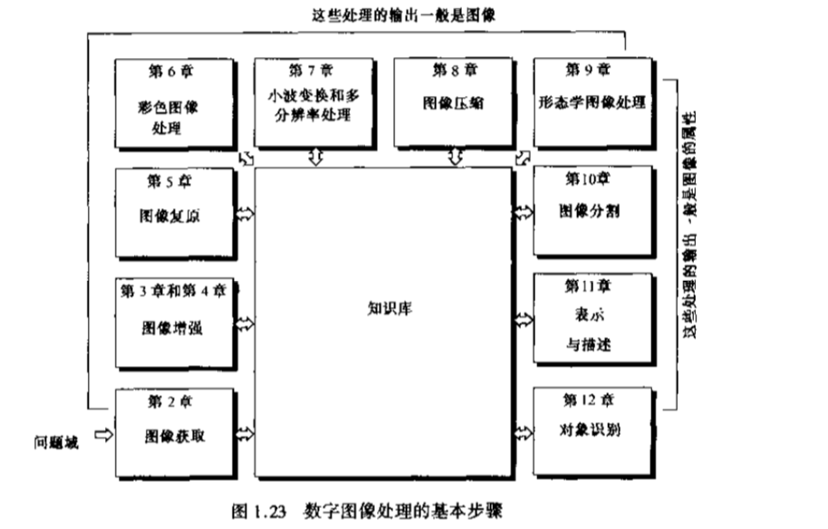

### 1.5图像处理系统的组成

硬拷贝 指的是打印机等设备

我们的很多工作 都是在图像处理软件这个环节

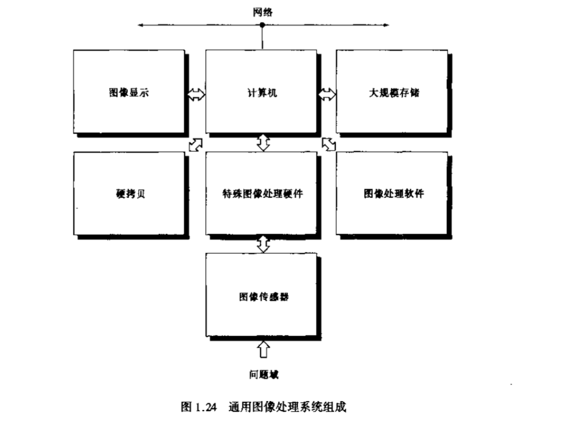

## 2数字图像基础

### 2.1视觉感知要素

人眼有很多误差 有时候不要相信自己的眼睛（有时候调程序的时候 不要太相信自己的眼睛）

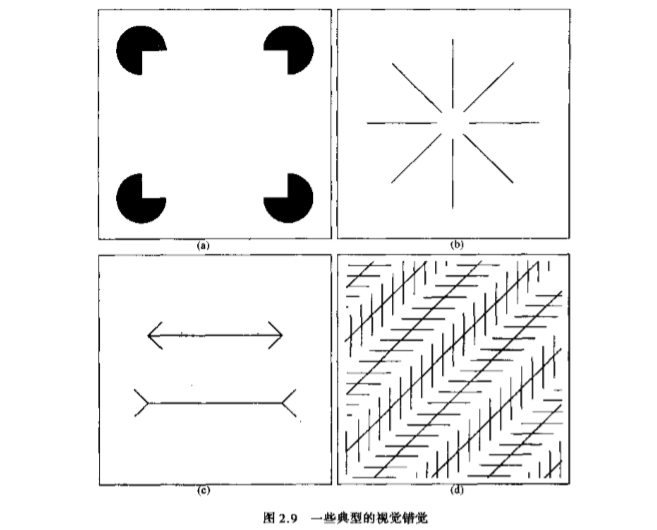

### 2.2光和电磁波谱

从黑到白的单色光的度量值范围通常称之为灰度级，而单色图像常称为灰度图像。

### 2.3图像感知和获取

* 使用单个传感器获取图像
* 使用条带传感器获取图像
* 使用传感器阵列获取图像

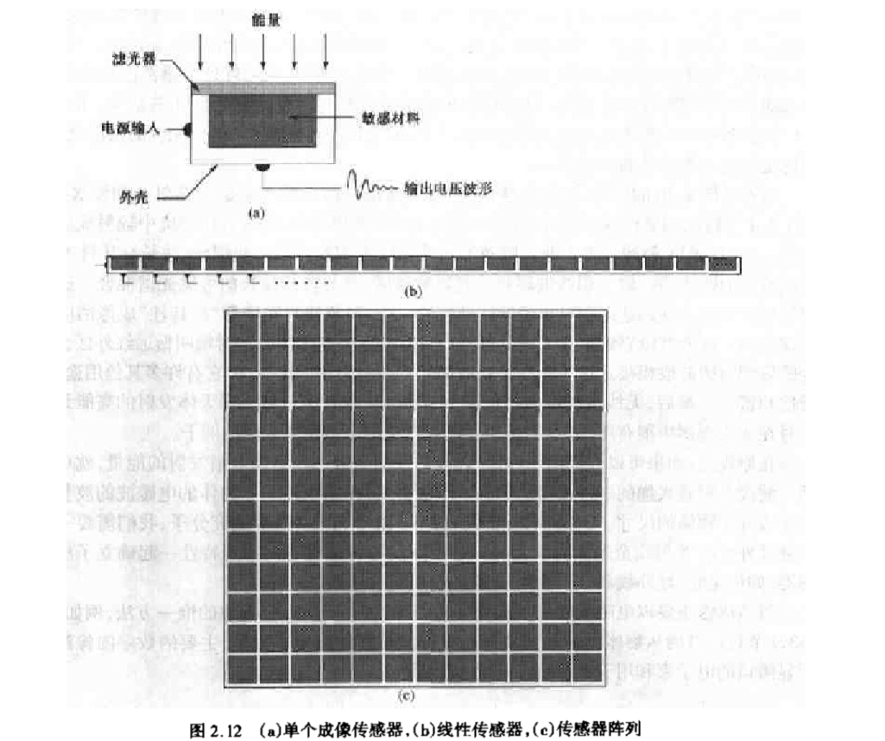

简单的图像形成模型：

i  入射分量  r 反射分量

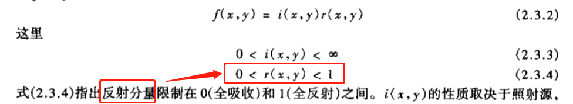

### 2.4 图像的取样和量化

#### 2.4.1概念

数字化坐标称为取样（下面直线AB就是对二维图像的一维图像）

数字化幅度值称为量化

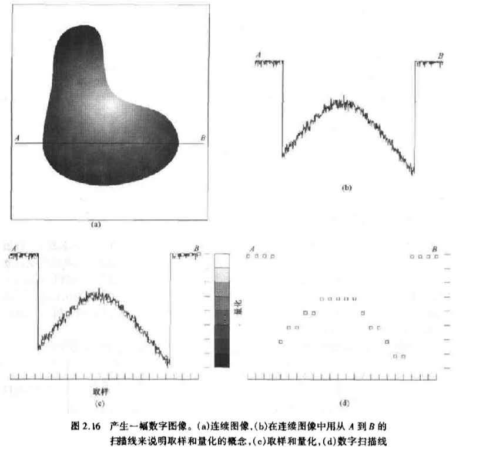

#### 2.4.2数字图像表示

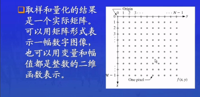

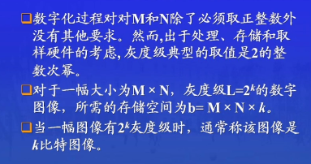

k比特图像 对于size 为3×3 uchar类型的图像（ 即2^8=256） 其所需要的存储空间为：3×3 ×8B  其称为8比特图像

#### 2.4.3空间和灰度级分辨率

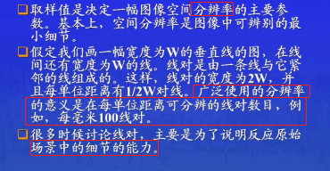

线对：比如实际情况中 我们要处理的目标的纹理比较细腻：每毫米就有100条明暗变化，那我们在设计图像处理系统的时候，就要考虑我们在取样的时候，最起码我们的取样精度要达到每毫米100线对

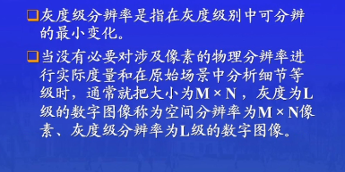

灰度级分辨率 这时候就不讨论反映原始场景中的细节能力（很多情况中我们也一般这样处理）

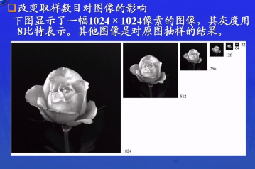

在这里 只抽取偶数行 偶数列 就可以把一个1024×1024 的图像，变成512×512的图像

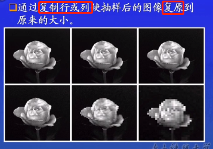

把512×512的图像回复成1024×1204的图像 但是这种复原，会有像素丢失

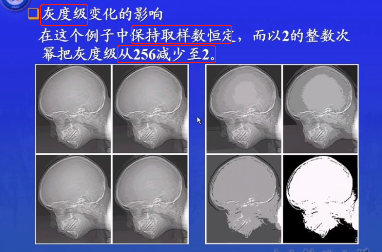

同样 灰度级越低 图像细节越少（对于第四个图片 可以明显看到 大脑中有一片空白 这是由于灰度级低导致的 ）

#### 2.4.5放大和收缩数字图像

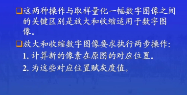

该方法适用于数字图像。（与抽样实现缩小放大相比）

操作：

1. 计算新的像素的对应位置

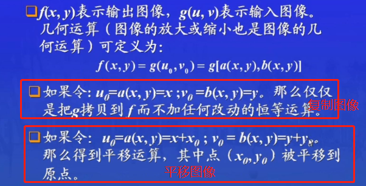

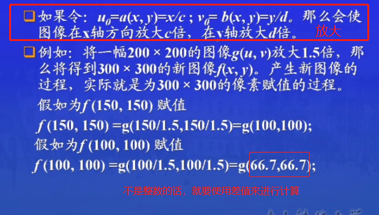

一些差值方法：

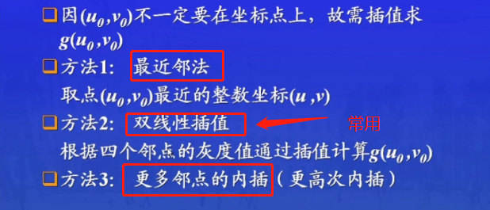

一维线性插值;

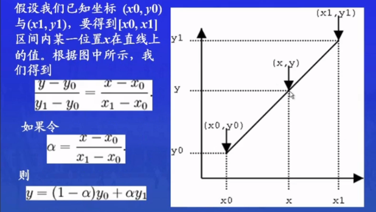

双线性插值：（性价比比较高）

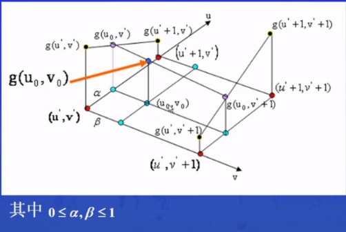

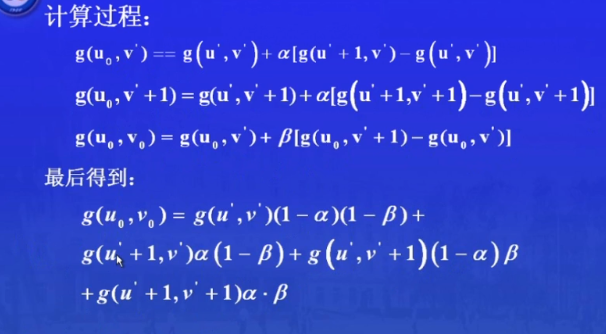

插值效果：

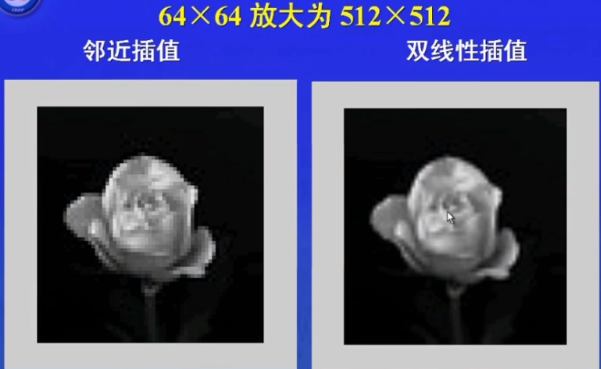

### 2.5像素间的一些基本关系

#### 2.5.1相邻像素

4邻域      D邻域

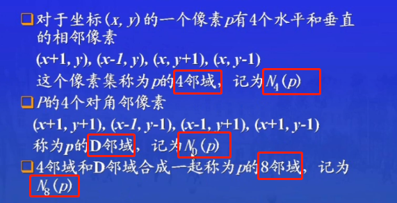

#### 2.5.2邻接性 连通性 区域 和边界

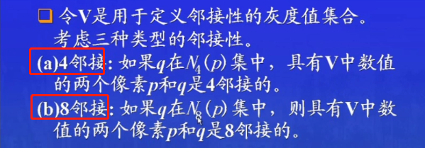

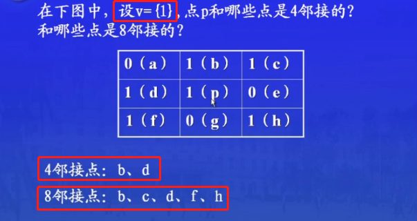

m邻接

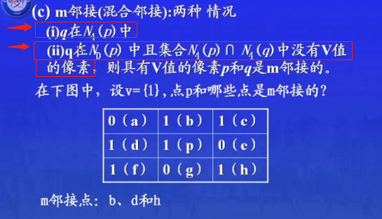

在通路中的各个中间点，都是满足某种邻接的（4邻接，8邻接，m邻接）

n是通路的长度

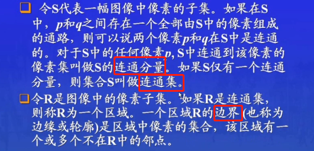

#### 2.5.3 距离度量

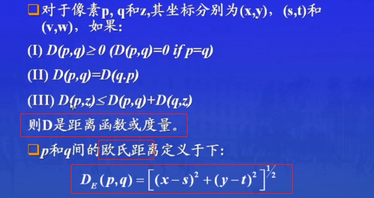

除了欧式距离，还有一些其他距离：D4距离  D8距离  Dm距离

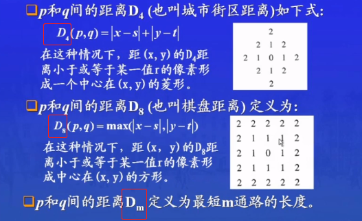

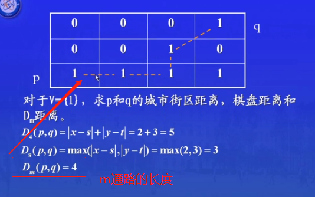

注意：D4和D8通路与任何通路无关，Dm距离与通路有关

## 3空间域图像增强

图像增强的首要目标是处理图像，使其比原始图像更适合特定的应用。

### 3.1背景知识

空间域方法：

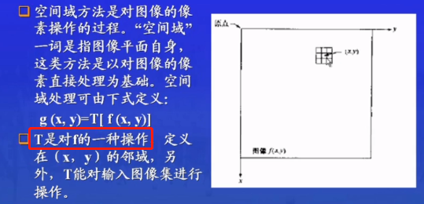

T 最简单的情况  掩膜kernel为1*1时 就是对灰度值进行操作

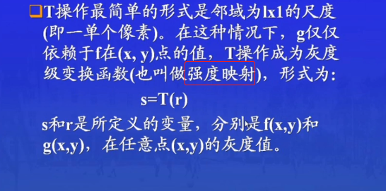

T 增强对比度的方法

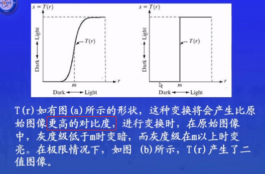

### 3.2某些基本灰度变换

灰度变化的时候，T就是把像素值r映射到值s的一种变换（一维映射）

#### 图像反转

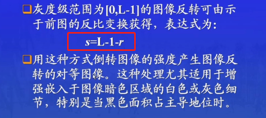

效果如下：

#### 对数变换

可以把窄带低灰度输入 转换为宽带输出  

与y=x（输入等于输出）相比， 显然对数函数图像在y=x图像上面 也就是说把大部分像素的灰度值增加了（尤其比较低的灰度）

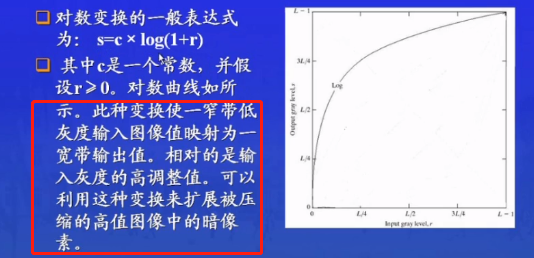

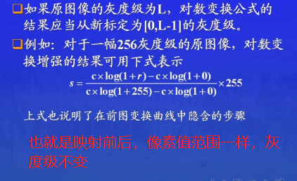

对数函数的应用：傅里叶频谱

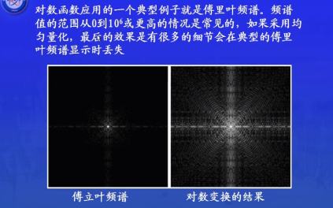

使用对数函数后，图片很多低灰度值的细节会更加突出。

#### 幂次变换

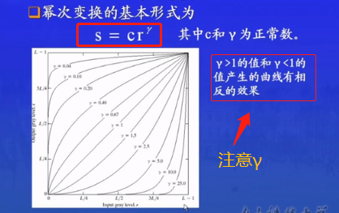

**γ越大，图像越低**

作用与对数函数差不多。具体效果与γ有关（根据图像一目了然）

监视器显示是非线性的，它的γ为2.5，我们使用矫正曲线γ=0.4来进行矫正（2.5*4=1）

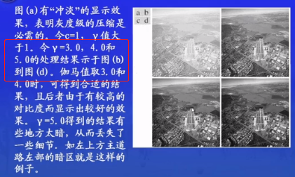

图像太亮的话，为了显示更多细节，可以把灰度级压缩，把图像变暗，使用γ大于1的幂级函数即可，γ越大，图像越暗。

图像太暗的话，可以使用γ<1的幂级函数，使图像变亮。

#### 分段线性变换函数

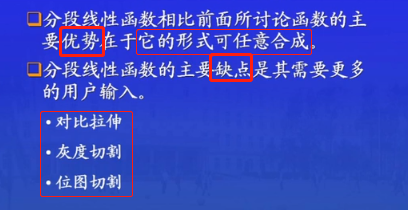

* 对比拉伸

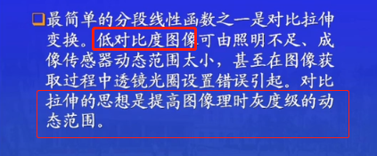

折线根据（r1,s1）,(r2,s2)两点的位置不同，可以有很多种形状。

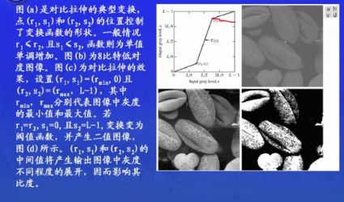

对于b图，很明显它的灰度级没有遍布0-255。对比拉伸变换的纵坐标为0-255，横坐标即原图灰度值范围。经过变换后的灰度值遍布0-255.

* 灰度切割

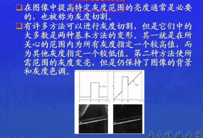

两种方法：

> 1. 指定范围，提高灰度,范围之外，降低灰度
> 2. 指定范围，提高灰度，图像的背景和灰度色调不变

* 位图切割

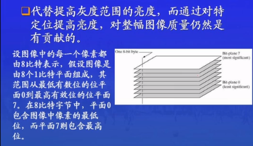

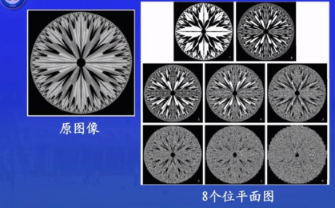

我的理解是：就像切片一样，得到的是图像各个位平面的截面。0-7八个位平面。0比特平面就是图像的第一位，灰度值范围0-1（2的1次方为2），

### 3.3直方图处理

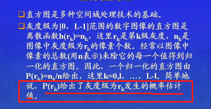

直方图很重要的意义就是，给出了各灰度级发生概率的估计值。

图像的**明暗度**和直方图

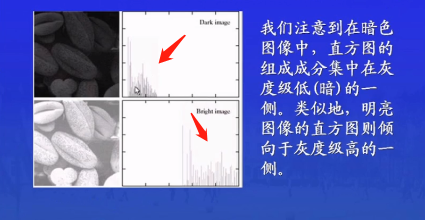

图像的**对比度**和直方图

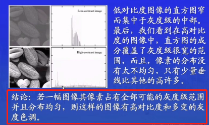

#### 3.3.1直方图均衡化

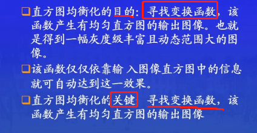

原理：其实就是根据各灰度级概率分布，把比较窄的灰度级变宽，得到一副灰度级丰富且动态范围大的图像。

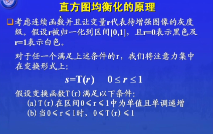

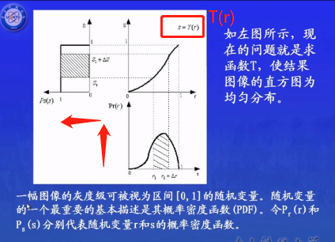

推导过程：

计算例子：

灰度级：0 1 2 3 4 5 6 7八个灰度级

归一化：对r归一化  Sk为灰度级的概率

对于S  ，结果图像的灰度级和原图像的灰度级一样，所以要把s 归一到0-7：

特点：

处理效果：

#### 3.3.2直方图匹配（规定化）

直方图均衡化，有时候会不好用：

这是因为，对于离散的数值图像，很难做到完全的均匀化。对于上图，因为原图中低灰度级的像素值太多，导致均衡化后的图像偏亮（在这里有点疑问，稍后再想想）

直方图匹配：

原理：

例子：

先求每个r值对应的S

与要求的的表二进行对比，寻找映射关系（可以按最接近的值进行映射）：

可以看出，原图像中的灰度级0 1 2....被映射成了3 4  5....，所以新图像中0 1 2灰度级为0。3 4 被映射成了6，所以新图像中灰度级6的像素点就为原图像中 灰度级3 4 像素点之和，新图像的灰度级7 的像素点同理可由原图像的5 6 7像素点得到。

==但是可以看出==，我们得到的新表和要求的表还是有些许差距，但是，实际他们的效果是差不多的。

处理后的效果：

规定化直方图，并没有一个确切的规定。主要是根据实际情况进行分析。

#### 3.3.3应用直方图进行局部增强

举个栗子：

可以看出，对比度和低噪声不可兼得，局部直方图是一个折中的方法（c图中，虽然也要噪点，但是相对来说少一点，而且把之前没有的细节也显示出来了）

==接下来，mask kernel什么的终于要登场了！==（也就是下面的Sxy）

举个栗子：

==对暗的地方进行增强的意思是，暗的地方可能有一些细节没有显示出来，我们需要提高暗区域的对比度，来使该区域的细节显示出来==

处理效果：

### 3.4用算术/逻辑操作增强

对灰度级图像进行操作时，像素值作为一个==二进制字符串==来处理

#### 3.4.1图像减法处理

两个图片相减，可以得到两个图片的差别。

举个栗子：

再来个栗子：

老前辈的经验：（在对像素值进行操作时，像素值可能发生溢出）

对于第一种方案，虽然可以保证操作后像素值不溢出，但是不能保证像素值覆盖0-255。

对于第二种方案，更靠谱一点。就是把最小像素值作为0,其他像素值进行相应操作，然后每个像素值/Max*255，即在0-255尺度上进行归一化。（其实就是对比拉伸）

#### 3.4.2图像平均处理（加法）

举个栗子：

对于受到噪声影响的图片，可以==对多张图片取平均值==，达到消除噪点的效果

可以看出，随着使用图片的数量的增加，差值图像的==均值和标准差==减小

### 3.5空间滤波基础

！！！终于到这一步 像不像卷积操作？

* ==线性空间滤波处理==

* ==非线性空间滤波处理==

空间滤波处理时的一些问题：（==边界问题==）

> 根据以上两种方向，有5种处理边界的方法：
>
> 1. 限制掩膜的移动范围（这样导致部分像素处理不到，而且输出图像尺寸变小）
> 2. 为了不改变图像大小，将未处理的边界赋值到图像上 
> 3. 在边界上掩膜被盖住多少，就是用多少权值，即所谓的部分掩膜处理。
> 4. 还有就是改变图像大小，在图像外边填充若干圈像素值
> 5. 将图像边缘复制补在图像之外

### 3.6平滑空间滤波器

平滑滤波器，其实就是==均值滤波器==

平滑滤波器通常用于平滑处理，进行降噪。但是也有负面效应，就是会使图像边缘模糊。

公式：

举个栗子：

效果：

* 使用平均滤波降噪（椒盐噪声）

* 使用中值滤波降噪

中值滤波去除噪声强力，但是会模糊细节。

==线性操作，我们可以进行复原。但是对于一些非线性的操作(比如中值滤波）我们要谨慎，因为这类操作不容易被复原==。

### 3.7锐化空间滤波器

#### 3.7.1基础

锐化空间滤波与平滑空间滤波在一定程度上是==相反的== 。锐化处理可以看成是一个==微分==的过程的过程（平滑处理可以看成==积分==的过程）。

一阶微分：

二阶微分：

结论：

> 1. 一阶微分通常会产生较宽的边缘
> 2. 二阶微分处理对细节有较强的响应，如细线和孤立点
> 3. 一阶微分处理一般对灰度阶梯有较强的相应
> 4. 二阶微分处理对灰度级阶梯变换产生双相应。

我们还注意到，二阶微分在图像中灰度值变化相似时，对线的响应要比对阶梯强。

#### 3.7.2基于二阶微分的图像增强-拉普拉斯算子

拉普拉斯算子是基于二阶微分的图像增强

各向同性就是，无论图像沿哪个方向突变，只要突变的大小相同，我们的算子的响应就相同

写成掩模的形式：

第二个掩模，是加入了对角线方向。（等于说再加两个方向，利用上面的公式，就得-8*f(x,y)）

第三第四个中心为正的掩膜在实践中也经常使用。这两个掩模也是以拉普拉斯变换定义为基础的，只是其中的系数与我们咋这里所用的的符号相反而已。

只要中间系数和其他系数之和为0，都成为拉普拉斯掩膜。

==处理点==：

使用中心为4和中心为-4的掩膜处理点，只是符号不同，响应的幅度还是一样的。处理之后，因为边界问题，输出图像的==尺寸减小==了。

==处理边缘==：

同上。

举个栗子：

使用中心为负的拉普拉斯掩膜对图像处理之后，得到了第二张图片，效果并不好，这是因为处理之后的像素值超出了0-255的范围（由于是负拉掩膜，所以导致量的地方都变成了负值，也就是黑色），对其重新标定在0-255后（可以用直方图均衡化），即第三张图片，能够看出，本来比较亮的边界，反而比较黑，原因不在赘述。想只增强原图的边界，就用原图减去第二张图，可以看出（第四张图），图像的细节部分得到了增强。（用减的原因，也是因为使用了中心为负值的拉普拉斯掩膜，若是正中心值的话，就用加）

先进行拉普拉斯掩膜操作，再将原图与之相减这两步可以==合成一步==来进行：

对于第一个图，即4+1 得到了中心值5

#### 3.7.3基于一阶微分的图像增强-梯度法

梯度分量的本身是线性的，但是梯度的模不是线性的。

在实际操作中，==常用绝对值代替平方与平方根运算近似求梯度的模值。==

其他方法：

但是偶数尺寸的掩膜并不好用

举个栗子：

### 3.8混合空间增强法

思考过程:

老师没讲啊啊啊啊！！   任重而道远啊

## 4频率域图像增强

什么是傅里叶变换和频域？如何将它们用于图像增强？

### 4.1背景

傅里叶变换：

### 4.2傅里叶变换和频率域的介绍

#### 4.2.1一维傅里叶变换及其反变换

离散函数的傅里叶变换：

其中的M也可以写成根号M

#### 4.2.2二维DEF及其反变换

同样的，MN也可写成根号MN

二维傅里叶变换的平移性：

这里需要用到欧拉公式：

举个栗子：

一些二维傅里叶变换的性质：

其中，M N是两个方向上的周期。

#### 4.2.3频率域滤波

举个栗子：

可以看出，45°的边缘的傅里叶谱是位于-45°方向，几乎水平的氧化物边缘的傅里叶谱位于差不多垂直的方向。

傅里叶谱中，低频部分对应灰度级变化缓慢的地方，高频部分对应灰度级变化大的地方，比如噪点，边缘等。

频率域滤波的步骤：

我们一般只关心它的频率，而不关心相位。

一些基本的滤波器及其性质：

举个栗子：

根据上面的步骤处理过的图片,整体颜色偏暗，这是因为设置的平均值灰度为0，这意味着灰度值有正有负，但是我们的图片里把负值都当作了0，所暗处比较多。

#### 4.2.4空间滤波和频率滤波之间的对应关系

举个栗子：

其他栗子：

### 4.3平滑的频率域滤波器

#### 4.3.1理想低通滤波器

举个栗子：

知识补充：[什么是功率谱](https://blog.csdn.net/liliqianbaidu/article/details/70035867)

**功率谱可以从两方面来定义，一个是自相关函数的傅立叶变换，另一个是时域信号傅氏变换模平方然后除以时间长度**

举个栗子：

对于第四幅图像，图像轮廓边缘出现皱纹一样的==振铃特性==，其产生原因如下：

#### 4.3.2巴特沃斯低通滤波器

效果：

#### 4.3.3高斯低通滤波器

效果：

高斯滤波器==没有振铃现象==，是最常用的滤波器。

### 4.4频率域锐化滤波器

对上一章的低通滤波器精确反操作即可：

结构：

#### 4.4.1频率域的拉普拉斯算子

在使用的时候，还要进行比例的变换：

三维透视图：

效果：

### 4.5同态滤波器

==不太懂啊==

再举一个栗子：

### 4.6实现

主要介绍一些傅里叶变换的实现问题。

二维的傅里叶变换可以利用一维的傅里叶变换实现

周期性：

==空间域的卷积过程==：

最后一个图，是卷积的结果，可以看到200-300之间的值是平的，说明卷积值没有变化，这是因为在这一段，f(m)等于3，h(x-m)完全滑进了f(m)里面，此时卷积结果是一个定值。之后下降是因为h(x-m)开始滑出f(m)。

==频率域的卷积过程：==

解决办法：

对于二维，类似的处理：

## 5图像复原

