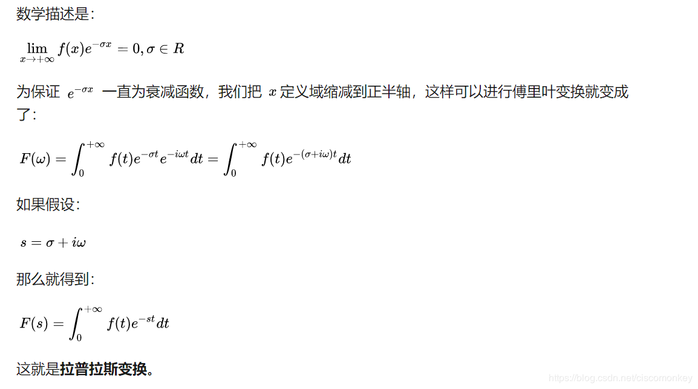

# 数学基础

## 拉氏变换

可参考文章[拉普拉斯变换](https://blog.csdn.net/ciscomonkey/article/details/85067036)

**拉普拉斯变换-原来就是这么回事**
傅里叶变换能帮我们解决很多问题，一经问世后便受到广大工程师们的喜爱，因为它给人们提供了一扇不同的窗户来观察世界，从这个窗户来看，很多事情往往变得简单多了。但是，别忘了，傅里叶变换有一个很大局限性，那就是信号必须满足狄利赫里条件才行，特别是那个绝对可积的条件，一下子就拦截掉了一大批函数。比如函数 f(t)=t^2 就无法进行傅里叶变换。这点难度当然拿不到聪明的数学家们，他们想到了一个绝佳的主意：把不满足绝对的可积的函数乘以一个快速衰减的函数，这样在趋于无穷 时原函数也衰减到零了，从而满足绝对可积。

