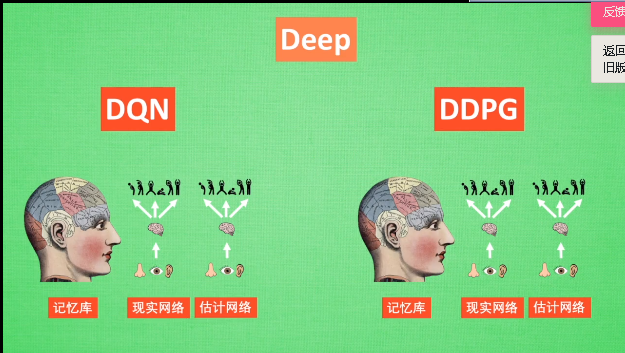

# 机器学习

## 神经网络(neural network)

利用神经元的敏感度  达到识别效果

### 特点

1. 自己逐渐适应（自适应）
2. 闭环控制
3. 梯度下降

### 类型

#### 1. 卷积神经网络CNN

* 应用：
  1. 分类（classification）
  2. 检索（retrieval） 类似于淘宝推荐同款
  3. 追踪（detection）
  4. 分割（segmentation）
* 过程：

输入的图片其实是一个矩阵，计算机看到的是一个个像素点的值，它不能看到图片的特征，卷积层的作用是，利用批量过滤器，对一小块像素进行卷积操作，得到一个特征值，从像素值得到一些edges特征。再进行卷积操作，得到object parts，再进行卷积操作，得到object models(对于人脸识别来说 就是从像素值 提出来线条，由线条提取出眼睛 耳朵 鼻子等器官 ，再提取一次就获得人脸的特征，然后把提取出来的人脸特征套入普通的全连接神经网络进行分类（看是谁的脸）。如下图：

在卷积的过程中，图片的长宽不断被压缩，但深度越来越大，对图片的理解越来越深（笑），如下图：

但是在卷积的过程中，随着图片的长宽被压缩，神经网络会丢失掉图片的一些信息，所以就使用POOL(池化层)来专门负责对图片进行压缩，而在卷积的时候不压缩图片，尽可能的保证图片信息不丢失。如下图：

#### 2. 循环神经网络RNN

* 应用

语音文字识别

输入的有序数据data1 data2 data3......有关联  这时卷积神经网络就无法考虑这些输入之间的关系。

循环神经网络RNN 在预测每个输入后 对输出结果都会有一个描述（相当于保留data1的预测），然后带着这个描述去进行其他的预测。

* 形式

对于图片分析，只需要一个输入，即我们输入的图片：

对于语言翻译，可能有两个输入，两个输出：

#### 3.LSTM RNN

Long short-term Memory 即长短期记忆

RNN 的弊端 ：会出现梯度消失或梯度爆炸  （与每一级的权重有关），即“失忆” 为了克服这种情况，增强RNN的记忆，增加了几个控制器。如果判断分线的重要程度较高，就改变它的权重，并把它合并进主线，如果重要程度较低，就将它忘记。输出的时候将结合主线和分线考虑输出的是什么。

#### 4. 自编码Autoencoder

就是为了在读取的数据较大的时候 先对数据进行压缩 然后对数据的精髓进行神经网络分析，如下图所示：

#### 5. GAN生成对抗网络

## 强化学习**(reinforcement Learning)**

利用奖惩 来进行决策

### 分类

#### 不理解环境(Medel-Based RL)

1. Q Learning
2. Sarsa
3. Policy Gradients

#### 理解环境（Model-Free RL)

比model free 多了一个建立环境的过程 可以自己学习思考

1. Q Learning
2. Sarsa
3. Policy Gradients

#### 基于概率（Policy-Based RL）

。。。

#### 基于价值（Value-Based RL）

。。。

按照不同的准则还可能分为好多类。。。。。。

### Q Learning

是一个决策过程

用Q表来存储每一个状态和动作

#### 算法

### Sarsa

与Q-Learning 相似  决策部分和Q-Learning 相同 但是更新的方式不同。

Q L属于离线学习  Ss 属于在线学习

QL 比较冒险     Ss 比较保守

### DQN

在电竞上 比较厉害

利用神经网络

### 策略梯度（Poliy Gradients)

### Actor Critic

是以值为基础 和 以概率动作为基础的一个结合体

### DDPG（Deep Deterministic Policy Gradient）

### A3C

平行宇宙

做三道题 每一个宇宙的你做一道题  这样效率会很高

## 进化算法

### 遗传算法（Genetic Algorithm）

物竞天择，适者生存。

### 神经网络进化（Neuro-Evolution）