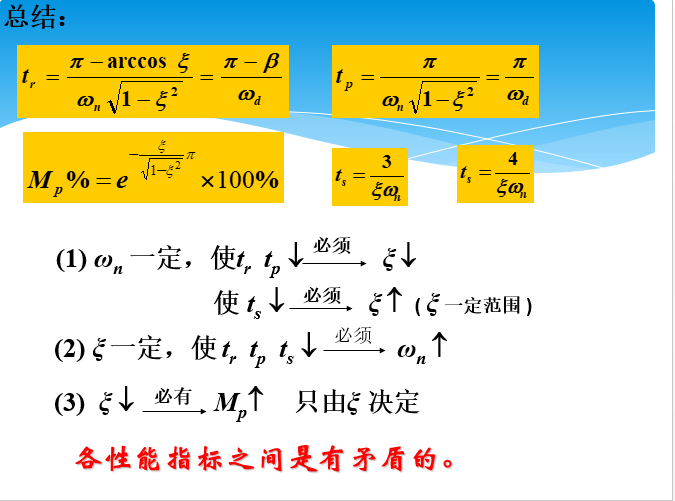

# 机电控制

## 典型的控制系统

按系统输入信号划分：

## 控制系统要求

控制精度是衡量系统技术性能的重要尺度。一个高品质的系统,在整个运行过程中,被控量对给定值的偏差应该是最小的。考虑动态过程在不同阶段中的特点,工程上通常从==稳、准、快==三个方面来衡量自动控制系统。

## 时间响应

控制系统在输入作用下所产生的输出称为响应。若已知系统的传递函数G(s)和参考输入U(s)，那么，响应可以表示为 

Y(s) = G(s)U(s)（1-29）

​    取式(1-29)的**拉氏反变换**，便得到响应的时域表达式y（t）,通常称作**时间响应**。如果所考虑的输出是频域表达式(即Y(jω))。则称为**频率响应** 。

## 二阶系统动态性能指标

## 线性系统的稳定性分析

### 劳斯判据

## 步进电机

按工作原理分为反应式，永磁式和永磁感应三类。

## 空间状态方程

## PID控制器

