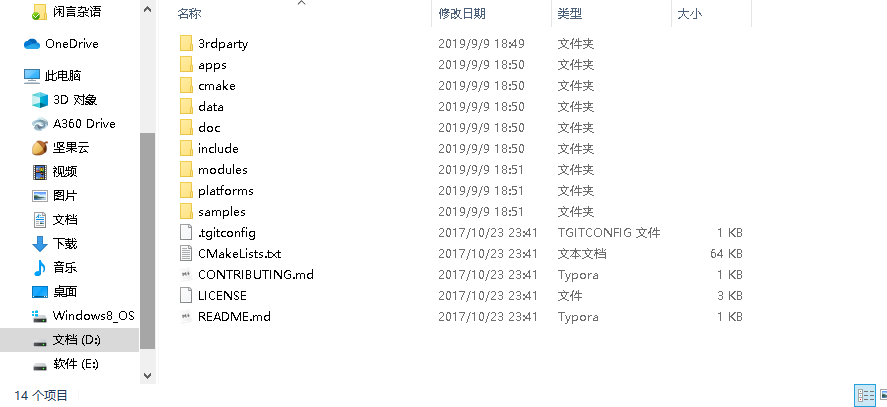

# 玩转opencv库

## opencv 文件

我们从opencv 中文网里面下载的opencv sources（以及安装opencv后的sources文件夹）其实就是opencv作者 在GitHub 仓库里面的东西：

这里面包括了opencv的所有东西 包括源码等等（在moudules)里面

使用OpenCV ，就是使用头文件+动态库的形式，我们先了解一下这些头文件对应的大体是什么功能或者说是模块。opencv有 cv.h cv.hpp cvaux.h cvaux.hpp cvwimage.h cxcore.h cxcore.hpp cxeigen.hpp cxmisc.h highgui.h ml.h;这些头文件以.h结尾的是C形式的头文件，.hpp是C++形式的头文件。这里的头文件是属于OpenCV1.0大致有的最基础的头文件了，也就是核心。

opencv2里有很多头文件和文件夹，简述几个常用的有用

core 核心模块 里面有CV基本的数据结构 绘图的函数 辅助的一些函数和宏 都说了是core了肯定是核心啦

highgui 这里面事涉及到GUI方面了 就是图形界面 有一些基础的函数和接口

imgproc 这里面是图像处理模块包含如 线性非线性变化 直方图 图形几何变化 和特征检测什么的

photo 图像去噪和修复

stitching 图像拼接 

video 视频处理组件

ml 机器学习模块 

objdetect 目标检测模块

features2d 2d功能模块

calib3d 有关相机和3D 模块

