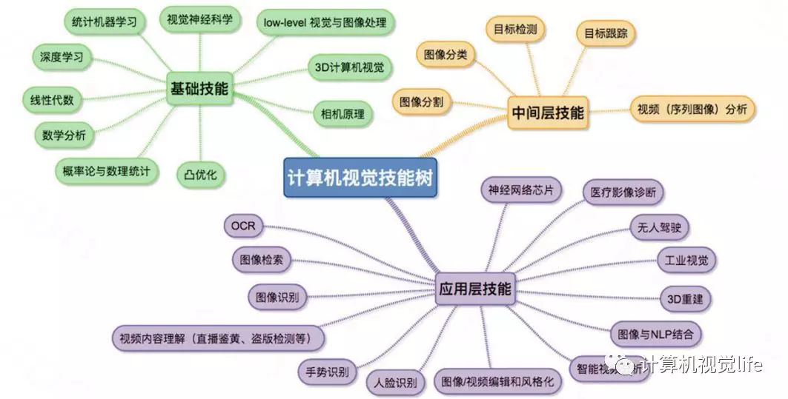
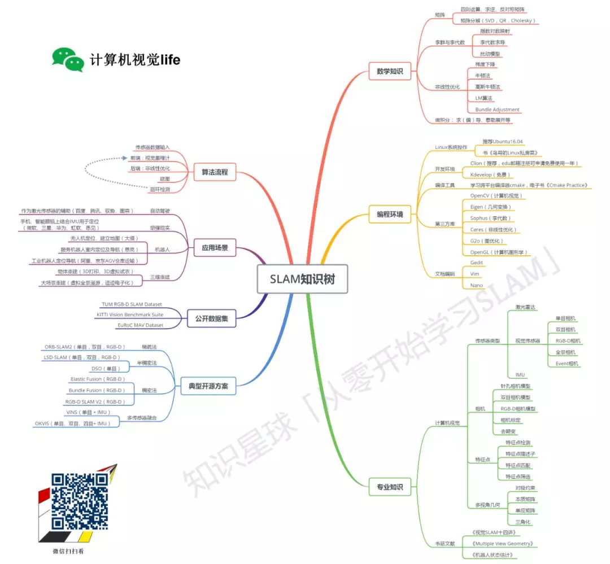

# 计算机视觉入门

## 计算机视觉

计算机视觉是人工智能技术的一个重要领域，他是人工智能时代的眼睛。计算机视觉是一个很宏大的概念，下图是计算机视觉所需要的技能树。

只有对计算机视觉这个领域有了一个初步的全面了解，我们才能够结合实际问题找到自己感兴趣的研究方向，而兴趣能够支持我们克服困难持续走下去。

## 入门

  从实践出发，并与理论相结合:一个是OpenCV，一个是MATLAB。

### opencv

OpenCV以C++为基础，需要具备一定的编程基础，可移植性强，运行速度比较快，比较适合实际的工程项目，在公司里用的较多.

入门书籍：

* 《学习OpenCV》

* 《OpenCV 2 计算机视觉编程手册》

这两本都是偏实践的书，理论知识较少，按照书上的步骤敲代码，可以快速了解到OpenCV的强大，想要实现某个功能，只要学会查函数（在https://www.docs.opencv.org/查询对应版本），调函数就可以轻松搞定。由于每个例子都有非常直观的可视化图像输出，所以学起来比较轻松有趣。

### MATLAB

MATLAB只需要非常简单的编程基础就可以很快上手，实现方便，代码比较简洁，可参考的资料非常丰富，方便快速尝试某个算法效果，适合做学术研究。当然两者搭配起来用更好啦。

入门书籍：

* 冈萨雷斯的《数字图像处理（MATLAB版）》（英文原版2001年出版，中译版2005年）
* 冈萨雷斯的《数字图像处理（第二版）》

不需要一上来就全部过一遍，只需要结合MATLAB学习一下基本原理、图像变换、形态学处理、图像分割，以上章节强烈建议按照书上手动敲一遍代码（和看一遍的效果完全不同），其他章节可快速扫描一遍即可。但这本书比较注重实践，对理论的解释不多，理论部分不明白的可以在配套的冈萨雷斯的《数字图像处理（第二版）》这本书里查找，这本书主要是作为工具书使用，以后遇到相关术语知道去哪里查就好。

## 进阶

经过前面对图像处理的基本学习，小白已经了解了图像处理的基础知识，并且会使用OpenCV或MATLAB来实现某个简单的功能。但是这些知识太单薄了，并且比较陈旧，计算机视觉领域还有大量的新知识在等你。

推荐书籍：

* 《Computer Vision: Algorithms and Application》

侧重视觉和几何知识 

这本书图文并茂地介绍了计算机视觉这门学科的诸多大方向，可以根据兴趣，选择性的看一些应用方向。

* 《Computer Vision: Models, Learning, and Inference》

侧重机器学习模型

该书从基础的概率模型讲起，涵盖了计算机视觉领域常用的概率模型、回归分类模型、图模型、优化方法等，以及偏底层的图像处理、多视角几何知识，图文并茂，并辅以非常多的例子和应用，非常适合入门

虽然都有中文版，但是如果有一定的英语阅读基础，推荐看英文原版

## 实践

计算机视觉可以分为两大方向：基于学习的方法和基于几何的方法。其中基于学习的方法最火的就是深度学习，而基于几何方法最火的就是视觉SLAM。

### 深度学习

  推荐：

吴恩达的深度学习视频

吴恩达自己创办的在线教育平台Coursera上学习，有配套习题，限时免费，结业通过后有相应证书。

### 视觉SLAM

SLAM（Simultaneous Localization and Mapping）（详见《[SLAM初识](http://mp.weixin.qq.com/s?__biz=MzIxOTczOTM4NA==&mid=2247484292&idx=1&sn=75799d2b2fc901dc965032333934ecda&chksm=97d7e613a0a06f054d4d32ff1733a07e0c0389abd032adc65d506e3070628a5db6c6caf6e154&scene=21#wechat_redirect)》），中文译作即时定位与地图创建。

推荐入门资料：

高翔（清华博士，慕尼黑理工博后）的《视觉SLAM十四讲-从理论到实践》

该书每章节都涵盖了基础理论和代码示例，深入浅出，非常注重理论与实践结合，大大降低了小白的学习门槛。

[我们为什么要学习SLAM](<https://mp.weixin.qq.com/s?__biz=MzIxOTczOTM4NA==&mid=2247485792&idx=1&sn=358b9bea94cf31b976abc3c12b28f4d7&chksm=97d7ecf7a0a065e1664469c22adce35e6d919d74f5ab95693c8921241f3fefe37fb571527e10&scene=21#wechat_redirect>)

